# Batch Job Flows

JCL job step sequences showing program execution order and data flow between steps for the CardDemo application.

## Job Flows

### POSTTRAN

Posts daily transaction file to VSAM master and builds transaction category balance file.

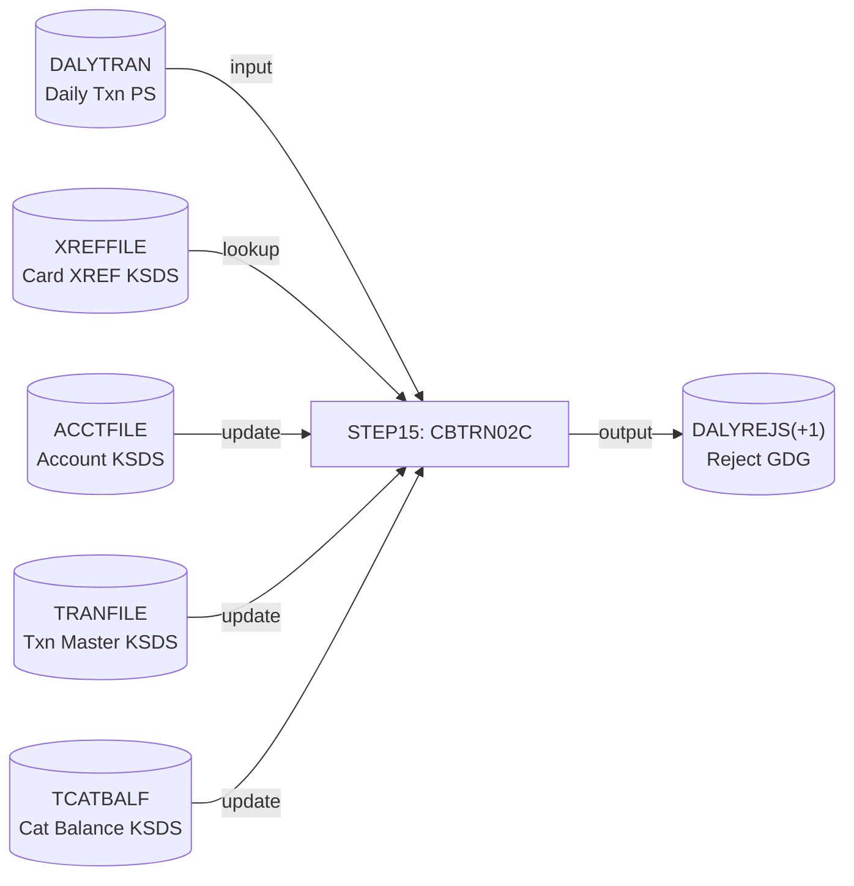

| Step  | Program  | Input DD                                  | Output DD        | Condition |
| ----- | -------- | ----------------------------------------- | ---------------- | --------- |
| STEP15 | CBTRN02C | DALYTRAN, XREFFILE, ACCTFILE, TRANFILE, TCATBALF | DALYREJS(+1) | None      |

---

### INTCALC

Calculates interest and fees from transaction category balances and writes system-generated transactions.

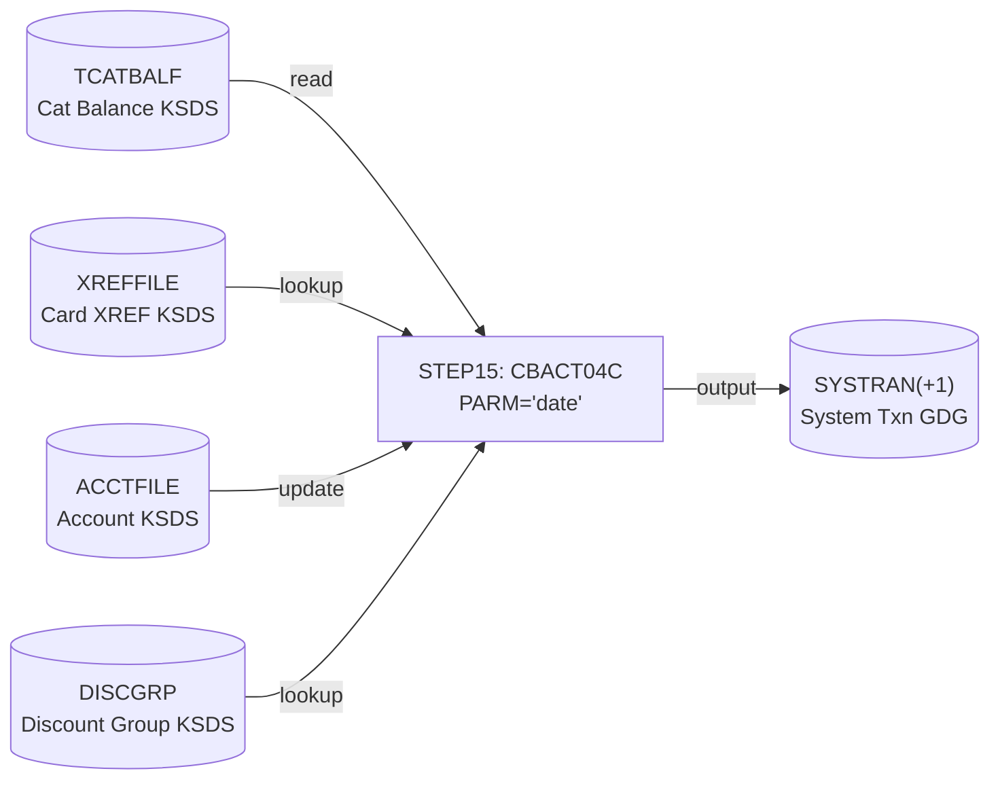

| Step  | Program  | Input DD                              | Output DD      | Condition |
| ----- | -------- | ------------------------------------- | -------------- | --------- |
| STEP15 | CBACT04C | TCATBALF, XREFFILE, XREFFIL1, ACCTFILE, DISCGRP | TRANSACT (SYSTRAN(+1)) | None |

---

### COMBTRAN

Sorts current transaction backup and system-generated transactions together, then loads the combined file back to the VSAM transaction master.

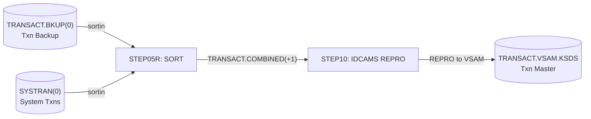

| Step    | Program | Input DD                                      | Output DD                    | Condition   |
| ------- | ------- | --------------------------------------------- | ---------------------------- | ----------- |
| STEP05R | SORT    | TRANSACT.BKUP(0), SYSTRAN(0)                  | TRANSACT.COMBINED(+1)        | None        |
| STEP10  | IDCAMS  | TRANSACT.COMBINED(+1)                         | TRANSACT.VSAM.KSDS (REPRO)   | None        |

---

### TRANREPT

Unloads processed transaction VSAM to flat file, filters and sorts by card number for a date range, then generates a formatted transaction detail report.

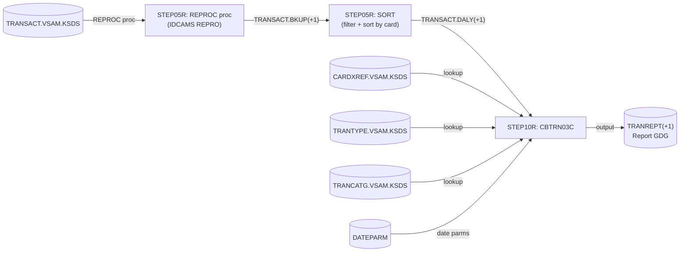

| Step    | Program  | Input DD                                          | Output DD           | Condition |
| ------- | -------- | ------------------------------------------------- | ------------------- | --------- |
| STEP05R | REPROC   | TRANSACT.VSAM.KSDS                                | TRANSACT.BKUP(+1)   | None      |
| STEP05R | SORT     | TRANSACT.BKUP(+1) (filtered by date, sorted by card) | TRANSACT.DALY(+1) | None      |
| STEP10R | CBTRN03C | TRANFILE (DALY(+1)), CARDXREF, TRANTYPE, TRANCATG, DATEPARM | TRANREPT(+1) | None |

---

### TRANBKP

Backs up the transaction VSAM master to a GDG flat file and recreates the VSAM cluster (cycle rollover).

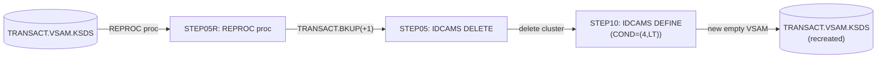

| Step    | Program | Input DD                 | Output DD                       | Condition          |
| ------- | ------- | ------------------------ | ------------------------------- | ------------------ |
| STEP05R | REPROC  | TRANSACT.VSAM.KSDS       | TRANSACT.BKUP(+1)               | None               |
| STEP05  | IDCAMS  | --                       | DELETE TRANSACT.VSAM.KSDS       | None               |
| STEP10  | IDCAMS  | --                       | DEFINE TRANSACT.VSAM.KSDS       | COND=(4,LT)        |

---

### CREASTMT

Creates account statements in plain text and HTML formats for each card present in the XREF file. Sorts the transaction VSAM into a card-keyed sequential file, loads it to a temporary KSDS, then runs CBSTM03A (which calls CBSTM03B as a file I/O subroutine) to produce the statement outputs.

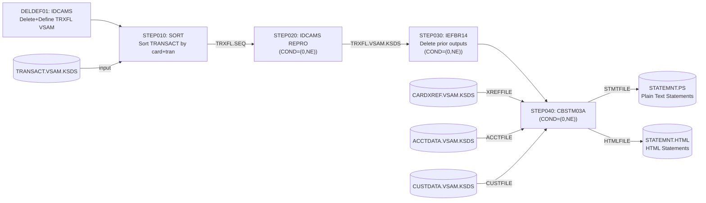

| Step     | Program  | Input DD                                               | Output DD                        | Condition   |
| -------- | -------- | ------------------------------------------------------ | -------------------------------- | ----------- |
| DELDEF01 | IDCAMS   | --                                                     | Define TRXFL.VSAM.KSDS           | None        |
| STEP010  | SORT     | TRANSACT.VSAM.KSDS                                     | TRXFL.SEQ (sorted by card+tran)  | None        |
| STEP020  | IDCAMS   | TRXFL.SEQ                                              | TRXFL.VSAM.KSDS (REPRO)          | COND=(0,NE) |
| STEP030  | IEFBR14  | --                                                     | Delete STATEMNT.HTML, STATEMNT.PS| COND=(0,NE) |
| STEP040  | CBSTM03A | TRNXFILE (TRXFL.VSAM.KSDS), XREFFILE, ACCTFILE, CUSTFILE | STMTFILE (STATEMNT.PS), HTMLFILE (STATEMNT.HTML) | COND=(0,NE) |

Note: CBSTM03A internally calls CBSTM03B for all file I/O against TRNXFILE, XREFFILE, CUSTFILE, and ACCTFILE.

---

### CBEXPORT

Exports all CardDemo VSAM files into a single multi-record VSAM export file for branch migration.

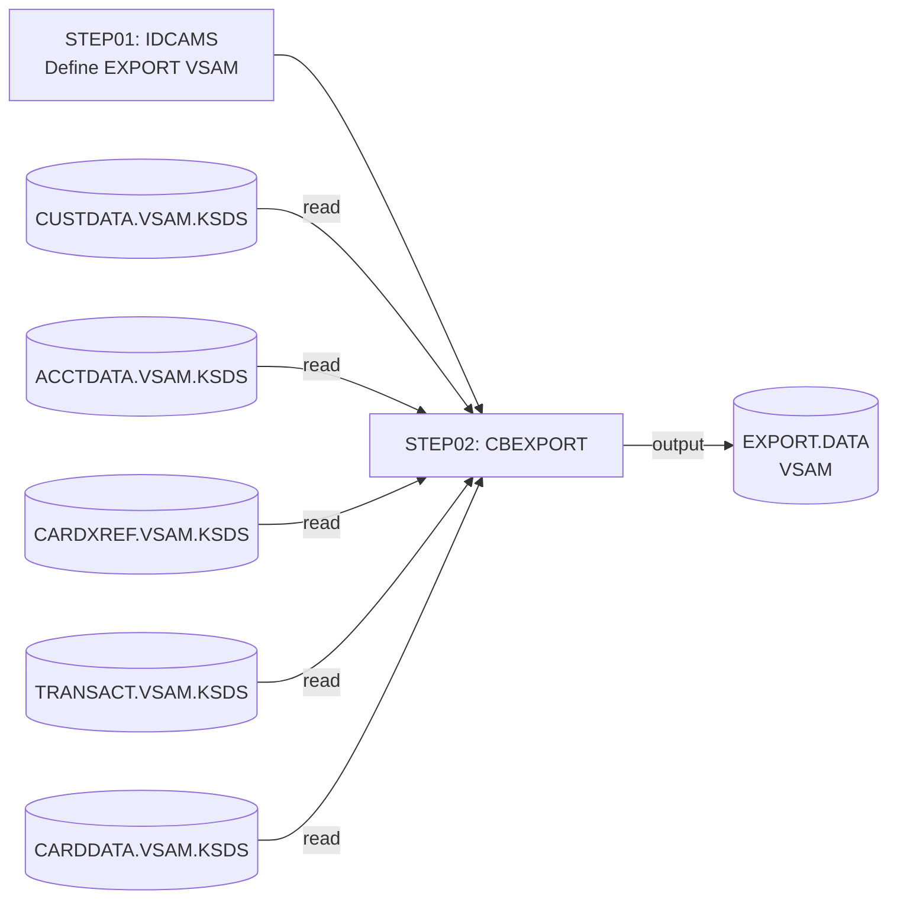

| Step  | Program | Input DD                                         | Output DD        | Condition |
| ----- | ------- | ------------------------------------------------ | ---------------- | --------- |
| STEP01 | IDCAMS | --                                               | Define EXPORT.DATA VSAM | None |
| STEP02 | CBEXPORT | CUSTFILE, ACCTFILE, XREFFILE, TRANSACT, CARDFILE | EXPFILE (EXPORT.DATA) | None |

---

### CBIMPORT

Imports a multi-record export file and splits it into separate normalized flat files for loading to a target system.

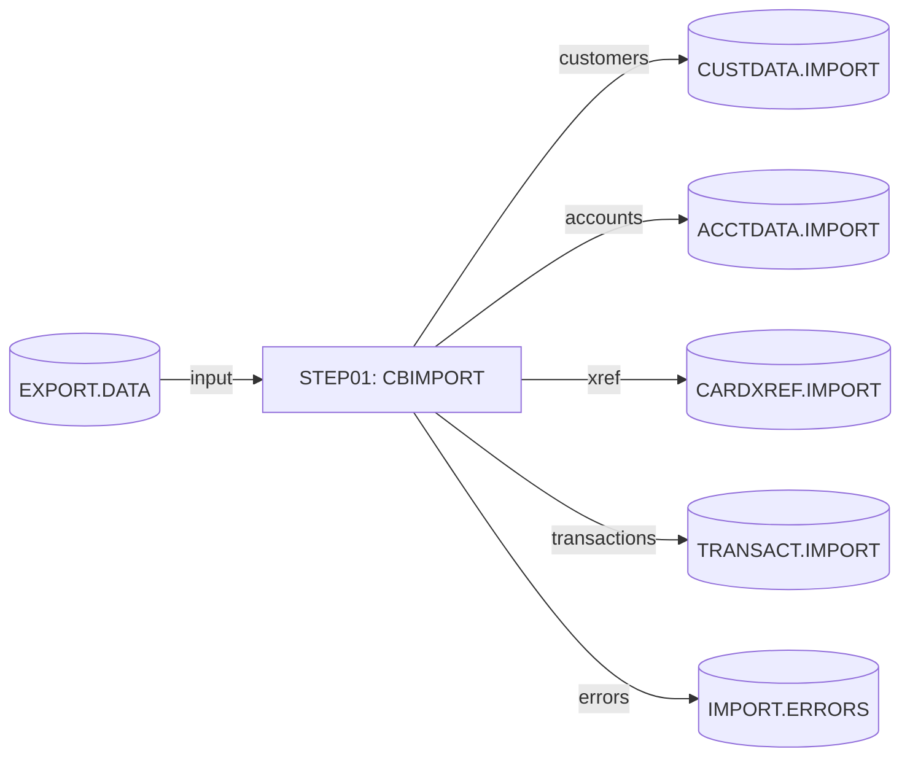

| Step  | Program  | Input DD         | Output DD                                               | Condition |
| ----- | -------- | ---------------- | ------------------------------------------------------- | --------- |
| STEP01 | CBIMPORT | EXPFILE          | CUSTOUT, ACCTOUT, XREFOUT, TRNXOUT, ERROUT              | None      |

---

### CBADMCDJ

Defines CICS CSD resources (programs, mapsets, transactions) for the CardDemo application group.

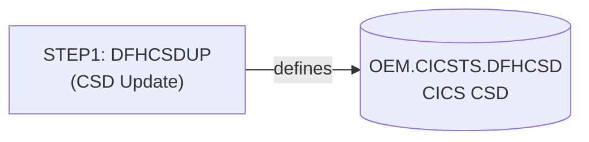

| Step  | Program  | Input DD          | Output DD         | Condition |
| ----- | -------- | ----------------- | ----------------- | --------- |
| STEP1 | DFHCSDUP | DFHCSD (read/write) | OUTDD (SYSOUT)  | None      |

---

### PRTCATBL

Unloads the transaction category balance VSAM to a sequential backup, then sorts and formats it as a printable report.

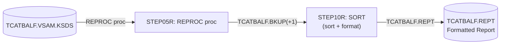

| Step    | Program | Input DD                 | Output DD              | Condition |
| ------- | ------- | ------------------------ | ---------------------- | --------- |
| DELDEF  | IEFBR14 | --                       | Delete TCATBALF.REPT   | None      |
| STEP05R | REPROC  | TCATBALF.VSAM.KSDS       | TCATBALF.BKUP(+1)      | None      |
| STEP10R | SORT    | TCATBALF.BKUP(+1)        | TCATBALF.REPT          | None      |

---

### READACCT

Diagnostic job: reads account VSAM and writes output in three flat file formats (compressed PS, array PS, variable-length PS).

| Step   | Program  | Input DD | Output DD                                             | Condition |
| ------ | -------- | -------- | ----------------------------------------------------- | --------- |
| PREDEL | IEFBR14  | --       | Delete ACCTDATA.PSCOMP, ACCTDATA.ARRYPS, ACCTDATA.VBPS | None    |
| STEP05 | CBACT01C | ACCTFILE (ACCTDATA.VSAM.KSDS) | OUTFILE (ACCTDATA.PSCOMP), ARRYFILE (ACCTDATA.ARRYPS), VBRCFILE (ACCTDATA.VBPS) | None |

---

### READCARD

Diagnostic job: reads card master VSAM and reports to SYSOUT.

| Step   | Program  | Input DD | Output DD | Condition |
| ------ | -------- | -------- | --------- | --------- |
| STEP05 | CBACT02C | CARDFILE (CARDDATA.VSAM.KSDS) | SYSOUT | None |

---

### READCUST

Diagnostic job: reads customer VSAM and reports to SYSOUT.

| Step   | Program  | Input DD | Output DD | Condition |
| ------ | -------- | -------- | --------- | --------- |
| STEP05 | CBCUS01C | CUSTFILE (CUSTDATA.VSAM.KSDS) | SYSOUT | None |

---

### READXREF

Diagnostic job: reads XREF VSAM and reports to SYSOUT.

| Step   | Program  | Input DD | Output DD | Condition |
| ------ | -------- | -------- | --------- | --------- |
| STEP05 | CBACT03C | XREFFILE (CARDXREF.VSAM.KSDS) | SYSOUT | None |

---

### WAITSTEP

Executes COBSWAIT to pause batch processing for a configurable number of centiseconds.

| Step | Program  | Input DD            | Output DD | Condition |
| ---- | -------- | ------------------- | --------- | --------- |
| WAIT | COBSWAIT | SYSIN (centiseconds value) | SYSOUT | None |

---

### CBPAUP0J (Extension: Authorization Module)

IMS batch job that runs CBPAUP0C as an IMS BMP (Batch Message Processing) program to purge expired pending authorization messages from the IMS database DBPAUTP0.

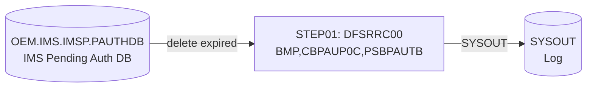

| Step   | Program  | Input DD                             | Output DD | Condition |
| ------ | -------- | ------------------------------------ | --------- | --------- |
| STEP01 | DFSRRC00 (BMP,CBPAUP0C,PSBPAUTB) | DDPAUTP0 (IMS.IMSP.PAUTHDB), DDPAUTX0 (IMS.IMSP.PAUTHDBX) | SYSOUX, SYSOUT | None |

---

### DBPAUTP0 (Extension: Authorization Module)

IMS DB unload job: extracts the DBPAUTP0 (Pending Authorization) IMS database to a sequential flat file for backup or migration purposes.

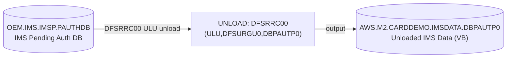

| Step    | Program  | Input DD                                          | Output DD                               | Condition |
| ------- | -------- | ------------------------------------------------- | --------------------------------------- | --------- |
| STEPDEL | IEFBR14  | --                                                | Delete prior IMSDATA.DBPAUTP0           | None      |
| UNLOAD  | DFSRRC00 | DDPAUTP0, DDPAUTX0 (IMS DB extents)               | DFSURGU1 (AWS.M2.CARDDEMO.IMSDATA.DBPAUTP0) | None  |

---

### MNTTRDB2 (Extension: Transaction Type DB2 Module)

DB2 batch job: runs COBTUPDT via IKJEFT01 to perform INSERT, UPDATE, or DELETE operations on the CARDDEMO.TRANSACTION_TYPE DB2 table. Input is a sequential file with A/D/U operation codes.

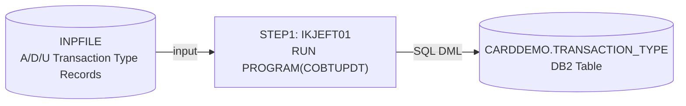

| Step  | Program  | Input DD        | Output DD     | Condition |
| ----- | -------- | --------------- | ------------- | --------- |
| STEP1 | IKJEFT01 (COBTUPDT) | INPFILE (sequential A/D/U records) | SYSTSPRT (SYSOUT), DB2 CARDDEMO.TRANSACTION_TYPE | None |

---

### TRANEXTR (Extension: Transaction Type DB2 Module)

DB2 extract job: unloads CARDDEMO.TRANSACTION_TYPE and CARDDEMO.TRANSACTION_TYPE_CATEGORY tables from DB2 to sequential flat files (TRANTYPE.PS and TRANCATG.PS) for use by the VSAM-based transaction report programs (CBTRN03C). Backs up prior versions to GDG before overwriting.

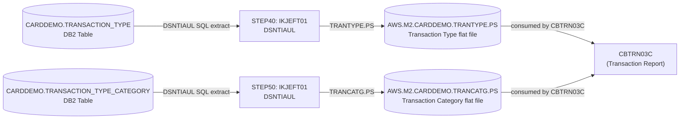

| Step   | Program  | Input DD                                          | Output DD                              | Condition   |
| ------ | -------- | ------------------------------------------------- | -------------------------------------- | ----------- |
| STEP10 | IEBGENER | TRANTYPE.PS (current)                             | TRANTYPE.BKUP(+1) GDG                  | None        |
| STEP20 | IEBGENER | TRANCATG.PS (current)                             | TRANCATG.PS.BKUP(+1) GDG              | COND=(0,NE) |
| STEP30 | IEFBR14  | --                                                | Delete TRANTYPE.PS, TRANCATG.PS        | COND=(0,NE) |
| STEP40 | IKJEFT01 (DSNTIAUL) | DB2 CARDDEMO.TRANSACTION_TYPE        | SYSREC00 (TRANTYPE.PS)                 | COND=(0,NE) |
| STEP50 | IKJEFT01 (DSNTIAUL) | DB2 CARDDEMO.TRANSACTION_TYPE_CATEGORY | SYSREC00 (TRANCATG.PS)               | COND=(4,LT) |

---

### CREADB21 (Extension: Transaction Type DB2 Module)

DB2 DDL job: creates the CARDDEMO database in DB2 subsystem DAZ1, defines transaction type tables, and loads initial reference data. This is a one-time setup job (TYPRUN=SCAN prevents automatic execution).

| Step    | Program  | Purpose                                                  | Condition   |
| ------- | -------- | -------------------------------------------------------- | ----------- |
| FREEPLN | IKJEFT01 | Free existing DB2 plans/packages (RC 8 if not existing) | None        |
| CRCRDDB | IKJEFT01 (DSNTIAD) | Execute DB2CREAT DDL to create database/tables | None      |
| LDTTYPE | IEFBR14  | Placeholder (no-op)                                      | COND=(0,NE) |
| RUNTEP2 | IKJEFT01 (DSNTEP4) | Load TRANSACTION_TYPE table from CNTL(DB2LTTYP) | None      |
| LDTCCAT | IKJEFT01 (DSNTEP4) | Load TRANSACTION_TYPE_CATEGORY from CNTL(DB2LTCAT) | COND=(0,NE) |

---

### Infrastructure / Setup JCL Jobs (Single-Step, IDCAMS)

These jobs define GDG base entries and VSAM clusters. They are prerequisites for the production jobs above.

| Job Name | Program | Purpose |
| -------- | ------- | ------- |
| DALYREJS | IDCAMS  | Define GDG base for DALYREJS (reject file, limit=5) |
| REPTFILE | IDCAMS  | Define GDG base for TRANREPT report file (limit=10) |
| DEFGDGB  | IDCAMS  | Define GDG bases for transaction GDGs |
| DEFGDGD  | IDCAMS  | Define GDG bases for data GDGs |
| ACCTFILE | IDCAMS  | Define/load ACCTDATA VSAM KSDS |
| CARDFILE | IDCAMS  | Define/load CARDDATA VSAM KSDS |
| CUSTFILE | IDCAMS  | Define/load CUSTDATA VSAM KSDS |
| XREFFILE | IDCAMS  | Define/load CARDXREF VSAM KSDS |
| TRANFILE | IDCAMS  | Define/load TRANSACT VSAM KSDS |
| TRANIDX  | IDCAMS  | Define AIX on TRANSACT VSAM |
| TRANTYPE | IDCAMS  | Define/load TRANTYPE VSAM |
| TRANCATG | IDCAMS  | Define/load TRANCATG VSAM |
| TCATBALF | IDCAMS  | Define/load TCATBALF VSAM KSDS |
| DISCGRP  | IDCAMS  | Define/load DISCGRP VSAM KSDS |
| OPENFIL  | IDCAMS  | Open VSAM files for CICS |
| CLOSEFIL | IDCAMS  | Close VSAM files for CICS |
| ESDSRRDS | IDCAMS  | ESDS to RRDS conversion utility |
| DEFCUST  | IDCAMS  | Define customer VSAM cluster |
| DUSRSECJ | IDCAMS  | Define/load USRSEC VSAM (user security file) |

## Step Dependencies

| Job Name  | Step    | Depends On         | Via Dataset                          | Dependency Type     |
| --------- | ------- | ------------------ | ------------------------------------ | ------------------- |
| COMBTRAN  | STEP10  | STEP05R            | TRANSACT.COMBINED(+1)                | Output-to-Input     |
| TRANREPT  | STEP05R (SORT) | STEP05R (REPROC) | TRANSACT.BKUP(+1)                | Output-to-Input     |
| TRANREPT  | STEP10R | STEP05R (SORT)     | TRANSACT.DALY(+1)                    | Output-to-Input     |
| TRANBKP   | STEP05  | STEP05R            | TRANSACT.BKUP(+1)                    | Output-to-Input     |
| TRANBKP   | STEP10  | STEP05             | DELETE of TRANSACT.VSAM.KSDS         | COND=(4,LT)         |
| CBEXPORT  | STEP02  | STEP01             | EXPORT.DATA VSAM cluster             | Output-to-Input     |
| COMBTRAN  | STEP05R | INTCALC/STEP15     | SYSTRAN(0)                           | Cross-job pipeline  |
| COMBTRAN  | STEP05R | TRANBKP/STEP05R    | TRANSACT.BKUP(0)                     | Cross-job pipeline  |
| POSTTRAN  | STEP15  | Daily file landing | DALYTRAN PS                          | Cross-job pipeline  |
| INTCALC   | STEP15  | POSTTRAN/STEP15    | TCATBALF VSAM (updated by CBTRN02C)  | Cross-job pipeline  |
| CREASTMT  | STEP020 | STEP010            | TRXFL.SEQ                            | Output-to-Input     |
| CREASTMT  | STEP030 | STEP020            | TRXFL.VSAM.KSDS (COND=(0,NE))        | Output-to-Input     |
| CREASTMT  | STEP040 | STEP030            | TRXFL.VSAM.KSDS (COND=(0,NE))        | Output-to-Input     |
| CREASTMT  | STEP040 | POSTTRAN / INTCALC | TRANSACT.VSAM.KSDS (source for sort) | Cross-job pipeline  |
| PRTCATBL  | STEP10R | STEP05R            | TCATBALF.BKUP(+1)                    | Output-to-Input     |
| TRANEXTR  | STEP20  | STEP10             | TRANCATG.PS (prior version backup)   | Output-to-Input     |
| TRANEXTR  | STEP30  | STEP20             | IEFBR14 delete (COND=(0,NE))         | COND=              |
| TRANEXTR  | STEP40  | STEP30             | TRANTYPE.PS (extracted from DB2)     | Output-to-Input     |
| TRANEXTR  | STEP50  | STEP40             | TRANCATG.PS (COND=(4,LT))            | COND=              |
| TRANREPT  | STEP10R | TRANEXTR/STEP40    | TRANTYPE.PS (via VSAM TRANTYPE)      | Cross-job pipeline  |

## Conditional Execution

| Job Name  | Step    | Condition       | Effect                                          |
| --------- | ------- | --------------- | ----------------------------------------------- |
| TRANBKP   | STEP10  | COND=(4,LT)     | Skip DEFINE of TRANSACT VSAM if prior step RC >= 4 (DELETE failed badly) |
| CREASTMT  | STEP020 | COND=(0,NE)     | Skip IDCAMS REPRO if SORT step RC != 0          |
| CREASTMT  | STEP030 | COND=(0,NE)     | Skip prior-output delete if REPRO step RC != 0  |
| CREASTMT  | STEP040 | COND=(0,NE)     | Skip CBSTM03A if any prior step RC != 0         |
| TRANEXTR  | STEP20  | COND=(0,NE)     | Skip TRANCATG backup if TRANTYPE backup failed  |
| TRANEXTR  | STEP30  | COND=(0,NE)     | Skip delete of PS files if backup step failed   |
| TRANEXTR  | STEP40  | COND=(0,NE)     | Skip DB2 extract if delete step failed          |
| TRANEXTR  | STEP50  | COND=(4,LT)     | Skip TRANCATG extract if prior step RC >= 4     |
| CREADB21  | LDTTYPE | COND=(0,NE)     | Skip placeholder if DDL creation failed         |
| CREADB21  | LDTCCAT | COND=(0,NE)     | Skip category load if transaction type load failed |
