# Data Flows

Producer-consumer relationships between programs, tracing how data moves through files and queues in the CardDemo application.

## Data Flow Diagram

```mermaid
graph TD
    %% ---- VSAM Master Files (shared by online and batch) ----
    ACCTDAT[("ACCTDAT\nAccount Master KSDS")]
    CUSTDAT[("CUSTDAT\nCustomer Master KSDS")]
    CARDDAT[("CARDDAT\nCard Master KSDS")]
    CARDXREF[("CARDXREF\nCard-Account XREF KSDS")]
    TRANSACT[("TRANSACT\nTransaction Master KSDS")]
    TCATBALF[("TCATBALF\nTxn Category Balance KSDS")]
    USRSEC[("USRSEC\nUser Security KSDS")]
    DISCGRP[("DISCGRP\nDiscount Group KSDS")]
    TRANTYPE[("TRANTYPE\nTransaction Type KSDS")]
    TRANCATG[("TRANCATG\nTransaction Category KSDS")]

    %% ---- Flat / GDG Files ----
    DALYTRAN[("DALYTRAN\nDaily Transaction PS")]
    DALYREJS[("DALYREJS GDG\nReject Records")]
    TRANREPT[("TRANREPT GDG\nTransaction Report")]
    SYSTRAN[("SYSTRAN GDG\nSystem Transactions")]
    TRANSBKP[("TRANSACT.BKUP GDG\nTransaction Backup")]
    EXPFILE[("EXPORT.DATA\nMigration Export VSAM")]
    TRXFLVSAM[("TRXFL.VSAM.KSDS\nCard-keyed Txn KSDS\n(CREASTMT work file)")]
    STMTPS[("STATEMNT.PS\nPlain Text Statements")]
    STMTHTML[("STATEMNT.HTML\nHTML Statements")]
    TRANTYPEPS[("TRANTYPE.PS\nTxn Type Flat File\n(DB2 extract)")]
    TRANCATGPS[("TRANCATG.PS\nTxn Category Flat File\n(DB2 extract)")]

    %% ---- DB2 Tables (extension: app-transaction-type-db2) ----
    DB2TT[("CARDDEMO.TRANSACTION_TYPE\nDB2 Table")]
    DB2TC[("CARDDEMO.TRANSACTION_TYPE_CATEGORY\nDB2 Table")]

    %% ---- IMS Database (extension: app-authorization-ims-db2-mq) ----
    IMSPAUTHDB[("OEM.IMS.IMSP.PAUTHDB\nIMS Pending Auth DB")]

    %% ---- MQ Queues (extension: app-vsam-mq) ----
    MQREQUEST[("CARDDEMO.REQUEST.QUEUE\nMQ Input Queue")]
    MQREPLYACCT[("CARD.DEMO.REPLY.ACCT\nMQ Reply Queue (account)")]
    MQREPLYDATE[("CARD.DEMO.REPLY.DATE\nMQ Reply Queue (date)")]
    MQERROR[("CARD.DEMO.ERROR\nMQ Error Queue")]

    %% ---- Online programs (CICS) ----
    COSGN00C["COSGN00C\n(Signon)"]
    COACTVWC["COACTVWC\n(Account View)"]
    COACTUPC["COACTUPC\n(Account Update)"]
    COCRDUPC["COCRDUPC\n(Card Update)"]
    COCRDLIC["COCRDLIC\n(Card List)"]
    COCRDSLC["COCRDSLC\n(Card Detail)"]
    COTRN00C["COTRN00C\n(Txn List)"]
    COTRN01C["COTRN01C\n(Txn View)"]
    COTRN02C["COTRN02C\n(Txn Add)"]
    COBIL00C["COBIL00C\n(Bill Payment)"]
    CORPT00C["CORPT00C\n(Reports)"]
    COUSR00C["COUSR00C\n(User List)"]
    COUSR01C["COUSR01C\n(User Add)"]
    COUSR02C["COUSR02C\n(User Update)"]
    COUSR03C["COUSR03C\n(User Delete)"]
    COTRTLIC["COTRTLIC\n(TranType List - Db2)\n[ext db2 module]"]
    COTRTUPC["COTRTUPC\n(TranType Update - Db2)\n[ext db2 module]"]
    COPAUS0C["COPAUS0C\n(Pending Auth Summary)\n[ext auth module]"]
    COPAUS1C["COPAUS1C\n(Pending Auth Detail)\n[ext auth module]"]
    COACCT01["COACCT01\n(Account Inquiry via MQ - CDRA)\n[ext vsam-mq module]"]
    CODATE01["CODATE01\n(Date Inquiry via MQ - CDRD)\n[ext vsam-mq module]"]

    %% ---- Batch programs ----
    CBTRN01C["CBTRN01C\n(Daily Txn Validate)"]
    CBTRN02C["CBTRN02C\n(Post Transactions)"]
    CBACT04C["CBACT04C\n(Interest Calc)"]
    CBTRN03C["CBTRN03C\n(Transaction Report)"]
    CBSTM03A["CBSTM03A\n(Statement Print)"]
    CBSTM03B["CBSTM03B\n(File I/O Sub)"]
    CBEXPORT["CBEXPORT\n(Export)"]
    CBIMPORT["CBIMPORT\n(Import)"]
    CBPAUP0C["CBPAUP0C\n(IMS Purge Auth)\n[ext auth module]"]
    COBTUPDT["COBTUPDT\n(DB2 TranType Maint)\n[ext db2 module]"]
    TRANEXTR["TRANEXTR\n(DB2 TranType Extract)\n[ext db2 module]"]

    %% ---- USRSEC flows ----
    COSGN00C -->|"reads (login)"| USRSEC
    COUSR00C -->|"reads"| USRSEC
    COUSR01C -->|"writes"| USRSEC
    COUSR02C -->|"updates"| USRSEC
    COUSR03C -->|"deletes"| USRSEC

    %% ---- ACCTDAT flows ----
    COACTVWC -->|"reads"| ACCTDAT
    COACTUPC -->|"reads/updates"| ACCTDAT
    COBIL00C -->|"reads/updates"| ACCTDAT
    COTRN02C -->|"reads"| ACCTDAT
    CBTRN01C -->|"reads"| ACCTDAT
    CBTRN02C -->|"reads/updates"| ACCTDAT
    CBACT04C -->|"reads/updates"| ACCTDAT
    CBEXPORT -->|"reads"| ACCTDAT
    CBSTM03B -->|"reads (via CBSTM03A)"| ACCTDAT
    COPAUS0C -->|"reads"| ACCTDAT
    COPAUS1C -->|"reads"| ACCTDAT
    COACCT01 -->|"reads (EXEC CICS READ)"| ACCTDAT

    %% ---- CUSTDAT flows ----
    COACTVWC -->|"reads"| CUSTDAT
    COACTUPC -->|"reads/updates"| CUSTDAT
    CBTRN01C -->|"reads"| CUSTDAT
    CBEXPORT -->|"reads"| CUSTDAT
    CBSTM03B -->|"reads (via CBSTM03A)"| CUSTDAT
    COPAUS0C -->|"reads"| CUSTDAT

    %% ---- CARDDAT flows ----
    COCRDSLC -->|"reads"| CARDDAT
    COCRDUPC -->|"reads/updates"| CARDDAT
    CBTRN01C -->|"reads"| CARDDAT
    CBEXPORT -->|"reads"| CARDDAT
    COPAUS0C -->|"reads"| CARDDAT

    %% ---- CARDXREF flows ----
    COACTVWC -->|"reads (CXACAIX)"| CARDXREF
    COACTUPC -->|"reads (CXACAIX)"| CARDXREF
    COCRDLIC -->|"reads (CARDAIX)"| CARDXREF
    COBIL00C -->|"reads (CXACAIX)"| CARDXREF
    COTRN02C -->|"reads (CXACAIX)"| CARDXREF
    CBTRN01C -->|"reads"| CARDXREF
    CBTRN02C -->|"reads"| CARDXREF
    CBACT04C -->|"reads"| CARDXREF
    CBTRN03C -->|"reads"| CARDXREF
    CBEXPORT -->|"reads"| CARDXREF
    CBSTM03B -->|"reads (via CBSTM03A)"| CARDXREF

    %% ---- TRANSACT flows ----
    COTRN00C -->|"reads (browse)"| TRANSACT
    COTRN01C -->|"reads"| TRANSACT
    COTRN02C -->|"writes"| TRANSACT
    COBIL00C -->|"writes"| TRANSACT
    CORPT00C -->|"reads"| TRANSACT
    CBTRN01C -->|"reads"| TRANSACT
    CBTRN02C -->|"reads/writes"| TRANSACT
    CBEXPORT -->|"reads"| TRANSACT

    %% ---- TRXFL.VSAM.KSDS flows (CREASTMT work) ----
    TRANSACT -->|"SORT + REPRO"| TRXFLVSAM
    CBSTM03B -->|"reads (via CBSTM03A)"| TRXFLVSAM
    CBSTM03A -->|"writes"| STMTPS
    CBSTM03A -->|"writes"| STMTHTML

    %% ---- TCATBALF flows ----
    CBTRN02C -->|"updates"| TCATBALF
    CBACT04C -->|"reads"| TCATBALF

    %% ---- Daily transaction pipeline ----
    DALYTRAN -->|"input"| CBTRN01C
    DALYTRAN -->|"input"| CBTRN02C
    CBTRN02C -->|"rejects"| DALYREJS

    %% ---- Interest/system transactions ----
    CBACT04C -->|"writes"| SYSTRAN

    %% ---- Report pipeline ----
    TRANSACT -->|"unload"| TRANSBKP
    CBTRN03C -->|"writes"| TRANREPT

    %% ---- Migration ----
    CBEXPORT -->|"writes"| EXPFILE
    EXPFILE -->|"reads"| CBIMPORT

    %% ---- DB2 extension flows ----
    COBTUPDT -->|"INSERT/UPDATE/DELETE"| DB2TT
    COTRTLIC -->|"SELECT"| DB2TT
    COTRTUPC -->|"UPDATE"| DB2TT
    TRANEXTR -->|"DSNTIAUL SELECT"| DB2TT
    TRANEXTR -->|"DSNTIAUL SELECT"| DB2TC
    TRANEXTR -->|"writes"| TRANTYPEPS
    TRANEXTR -->|"writes"| TRANCATGPS
    TRANTYPEPS -->|"loaded to VSAM TRANTYPE"| TRANTYPE
    TRANCATGPS -->|"loaded to VSAM TRANCATG"| TRANCATG
    CBTRN03C -->|"reads"| TRANTYPE
    CBTRN03C -->|"reads"| TRANCATG

    %% ---- IMS auth module flows ----
    CBPAUP0C -->|"deletes expired"| IMSPAUTHDB
    COPAUS0C -->|"reads"| IMSPAUTHDB
    COPAUS1C -->|"reads"| IMSPAUTHDB

    %% ---- VSAM-MQ module flows ----
    MQREQUEST -->|"MQGET (account inquiry)"| COACCT01
    COACCT01 -->|"MQPUT (account data)"| MQREPLYACCT
    COACCT01 -->|"MQPUT (errors)"| MQERROR
    MQREQUEST -->|"MQGET (date inquiry)"| CODATE01
    CODATE01 -->|"MQPUT (date/time)"| MQREPLYDATE
    CODATE01 -->|"MQPUT (errors)"| MQERROR
```

## File Data Flows

| File / Dataset                  | Producers (Write)               | Consumers (Read)                                                              | Flow Pattern        |
| -------------------------------- | -------------------------------- | ----------------------------------------------------------------------------- | ------------------- |
| ACCTDAT (ACCTDATA.VSAM.KSDS)    | COACTUPC, COBIL00C, CBTRN02C, CBACT04C | COACTVWC, COACTUPC, COBIL00C, COTRN02C, CBTRN01C, CBTRN02C, CBACT04C, CBEXPORT, CBSTM03B, COPAUS0C, COPAUS1C, COACCT01 | Fan-in / Round-trip |
| CUSTDAT (CUSTDATA.VSAM.KSDS)    | COACTUPC                         | COACTVWC, COACTUPC, CBTRN01C, CBEXPORT, CBSTM03B, COPAUS0C                   | Round-trip          |
| CARDDAT (CARDDATA.VSAM.KSDS)    | COCRDUPC                         | COCRDSLC, COCRDUPC, CBTRN01C, CBEXPORT, COPAUS0C                             | Round-trip          |
| CARDXREF (CARDXREF.VSAM.KSDS)   | (pre-loaded via JCL)             | COACTVWC, COACTUPC, COCRDLIC, COBIL00C, COTRN02C, CBTRN01C, CBTRN02C, CBACT04C, CBTRN03C, CBEXPORT, CBSTM03B | Fan-in |
| TRANSACT (TRANSACT.VSAM.KSDS)   | COTRN02C, COBIL00C, CBTRN02C     | COTRN00C, COTRN01C, CORPT00C, CBTRN01C, CBTRN02C, CBTRN03C, CBEXPORT, CREASTMT SORT step | Fan-in / Round-trip |
| TCATBALF (TCATBALF.VSAM.KSDS)   | CBTRN02C                         | CBACT04C, PRTCATBL REPROC step                                                | Pipeline            |
| USRSEC (USRSEC VSAM KSDS)       | COUSR01C, COUSR02C               | COSGN00C, COUSR00C, COUSR03C                                                  | Fan-in              |
| DISCGRP (DISCGRP.VSAM.KSDS)     | (pre-loaded via JCL)             | CBACT04C                                                                      | Fan-in              |
| TRANTYPE (TRANTYPE.VSAM.KSDS)   | (pre-loaded via JCL; refreshed by TRANEXTR via TRANTYPE.PS) | CBTRN03C                       | Pipeline            |
| TRANCATG (TRANCATG.VSAM.KSDS)   | (pre-loaded via JCL; refreshed by TRANEXTR via TRANCATG.PS) | CBTRN03C                       | Pipeline            |
| DALYTRAN (CARDDEMO.DALYTRAN.PS) | (external feed / prior job)      | CBTRN01C, CBTRN02C                                                            | Fan-in              |
| DALYREJS GDG                    | CBTRN02C                         | (downstream error processing)                                                 | Pipeline            |
| SYSTRAN GDG                     | CBACT04C                         | COMBTRAN SORT step                                                            | Pipeline            |
| TRANSACT.BKUP GDG               | TRANBKP REPROC, TRANREPT REPROC  | COMBTRAN SORT step, TRANREPT SORT step                                        | Pipeline            |
| TRANSACT.COMBINED GDG           | COMBTRAN SORT step               | COMBTRAN IDCAMS REPRO step                                                    | Pipeline            |
| TRANSACT.DALY GDG               | TRANREPT SORT step               | CBTRN03C                                                                      | Pipeline            |
| TRANREPT GDG                    | CBTRN03C                         | (print/archive)                                                               | Fan-out             |
| TRXFL.VSAM.KSDS                 | CREASTMT SORT+REPRO steps        | CBSTM03B (via CBSTM03A STEP040)                                               | Pipeline            |
| STATEMNT.PS                     | CBSTM03A                         | (print/archive)                                                               | Pipeline            |
| STATEMNT.HTML                   | CBSTM03A                         | (web/archive)                                                                 | Pipeline            |
| TCATBALF.BKUP GDG               | PRTCATBL REPROC step             | PRTCATBL SORT step                                                            | Pipeline            |
| TCATBALF.REPT                   | PRTCATBL SORT step               | (print/archive)                                                               | Pipeline            |
| ACCTDATA.PSCOMP (PS)            | CBACT01C (READACCT)              | (diagnostic / downstream)                                                    | Pipeline            |
| ACCTDATA.ARRYPS (PS)            | CBACT01C (READACCT)              | (diagnostic / downstream)                                                    | Pipeline            |
| ACCTDATA.VBPS (VB PS)           | CBACT01C (READACCT)              | (diagnostic / downstream)                                                    | Pipeline            |
| EXPORT.DATA (VSAM)              | CBEXPORT                         | CBIMPORT                                                                      | Pipeline            |
| CUSTDATA.IMPORT (PS)            | CBIMPORT                         | (target system load)                                                          | Pipeline            |
| ACCTDATA.IMPORT (PS)            | CBIMPORT                         | (target system load)                                                          | Pipeline            |
| CARDXREF.IMPORT (PS)            | CBIMPORT                         | (target system load)                                                          | Pipeline            |
| TRANSACT.IMPORT (PS)            | CBIMPORT                         | (target system load)                                                          | Pipeline            |
| IMPORT.ERRORS (PS)              | CBIMPORT                         | (error review)                                                                | Fan-out             |
| TRANTYPE.PS                     | TRANEXTR (DSNTIAUL from DB2)     | Loaded to TRANTYPE VSAM for CBTRN03C                                          | Pipeline            |
| TRANCATG.PS                     | TRANEXTR (DSNTIAUL from DB2)     | Loaded to TRANCATG VSAM for CBTRN03C                                          | Pipeline            |
| AWS.M2.CARDDEMO.IMSDATA.DBPAUTP0 (VB PS) | DBPAUTP0 (IMS unload) | (backup / migration)                                                   | Pipeline            |

## Database Data Flows

The base CardDemo application uses VSAM files exclusively. Optional extension modules add DB2 and IMS database access.

### DB2 Extension (app-transaction-type-db2)

| Table / Segment | Writers (INSERT/UPDATE/DELETE) | Readers (SELECT) | Flow Pattern |
| --------------- | ------------------------------ | ---------------- | ------------ |
| CARDDEMO.TRANSACTION_TYPE | COBTUPDT (batch DML via MNTTRDB2 JCL) | COTRTLIC (CICS list screen), COTRTUPC (CICS update screen), TRANEXTR (DSNTIAUL export to TRANTYPE.PS) | Shared read + batch write |
| CARDDEMO.TRANSACTION_TYPE_CATEGORY | (populated by CREADB21 DDL load) | TRANEXTR (DSNTIAUL export to TRANCATG.PS) | Pipeline |

### IMS Database Extension (app-authorization-ims-db2-mq)

| Table / Segment | Writers (INSERT/UPDATE/DELETE) | Readers (SELECT/GET) | Flow Pattern |
| --------------- | ------------------------------ | -------------------- | ------------ |
| IMS DBPAUTP0 (Pending Auth DB) | CBPAUP0C (IMS BMP batch purge via CBPAUP0J JCL); COPAUA0C (authorization event processor writes pending auth records) | COPAUS0C (summary list), COPAUS1C (detail view), DBPAUTP0 job (unload) | Round-trip / Fan-in |

## Messaging Data Flows

| Queue / Topic     | Producers (PUT)  | Consumers (GET)         | Message Format        |
| ----------------- | ---------------- | ----------------------- | --------------------- |
| Extra-partition TDQ (JES internal reader) | CORPT00C | JES (batch job submission) | JCL records (80-byte, PIC X(80)) |
| MQ Authorization Queue (ext auth module) | External authorization system | COPAUA0C (event processor) | Authorization event record (pending auth module layout) |
| CARDDEMO.REQUEST.QUEUE (ext vsam-mq module) | External client / requester | COACCT01 (INQA function, account lookup), CODATE01 (date inquiry) | Request message: WS-FUNC (4 bytes) + WS-KEY (11-digit account ID) + filler (985 bytes); 1000-byte fixed |
| CARD.DEMO.REPLY.ACCT (ext vsam-mq module) | COACCT01 (account inquiry reply) | External client / requester | Account details response: account ID, status, current balance, credit limit, cash credit limit, open/expiry/reissue dates, current cycle credit/debit, group ID; formatted as WS-ACCT-RESPONSE (1000-byte buffer) |
| CARD.DEMO.REPLY.DATE (ext vsam-mq module) | CODATE01 (date inquiry reply) | External client / requester | Date/time response: 'SYSTEM DATE : MM-DD-YYYY SYSTEM TIME : HH:MM:SS' (1000-byte buffer) |
| CARD.DEMO.ERROR (ext vsam-mq module) | COACCT01, CODATE01 (error handler paragraphs) | External monitoring / error handling | MQ-ERR-DISPLAY: error paragraph (25 bytes), return message (25 bytes), condition code (2 digits), reason code (5 digits), queue name (48 bytes) |

## Data Transformation Chains

### Daily Transaction Posting Chain

| Chain Name        | Step | Program  | Input                       | Output                          | Transformation                              |
| ----------------- | ---- | -------- | --------------------------- | ------------------------------- | ------------------------------------------- |
| Daily Txn Post    | 1    | CBTRN02C | DALYTRAN (sequential PS)    | TRANSACT VSAM + TCATBALF VSAM + DALYREJS GDG | Validate, cross-ref cards, post to VSAM master, accumulate category balances, write rejects |

### Interest Calculation Chain

| Chain Name        | Step | Program  | Input                       | Output               | Transformation                               |
| ----------------- | ---- | -------- | --------------------------- | -------------------- | -------------------------------------------- |
| Interest Calc     | 1    | CBACT04C | TCATBALF, XREFFILE, ACCTFILE, DISCGRP | SYSTRAN GDG + ACCTFILE updates | Read category balances, look up discount group rates, compute interest/fees, write system transactions, update account balances |

### Transaction Combination and Report Chain

| Chain Name        | Step | Program    | Input                        | Output                     | Transformation                             |
| ----------------- | ---- | ---------- | ---------------------------- | -------------------------- | ------------------------------------------ |
| Txn Combine/Report | 1   | SORT       | TRANSACT.BKUP(0) + SYSTRAN(0) | TRANSACT.COMBINED(+1)      | Merge and sort by transaction ID           |
| Txn Combine/Report | 2   | IDCAMS REPRO | TRANSACT.COMBINED(+1)      | TRANSACT.VSAM.KSDS         | Load combined sorted file back to KSDS     |
| Txn Combine/Report | 3   | REPROC proc | TRANSACT.VSAM.KSDS          | TRANSACT.BKUP(+1)          | Unload VSAM to sequential backup           |
| Txn Combine/Report | 4   | SORT       | TRANSACT.BKUP(+1)            | TRANSACT.DALY(+1)          | Filter by date range, sort by card number  |
| Txn Combine/Report | 5   | CBTRN03C   | TRANSACT.DALY(+1), CARDXREF, TRANTYPE, TRANCATG, DATEPARM | TRANREPT(+1) | Format and print transaction detail report |

### Account Statement Generation Chain

| Chain Name       | Step | Program    | Input                                              | Output                     | Transformation                                          |
| ---------------- | ---- | ---------- | -------------------------------------------------- | -------------------------- | ------------------------------------------------------- |
| Statement Create | 1    | SORT       | TRANSACT.VSAM.KSDS                                 | TRXFL.SEQ                  | Re-sort transactions by card number + transaction ID    |
| Statement Create | 2    | IDCAMS REPRO | TRXFL.SEQ                                        | TRXFL.VSAM.KSDS            | Load card-keyed sequential file into temporary KSDS     |
| Statement Create | 3    | CBSTM03A (calls CBSTM03B) | TRXFL.VSAM.KSDS, CARDXREF, ACCTFILE, CUSTFILE | STATEMNT.PS + STATEMNT.HTML | For each card in XREF: fetch account and customer details, enumerate transactions, format plain text and HTML statement |

### Data Migration Export Chain

| Chain Name   | Step | Program  | Input                                              | Output              | Transformation                                                  |
| ------------ | ---- | -------- | -------------------------------------------------- | ------------------- | --------------------------------------------------------------- |
| Export/Import | 1   | CBEXPORT | CUSTFILE, ACCTFILE, XREFFILE, TRANSACT, CARDFILE   | EXPORT.DATA VSAM    | Read normalized VSAM files; write multi-record VSAM with record-type prefixes |
| Export/Import | 2   | CBIMPORT | EXPORT.DATA VSAM                                   | CUSTOUT, ACCTOUT, XREFOUT, TRNXOUT, ERROUT | Parse multi-record layout; split into normalized sequential files; validate checksums |

### Transaction Type Reference Data Chain (DB2 Extension)

| Chain Name   | Step | Program   | Input                                  | Output                          | Transformation                                          |
| ------------ | ---- | --------- | -------------------------------------- | ------------------------------- | ------------------------------------------------------- |
| TranType Sync | 1   | COBTUPDT  | INPFILE (sequential A/D/U records)    | CARDDEMO.TRANSACTION_TYPE (DB2) | Batch maintenance: insert, update, delete transaction type rows in DB2 |
| TranType Sync | 2   | TRANEXTR  | CARDDEMO.TRANSACTION_TYPE (DB2)       | TRANTYPE.PS                     | DSNTIAUL unload: extract rows to sequential flat file   |
| TranType Sync | 3   | TRANEXTR  | CARDDEMO.TRANSACTION_TYPE_CATEGORY (DB2) | TRANCATG.PS                  | DSNTIAUL unload: extract rows to sequential flat file   |
| TranType Sync | 4   | (JCL load) | TRANTYPE.PS                          | TRANTYPE VSAM KSDS              | IDCAMS REPRO or batch load to VSAM for online/batch use |
| TranType Sync | 5   | CBTRN03C  | TRANTYPE VSAM, TRANCATG VSAM           | TRANREPT(+1)                    | Read reference data for transaction type descriptions in report |

### Authorization Purge Chain (IMS Extension)

| Chain Name   | Step | Program   | Input                        | Output                          | Transformation                                          |
| ------------ | ---- | --------- | ---------------------------- | ------------------------------- | ------------------------------------------------------- |
| Auth Purge   | 1    | CBPAUP0C  | IMS DB DBPAUTP0 (PSBPAUTB)  | IMS DB DBPAUTP0 (updated)       | Scan all pending authorization segments; delete those older than expiry threshold (WS-EXPIRY-DAYS) |

### MQ Account Inquiry Chain (VSAM-MQ Extension)

| Chain Name     | Step | Program  | Input                              | Output                          | Transformation                                                    |
| -------------- | ---- | -------- | ---------------------------------- | ------------------------------- | ----------------------------------------------------------------- |
| MQ Acct Inquiry | 1   | External  | Account ID                         | CARDDEMO.REQUEST.QUEUE          | Client builds INQA + account ID request message and PUTs to MQ   |
| MQ Acct Inquiry | 2   | COACCT01 | CARDDEMO.REQUEST.QUEUE (MQGET)     | ACCTDAT VSAM read               | Retrieve message, extract account ID from WS-KEY, perform EXEC CICS READ on ACCTDAT |
| MQ Acct Inquiry | 3   | COACCT01 | ACCTDAT VSAM record (ACCOUNT-RECORD) | CARD.DEMO.REPLY.ACCT (MQPUT) | Format account details into WS-ACCT-RESPONSE buffer and PUT to reply queue |

### MQ Date Inquiry Chain (VSAM-MQ Extension)

| Chain Name    | Step | Program  | Input                              | Output                          | Transformation                                                    |
| ------------- | ---- | -------- | ---------------------------------- | ------------------------------- | ----------------------------------------------------------------- |
| MQ Date Inquiry | 1  | External  | (any request)                      | CARDDEMO.REQUEST.QUEUE          | Client PUTs any request to MQ queue triggering CDRD transaction   |
| MQ Date Inquiry | 2  | CODATE01 | CARDDEMO.REQUEST.QUEUE (MQGET)     | CICS ASKTIME / FORMATTIME       | Retrieve message, invoke EXEC CICS ASKTIME and FORMATTIME to get system date/time |
| MQ Date Inquiry | 3  | CODATE01 | System date/time (WS-MMDDYYYY, WS-TIME) | CARD.DEMO.REPLY.DATE (MQPUT) | Format date+time string into REPLY-MESSAGE buffer and PUT to reply queue |
