# Program Call Graph

Topology of CALL, PERFORM, and CICS LINK/XCTL relationships between programs in the CardDemo application.

## Call Graph

```mermaid
graph TD
    COSGN00C["COSGN00C\n(Signon - CC00)"]
    COADM01C["COADM01C\n(Admin Menu - CA00)"]
    COMEN01C["COMEN01C\n(Main Menu - CM00)"]
    COACTVWC["COACTVWC\n(Account View - CAVW)"]
    COACTUPC["COACTUPC\n(Account Update)"]
    COCRDLIC["COCRDLIC\n(Card List - CCLI)"]
    COCRDSLC["COCRDSLC\n(Card Detail - CCDL)"]
    COCRDUPC["COCRDUPC\n(Card Update - CCUP)"]
    COTRN00C["COTRN00C\n(Txn List - CT00)"]
    COTRN01C["COTRN01C\n(Txn View)"]
    COTRN02C["COTRN02C\n(Txn Add - CT02)"]
    CORPT00C["CORPT00C\n(Reports - CR00)"]
    COBIL00C["COBIL00C\n(Bill Payment - CB00)"]
    COUSR00C["COUSR00C\n(User List)"]
    COUSR01C["COUSR01C\n(User Add)"]
    COUSR02C["COUSR02C\n(User Update)"]
    COUSR03C["COUSR03C\n(User Delete)"]
    COPAUS0C["COPAUS0C\n(Pending Auth Summary - CPVS)\n[ext: auth module]"]
    COPAUS1C["COPAUS1C\n(Pending Auth Detail)\n[ext: auth module]"]
    COPAUS2C["COPAUS2C\n(Pending Auth Fraud)\n[ext: auth module]"]
    COPAUA0C["COPAUA0C\n(Auth Processing)\n[ext: auth module]"]
    COTRTLIC["COTRTLIC\n(TranType List - Db2)\n[ext: db2 module]"]
    COTRTUPC["COTRTUPC\n(TranType Update - Db2)\n[ext: db2 module]"]
    COACCT01["COACCT01\n(Account Inquiry via MQ - CDRA)\n[ext: vsam-mq module]"]
    CODATE01["CODATE01\n(Date Inquiry via MQ - CDRD)\n[ext: vsam-mq module]"]
    CSUTLDTC["CSUTLDTC\n(Date Utility)"]
    COBSWAIT["COBSWAIT\n(Batch Wait)"]
    CBSTM03A["CBSTM03A\n(Statement Print)"]
    CBSTM03B["CBSTM03B\n(File I/O Subroutine)"]

    COSGN00C -->|"CICS XCTL (admin)"| COADM01C
    COSGN00C -->|"CICS XCTL (regular)"| COMEN01C

    COADM01C -->|"CICS XCTL (dynamic opt 1)"| COUSR00C
    COADM01C -->|"CICS XCTL (dynamic opt 2)"| COUSR01C
    COADM01C -->|"CICS XCTL (dynamic opt 3)"| COUSR02C
    COADM01C -->|"CICS XCTL (dynamic opt 4)"| COUSR03C
    COADM01C -->|"CICS XCTL (dynamic opt 5, Db2)"| COTRTLIC
    COADM01C -->|"CICS XCTL (dynamic opt 6, Db2)"| COTRTUPC
    COADM01C -->|"CICS XCTL (back)"| COSGN00C

    COMEN01C -->|"CICS XCTL (opt 1)"| COACTVWC
    COMEN01C -->|"CICS XCTL (opt 2)"| COACTUPC
    COMEN01C -->|"CICS XCTL (opt 3)"| COCRDLIC
    COMEN01C -->|"CICS XCTL (opt 4)"| COCRDSLC
    COMEN01C -->|"CICS XCTL (opt 5)"| COCRDUPC
    COMEN01C -->|"CICS XCTL (opt 6)"| COTRN00C
    COMEN01C -->|"CICS XCTL (opt 7)"| COTRN01C
    COMEN01C -->|"CICS XCTL (opt 8)"| COTRN02C
    COMEN01C -->|"CICS XCTL (opt 9)"| CORPT00C
    COMEN01C -->|"CICS XCTL (opt 10)"| COBIL00C
    COMEN01C -->|"CICS XCTL (opt 11, if installed)"| COPAUS0C
    COMEN01C -->|"CICS XCTL (back)"| COSGN00C

    COACTVWC -->|"CICS XCTL (back)"| COMEN01C
    COACTUPC -->|"CICS XCTL (back)"| COMEN01C

    COCRDLIC -->|"CICS XCTL (back)"| COMEN01C
    COCRDLIC -->|"CICS XCTL (view)"| COCRDSLC
    COCRDLIC -->|"CICS XCTL (update)"| COCRDUPC

    COCRDSLC -->|"CICS XCTL (back)"| COCRDLIC
    COCRDUPC -->|"CICS XCTL (back)"| COCRDLIC

    COTRN00C -->|"CICS XCTL (back)"| COMEN01C
    COTRN01C -->|"CICS XCTL (back)"| COMEN01C
    COTRN02C -->|"CICS XCTL (back)"| COMEN01C
    CORPT00C -->|"CICS XCTL (back)"| COMEN01C
    COBIL00C -->|"CICS XCTL (back)"| COMEN01C

    COUSR00C -->|"CICS XCTL (back)"| COADM01C
    COUSR01C -->|"CICS XCTL (back)"| COADM01C
    COUSR02C -->|"CICS XCTL (back)"| COADM01C
    COUSR03C -->|"CICS XCTL (back)"| COADM01C

    COTRTLIC -->|"CICS XCTL (back)"| COADM01C
    COTRTLIC -->|"CICS XCTL (PF2 add)"| COTRTUPC
    COTRTUPC -->|"CICS XCTL (back)"| COADM01C

    COPAUS0C -->|"CICS XCTL (detail)"| COPAUS1C
    COPAUS0C -->|"CICS XCTL (back)"| COMEN01C
    COPAUS1C -->|"CICS LINK (fraud)"| COPAUS2C
    COPAUS1C -->|"CICS XCTL (back)"| COPAUS0C

    CORPT00C -->|"CALL (static)"| CSUTLDTC
    COTRN02C -->|"CALL (static)"| CSUTLDTC
    CSUTLDTC -->|"CALL (static)"| CEEDAYS["CEEDAYS\n(LE Date API)"]

    CBSTM03A -->|"CALL (static, repeated)"| CBSTM03B
    CBSTM03A -->|"CALL (static)"| CEE3ABD["CEE3ABD\n(LE Abend Handler)"]

    COBSWAIT -->|"CALL (static)"| MVSWAIT["MVSWAIT\n(MVS Sleep)"]

    COACCT01 -->|"CALL (static, MQ)"| MQOPEN1["MQOPEN/MQGET/MQPUT/MQCLOSE\n(MQ API)"]
    CODATE01 -->|"CALL (static, MQ)"| MQOPEN2["MQOPEN/MQGET/MQPUT/MQCLOSE\n(MQ API)"]

    style COSGN00C fill:#4a90d9,color:#fff
    style COADM01C fill:#4a90d9,color:#fff
    style COMEN01C fill:#4a90d9,color:#fff
    style COACTVWC fill:#7ab648,color:#fff
    style COACTUPC fill:#7ab648,color:#fff
    style COCRDLIC fill:#7ab648,color:#fff
    style COCRDSLC fill:#7ab648,color:#fff
    style COCRDUPC fill:#7ab648,color:#fff
    style COTRN00C fill:#7ab648,color:#fff
    style COTRN01C fill:#7ab648,color:#fff
    style COTRN02C fill:#7ab648,color:#fff
    style CORPT00C fill:#7ab648,color:#fff
    style COBIL00C fill:#7ab648,color:#fff
    style COUSR00C fill:#7ab648,color:#fff
    style COUSR01C fill:#7ab648,color:#fff
    style COUSR02C fill:#7ab648,color:#fff
    style COUSR03C fill:#7ab648,color:#fff
    style COPAUS0C fill:#e67e22,color:#fff
    style COPAUS1C fill:#e67e22,color:#fff
    style COPAUS2C fill:#e67e22,color:#fff
    style COPAUA0C fill:#e67e22,color:#fff
    style COTRTLIC fill:#e67e22,color:#fff
    style COTRTUPC fill:#e67e22,color:#fff
    style COACCT01 fill:#16a085,color:#fff
    style CODATE01 fill:#16a085,color:#fff
    style CSUTLDTC fill:#f5a623,color:#fff
    style COBSWAIT fill:#f5a623,color:#fff
    style CBSTM03A fill:#9b59b6,color:#fff
    style CBSTM03B fill:#f5a623,color:#fff
    style CEEDAYS fill:#aaaaaa,color:#fff
    style CEE3ABD fill:#aaaaaa,color:#fff
    style MVSWAIT fill:#aaaaaa,color:#fff
    style MQOPEN1 fill:#aaaaaa,color:#fff
    style MQOPEN2 fill:#aaaaaa,color:#fff
```

## Call Matrix

| Caller     | Callee     | Call Type       | Linkage Items / Notes                              |
| ---------- | ---------- | --------------- | -------------------------------------------------- |
| COSGN00C   | COADM01C   | CICS XCTL       | CARDDEMO-COMMAREA (admin user path)                |
| COSGN00C   | COMEN01C   | CICS XCTL       | CARDDEMO-COMMAREA (regular user path)              |
| COADM01C   | COUSR00C   | CICS XCTL       | CARDDEMO-COMMAREA (menu opt 1 - dynamic via CDEMO-ADMIN-OPT-PGMNAME) |
| COADM01C   | COUSR01C   | CICS XCTL       | CARDDEMO-COMMAREA (menu opt 2)                     |
| COADM01C   | COUSR02C   | CICS XCTL       | CARDDEMO-COMMAREA (menu opt 3)                     |
| COADM01C   | COUSR03C   | CICS XCTL       | CARDDEMO-COMMAREA (menu opt 4)                     |
| COADM01C   | COTRTLIC   | CICS XCTL       | CARDDEMO-COMMAREA (menu opt 5 - Db2 TranType List; ext module) |
| COADM01C   | COTRTUPC   | CICS XCTL       | CARDDEMO-COMMAREA (menu opt 6 - Db2 TranType Update; ext module) |
| COADM01C   | COSGN00C   | CICS XCTL       | CARDDEMO-COMMAREA (PF3 back)                       |
| COMEN01C   | COACTVWC   | CICS XCTL       | CARDDEMO-COMMAREA (menu opt 1)                     |
| COMEN01C   | COACTUPC   | CICS XCTL       | CARDDEMO-COMMAREA (menu opt 2)                     |
| COMEN01C   | COCRDLIC   | CICS XCTL       | CARDDEMO-COMMAREA (menu opt 3)                     |
| COMEN01C   | COCRDSLC   | CICS XCTL       | CARDDEMO-COMMAREA (menu opt 4)                     |
| COMEN01C   | COCRDUPC   | CICS XCTL       | CARDDEMO-COMMAREA (menu opt 5)                     |
| COMEN01C   | COTRN00C   | CICS XCTL       | CARDDEMO-COMMAREA (menu opt 6)                     |
| COMEN01C   | COTRN01C   | CICS XCTL       | CARDDEMO-COMMAREA (menu opt 7)                     |
| COMEN01C   | COTRN02C   | CICS XCTL       | CARDDEMO-COMMAREA (menu opt 8)                     |
| COMEN01C   | CORPT00C   | CICS XCTL       | CARDDEMO-COMMAREA (menu opt 9)                     |
| COMEN01C   | COBIL00C   | CICS XCTL       | CARDDEMO-COMMAREA (menu opt 10)                    |
| COMEN01C   | COPAUS0C   | CICS XCTL       | CARDDEMO-COMMAREA (menu opt 11 - Pending Auth Summary; dispatched only if CICS INQUIRE returns NORMAL) |
| COMEN01C   | COSGN00C   | CICS XCTL       | CARDDEMO-COMMAREA (PF3 back)                       |
| COACTVWC   | COMEN01C   | CICS XCTL       | CARDDEMO-COMMAREA (PF3 back via CDEMO-TO-PROGRAM)  |
| COACTUPC   | COMEN01C   | CICS XCTL       | CARDDEMO-COMMAREA (PF3 back via CDEMO-TO-PROGRAM)  |
| COCRDLIC   | COMEN01C   | CICS XCTL       | CARDDEMO-COMMAREA (PF3 back via LIT-MENUPGM)       |
| COCRDLIC   | COCRDSLC   | CICS XCTL       | CARDDEMO-COMMAREA (S-select, CCARD-NEXT-PROG)      |
| COCRDLIC   | COCRDUPC   | CICS XCTL       | CARDDEMO-COMMAREA (U-update, CCARD-NEXT-PROG)      |
| COCRDSLC   | COCRDLIC   | CICS XCTL       | CARDDEMO-COMMAREA (PF3 back via CDEMO-TO-PROGRAM)  |
| COCRDUPC   | COCRDLIC   | CICS XCTL       | CARDDEMO-COMMAREA (PF3 back via CDEMO-TO-PROGRAM)  |
| COTRN00C   | COMEN01C   | CICS XCTL       | CARDDEMO-COMMAREA (PF3 back via CDEMO-TO-PROGRAM)  |
| COTRN01C   | COMEN01C   | CICS XCTL       | CARDDEMO-COMMAREA (PF3 back via CDEMO-TO-PROGRAM)  |
| COTRN02C   | COMEN01C   | CICS XCTL       | CARDDEMO-COMMAREA (PF3 back via CDEMO-TO-PROGRAM)  |
| CORPT00C   | COMEN01C   | CICS XCTL       | CARDDEMO-COMMAREA (PF3 back via CDEMO-TO-PROGRAM)  |
| COBIL00C   | COMEN01C   | CICS XCTL       | CARDDEMO-COMMAREA (PF3 back via CDEMO-TO-PROGRAM)  |
| COUSR00C   | COADM01C   | CICS XCTL       | CARDDEMO-COMMAREA (PF3 back via CDEMO-TO-PROGRAM)  |
| COUSR01C   | COADM01C   | CICS XCTL       | CARDDEMO-COMMAREA (PF3 back via CDEMO-TO-PROGRAM)  |
| COUSR02C   | COADM01C   | CICS XCTL       | CARDDEMO-COMMAREA (PF3 back via CDEMO-TO-PROGRAM)  |
| COUSR03C   | COADM01C   | CICS XCTL       | CARDDEMO-COMMAREA (PF3 back via CDEMO-TO-PROGRAM)  |
| COTRTLIC   | COADM01C   | CICS XCTL       | CARDDEMO-COMMAREA (PF3 back via CDEMO-TO-PROGRAM; ext db2 module) |
| COTRTLIC   | COTRTUPC   | CICS XCTL       | CARDDEMO-COMMAREA (PF2 add; via LIT-ADDTPGM; ext db2 module) |
| COTRTUPC   | COADM01C   | CICS XCTL       | CARDDEMO-COMMAREA (PF3 back via CDEMO-TO-PROGRAM; ext db2 module) |
| COPAUS0C   | COPAUS1C   | CICS XCTL       | CARDDEMO-COMMAREA (view detail; via WS-PGM-AUTH-DTL; ext auth module) |
| COPAUS0C   | COMEN01C   | CICS XCTL       | CARDDEMO-COMMAREA (PF3 back via WS-PGM-MENU; ext auth module) |
| COPAUS1C   | COPAUS2C   | CICS LINK       | CARDDEMO-COMMAREA (fraud check; via WS-PGM-AUTH-FRAUD; ext auth module) |
| COPAUS1C   | COPAUS0C   | CICS XCTL       | CARDDEMO-COMMAREA (back to summary; ext auth module) |
| CORPT00C   | CSUTLDTC   | Static CALL     | CSUTLDTC-DATE (date validation utility)            |
| COTRN02C   | CSUTLDTC   | Static CALL     | CSUTLDTC-DATE (date validation utility)            |
| CSUTLDTC   | CEEDAYS    | Static CALL     | WS-DATE-TO-TEST, WS-DATE-FORMAT, OUTPUT-LILLIAN, FEEDBACK-CODE (LE date conversion API) |
| CBTRN01C   | CEE3ABD    | Static CALL     | ABCODE, TIMING (LE abend handler)                  |
| CBTRN02C   | CEE3ABD    | Static CALL     | ABCODE, TIMING (LE abend handler)                  |
| CBTRN03C   | CEE3ABD    | Static CALL     | ABCODE, TIMING (LE abend handler)                  |
| CBACT01C   | COBDATFT   | Static CALL     | CODATECN-REC (date conversion)                     |
| CBACT01C   | CEE3ABD    | Static CALL     | ABCODE, TIMING (LE abend handler)                  |
| CBACT02C   | CEE3ABD    | Static CALL     | ABCODE, TIMING (LE abend handler)                  |
| CBACT03C   | CEE3ABD    | Static CALL     | ABCODE, TIMING (LE abend handler)                  |
| CBACT04C   | CEE3ABD    | Static CALL     | ABCODE, TIMING (LE abend handler)                  |
| CBCUS01C   | CEE3ABD    | Static CALL     | ABCODE, TIMING (LE abend handler)                  |
| CBSTM03A   | CBSTM03B   | Static CALL     | WS-M03B-AREA (DD name, operation code, record key, data buffer) |
| CBSTM03A   | CEE3ABD    | Static CALL     | (LE abend handler; called without USING from 9999-ABEND-PROGRAM) |
| COBSWAIT   | MVSWAIT    | Static CALL     | MVSWAIT-TIME (MVS wait/sleep)                      |
| CBEXPORT   | CEE3ABD    | Static CALL     | (LE abend handler; called without USING)           |
| CBIMPORT   | CEE3ABD    | Static CALL     | (LE abend handler; called without USING)           |
| COACCT01   | MQOPEN     | Static CALL     | QMGR-HANDLE-CONN, MQ-OBJECT-DESCRIPTOR, MQ-OPTIONS, MQ-HOBJ, MQ-CONDITION-CODE, MQ-REASON-CODE (MQ API; ext vsam-mq module) |
| COACCT01   | MQGET      | Static CALL     | MQ-HCONN, MQ-HOBJ, MQ-MESSAGE-DESCRIPTOR, MQ-GET-MESSAGE-OPTIONS, MQ-BUFFER-LENGTH, MQ-BUFFER, MQ-DATA-LENGTH, codes (MQ API; ext vsam-mq module) |
| COACCT01   | MQPUT      | Static CALL     | MQ-HCONN, OUTPUT-QUEUE-HANDLE, MQ-MESSAGE-DESCRIPTOR, MQ-PUT-MESSAGE-OPTIONS, MQ-BUFFER-LENGTH, MQ-BUFFER, codes (MQ API; ext vsam-mq module) |
| COACCT01   | MQCLOSE    | Static CALL     | MQ-HCONN, MQ-HOBJ, MQ-OPTIONS, codes (MQ API; ext vsam-mq module) |
| CODATE01   | MQOPEN     | Static CALL     | Same MQ API signature as COACCT01 (MQ API; ext vsam-mq module) |
| CODATE01   | MQGET      | Static CALL     | Same MQ API signature as COACCT01 (MQ API; ext vsam-mq module) |
| CODATE01   | MQPUT      | Static CALL     | Same MQ API signature as COACCT01 (MQ API; ext vsam-mq module) |
| CODATE01   | MQCLOSE    | Static CALL     | Same MQ API signature as COACCT01 (MQ API; ext vsam-mq module) |

## Entry Point Programs

Programs that are not called by any other program in the analysed codebase (likely top-level batch or CICS entry points):

- **COSGN00C** -- CICS transaction CC00; the primary application entry point for all users
- **CBTRN01C** -- batch; reads daily transaction file, looks up XREF, account, and card data for validation/display (no JCL found in source; program is an early-stage batch skeleton)
- **CBTRN02C** -- batch; posts daily transactions to VSAM and category balance file (POSTTRAN JCL)
- **CBTRN03C** -- batch; prints transaction detail report (TRANREPT JCL)
- **CBACT01C** -- batch; reads account VSAM and writes output flat files in multiple formats (READACCT JCL)
- **CBACT02C** -- batch; reads card master VSAM file (READCARD JCL)
- **CBACT03C** -- batch; reads XREF VSAM file (READXREF JCL)
- **CBACT04C** -- batch; interest calculator (INTCALC JCL)
- **CBCUS01C** -- batch; reads customer VSAM file (READCUST JCL)
- **CBSTM03A** -- batch; prints account statements in plain text and HTML format (CREASTMT JCL STEP040)
- **CBEXPORT** -- batch; exports data for branch migration (CBEXPORT JCL)
- **CBIMPORT** -- batch; imports data from export file (CBIMPORT JCL)
- **CBPAUP0C** -- IMS batch; deletes expired pending authorization messages from IMS DB DBPAUTP0 (CBPAUP0J JCL; ext auth module)
- **COBTUPDT** -- batch DB2; inserts, updates, or deletes records in CARDDEMO.TRANSACTION_TYPE table from a sequential input file (MNTTRDB2 JCL; ext db2 module)
- **COACCT01** -- CICS transaction CDRA; MQ-triggered account inquiry service; started via CICS START or MQ trigger; responds to INQA requests on CARDDEMO.REQUEST.QUEUE (ext vsam-mq module)
- **CODATE01** -- CICS transaction CDRD; MQ-triggered date inquiry service; responds to requests on CARDDEMO.REQUEST.QUEUE with system date (ext vsam-mq module)

## Leaf Programs

Programs that do not call any other application program (utility or terminal processing):

- **CSUTLDTC** -- date utility subprogram; wraps the CEEDAYS Language Environment API; called by CORPT00C and COTRN02C. Note: CSUTLDTC itself calls CEEDAYS (an LE system routine, not an application program).
- **COBSWAIT** -- MVS wait utility; wraps MVSWAIT; used in batch sequencing (WAITSTEP JCL)
- **CBSTM03B** -- file I/O subroutine; handles open/read/close for TRNXFILE, XREFFILE, CUSTFILE, and ACCTFILE VSAM files via LINKAGE parameter
- **COACTVWC** -- account view screen; reads ACCTDAT, CUSTDAT, CARDXREF; returns to caller via XCTL
- **COUSR00C** -- user list screen; reads USRSEC file; returns to COADM01C
- **COUSR01C** -- user add screen; writes USRSEC file; returns to COADM01C
- **COUSR02C** -- user update screen; updates USRSEC file; returns to COADM01C
- **COUSR03C** -- user delete screen; deletes from USRSEC file; returns to COADM01C
- **COBIL00C** -- bill payment screen; updates TRANSACT and ACCTDAT; returns to COMEN01C
- **COTRN01C** -- transaction view screen; reads TRANSACT; returns to COMEN01C
- **COPAUS2C** -- pending auth fraud-check subprogram; called via CICS LINK from COPAUS1C; no outbound calls (ext auth module)
- **COPAUA0C** -- authorization processing program; no outbound CICS calls detected; receives authorization events (ext auth module)
- **COBTUPDT** -- DB2 batch maintenance; reads sequential input file, executes SQL INSERT/UPDATE/DELETE on CARDDEMO.TRANSACTION_TYPE; no outbound calls (ext db2 module)

## Hub Programs

Programs called by 3 or more other programs:

- **COMEN01C** -- called by: COSGN00C, COACTVWC, COACTUPC, COCRDLIC, COTRN00C, COTRN01C, COTRN02C, CORPT00C, COBIL00C, COPAUS0C (10 callers); regular user main menu hub
- **CSUTLDTC** -- called by: CORPT00C, COTRN02C (2 callers); date utility subprogram
- **COCRDLIC** -- called by: COMEN01C, COCRDSLC, COCRDUPC (3 callers); credit card list acts as navigation hub for card subsystem
- **COADM01C** -- called by: COSGN00C, COUSR00C, COUSR01C, COUSR02C, COUSR03C, COTRTLIC, COTRTUPC (7 callers); admin menu hub
- **CEE3ABD** -- called by: CBTRN01C, CBTRN02C, CBTRN03C, CBACT01C, CBACT02C, CBACT03C, CBACT04C, CBCUS01C, CBSTM03A, CBEXPORT, CBIMPORT (11 callers); LE abend handler (system routine, not an application program)

## Extension Modules

The following programs are in optional extension subdirectories within the source tree. They are fully implemented but ship as separate modules:

### Authorization Module (`app-authorization-ims-db2-mq/`)

| Program  | Type        | Purpose |
| -------- | ----------- | ------- |
| COPAUS0C | CICS online | Pending Authorization Summary screen (transaction CPVS); main menu opt 11 |
| COPAUS1C | CICS online | Pending Authorization Detail screen; drills into individual authorization records |
| COPAUS2C | CICS online | Pending Authorization Fraud check; called via CICS LINK from COPAUS1C |
| COPAUA0C | CICS online | Authorization event processor; receives MQ-triggered or CICS-started authorization events |
| CBPAUP0C | IMS batch   | Purges expired pending authorization records from IMS DB DBPAUTP0 (run via CBPAUP0J JCL) |

### Transaction Type DB2 Module (`app-transaction-type-db2/`)

| Program  | Type        | Purpose |
| -------- | ----------- | ------- |
| COTRTLIC | CICS online | Transaction Type List screen (Db2); admin menu opt 5; navigates to COTRTUPC on PF2 |
| COTRTUPC | CICS online | Transaction Type Update/Add screen (Db2); admin menu opt 6; returns to COADM01C or COTRTLIC |
| COBTUPDT | DB2 batch   | Batch maintenance of CARDDEMO.TRANSACTION_TYPE table; driven by sequential INPFILE with A/D/U codes |

### VSAM-MQ Integration Module (`app-vsam-mq/`)

| Program  | Type        | Transaction | Purpose |
| -------- | ----------- | ----------- | ------- |
| COACCT01 | CICS online | CDRA        | MQ-triggered account inquiry service; GETs requests from CARDDEMO.REQUEST.QUEUE, reads ACCTDAT VSAM via EXEC CICS READ, PUTs account details to CARD.DEMO.REPLY.ACCT reply queue; errors to CARD.DEMO.ERROR |
| CODATE01 | CICS online | CDRD        | MQ-triggered date inquiry service; GETs requests from CARDDEMO.REQUEST.QUEUE, returns current system date/time via EXEC CICS ASKTIME/FORMATTIME, PUTs response to CARD.DEMO.REPLY.DATE reply queue; errors to CARD.DEMO.ERROR |

Both programs use EXEC CICS RETRIEVE to obtain the queue name that triggered the transaction (MQ bridge pattern), then use MQOPEN/MQGET/MQPUT/MQCLOSE (static CALLs to MQ API) for message I/O.

## CSD-Defined Programs Not Found in Source

The CBADMCDJ.jcl CSD definition job references additional programs and transactions that are not present in any source directory. These appear to be from an older or parallel development stream:

| Program   | Transaction | Description                          |
| --------- | ----------- | ------------------------------------ |
| COACT00C  | --          | Account/Card menu (superseded by COMEN01C) |
| COACTDEC  | --          | Deactivate Account/Card screen       |
| COTRNVWC  | --          | Transaction Report view              |
| COTRNVDC  | --          | Transaction Details view             |
| COTRNATC  | --          | Add Transactions screen              |
| COTSTP1C  | CCT1        | Test program 1                       |
| COTSTP2C  | CCT2        | Test program 2                       |
| COTSTP3C  | CCT3        | Test program 3                       |
| COTSTP4C  | CCT4        | Test program 4                       |
| COADM00C  | CCDM/CCAD   | Older admin menu (transaction CCDM; separate from COADM01C which uses CA00) |

## Referenced-but-Absent Programs

Programs referenced by CALL or XCTL dispatch tables but not present in any source directory:

- **COBDATFT** -- Date conversion utility called by CBACT01C (batch); not in source directory
- **MVSWAIT** -- MVS sleep routine called by COBSWAIT; system utility, not in source
- **CEE3ABD** -- LE abend handler; LE system routine, not in source
- **CEEDAYS** -- LE date API; LE system routine, not in source
- **MQOPEN, MQGET, MQPUT, MQCLOSE** -- IBM MQ API stubs called by COACCT01 and CODATE01; MQ system routines, not in source

## Circular Dependencies

The CICS XCTL "back" navigation creates apparent round-trips between programs, but these are not true circular dependencies -- they represent sequential screen navigation:

- COSGN00C → COADM01C → COSGN00C: navigation loop (user exits admin menu back to signon)
- COSGN00C → COMEN01C → COSGN00C: navigation loop (user exits main menu back to signon)
- COCRDLIC → COCRDSLC → COCRDLIC: navigation loop (card list → detail → list)
- COCRDLIC → COCRDUPC → COCRDLIC: navigation loop (card list → update → list)
- COTRTLIC → COTRTUPC → COADM01C: navigation loop (tran type list → add → back to admin)
- COPAUS0C → COPAUS1C → COPAUS0C: navigation loop (auth summary → detail → summary)

None of these constitute problematic circular compile-time or runtime dependencies because CICS XCTL is a transfer-of-control with no return stack -- each XCTL terminates the calling task.

**True circular dependencies: None detected.**
