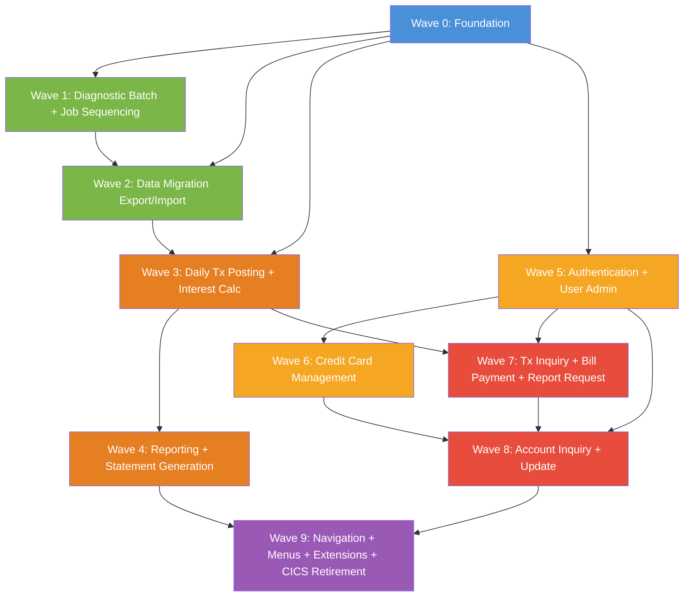

# Implementation Plan

A phased migration plan for incrementally extracting capabilities from the CardDemo Credit Card Management System COBOL application using a strangler fig (hollow-out) approach.

## Executive Summary

CardDemo is a 31-program, ~19,600 LOC COBOL application running on z/OS with CICS for online transactions and JCL-driven batch pipelines. The core application uses VSAM files exclusively; three optional extension modules add DB2, IMS/DL/I, and IBM MQ integration. The recommended migration strategy is a strangler fig (hollow-out) approach over nine waves spanning an estimated 18–24 months of coexistence. The primary seam is the CICS XCTL / CARDDEMO-COMMAREA boundary: every online program communicates exclusively through the shared COMMAREA structure (COCOM01Y), which maps cleanly to a JWT session token plus stateless REST API endpoints. Batch programs are separated from online programs throughout and can begin migrating from Wave 2 onwards because they share no real-time coupling — batch files are exchanged via VSAM/sequential datasets accessible to both old and new systems simultaneously.

Three risks require attention before migration begins. First, known data integrity defects in COBIL00C (balance reduction after failed TRANSACT write, and first-payment failure on an empty TRANSACT file) and CBTRN02C (silent account-update loss on INVALID KEY) may have already produced inconsistent data in production VSAM files; a reconciliation pass is mandatory before any data migration. Second, COACTUPC's dual-VSAM write without a spanning SYNCPOINT between ACCTDAT and CUSTDAT creates a partial-update exposure that the replacement service must eliminate with a single database transaction. Third, CBSTM03A's use of ALTER/GO TO dispatch and z/OS TIOT control block addressing makes it the only program in the application that cannot be incrementally extracted or translated — it requires a full redesign and is therefore deferred to the final wave.

## Migration Strategy

| Property              | Value                                                                  |
| --------------------- | ---------------------------------------------------------------------- |
| Approach              | Strangler Fig (hollow-out)                                             |
| Direction             | Outside-in (leaf programs and batch first; hub programs last)          |
| Coexistence Duration  | 18–24 months estimated                                                 |
| Primary Seam Type     | CICS XCTL / COMMAREA boundary (online); File intercept / JCL pipeline (batch) |

### Strategy Rationale

The CardDemo codebase has three properties that make a strangler fig approach the only viable strategy. First, COCOM01Y (CARDDEMO-COMMAREA) couples all 17 online programs at the inter-program communication level; a big-bang replacement would require all programs to be replaced simultaneously before any could go live. Second, batch and online programs share VSAM files but have no real-time coupling — batch jobs run on a schedule and exchange data through VSAM and sequential datasets, creating natural file-intercept seams where old and new can coexist using a shared-database or dual-write pattern. Third, several high-complexity programs (COACTUPC at 3,860 LOC, CBSTM03A with ALTER/GO TO, COBIL00C with two production defects) require extensive redesign and cannot be extracted quickly; placing them in later waves protects the project schedule while earlier waves build team confidence and infrastructure.

The direction is outside-in: leaf programs with no downstream callers (COACTVWC, COBIL00C, leaf user-admin programs, diagnostic batch programs) migrate early; hub programs with many callers (COMEN01C, COADM01C, COSGN00C) migrate last. The COMMAREA seam is replaced wave-by-wave as each online capability is extracted behind a REST API facade. The CICS region continues to run for remaining programs until Wave 9 retires it entirely.

## Seam Analysis

Natural boundaries in the current system where extraction intercepts can be placed:

| Seam | Type | Programs Involved | Direction | Complexity | Notes |
| --- | --- | --- | --- | --- | --- |
| COCOM01Y COMMAREA boundary | CALL / CICS XCTL | All 17 online programs | Both | Medium | Every online program accepts and returns the COMMAREA; maps cleanly to a session token + REST API. Replace XCTL one program at a time behind an API gateway. |
| USRSEC VSAM file | File | COSGN00C, COUSR00C-03C | Both | Low | Isolated to authentication and user-admin programs only; no batch writers. Can be migrated to a dedicated identity store with a VSAM adapter during transition. |
| ACCTDAT / CUSTDAT VSAM pair | File | COACTUPC, COACTVWC, COBIL00C, CBTRN02C, CBACT04C, CBSTM03B, COACCT01 | Both | High | Most-shared data store; 4 writers across online and batch. Requires dual-write or shared-DB coexistence pattern until all programs migrate. |
| TRANSACT VSAM | File | COTRN02C, COBIL00C, CBTRN02C, COTRN00C, COTRN01C, CBTRN03C | Both | High | Online writes (COTRN02C, COBIL00C) and destructive batch rewrite (CBTRN02C OPEN OUTPUT). Online and batch must not share TRANSACT during the same wave; sequence batch migration after online. |
| CARDDAT VSAM | File | COCRDUPC, COCRDLIC, COCRDSLC, CBTRN01C, CBEXPORT | Both | Low | Single online writer (COCRDUPC); diagnostic-only batch readers. Cleaner boundary than ACCTDAT. |
| DALYTRAN -> CBTRN02C pipeline | File | CBTRN02C, external feed | In | Low | DALYTRAN is an external sequential feed; intercept at the JCL step level. Replace CBTRN02C step with new service without changing upstream feed. |
| TCATBALF -> CBACT04C pipeline | File | CBTRN02C, CBACT04C | Both | Medium | TCATBALF produced by CBTRN02C and consumed by CBACT04C; migrate both in the same wave or implement a file-based handoff adapter between waves. |
| JOBS TDQ (JES internal reader) | Queue | CORPT00C | Out | Low | CORPT00C writes JCL records to the JOBS extra-partition TDQ; the seam is the TDQ write. Replace with an API call to a job scheduler (e.g., Apache Airflow or cloud scheduler) to trigger the report job. |
| CARDDEMO.REQUEST.QUEUE (MQ) | Queue | COACCT01, CODATE01 | In | Low | Already event-driven; replace by rerouting the MQ queue to a new consumer service — the easiest possible seam type. |
| IMS DBPAUTP0 database | DB | COPAUA0C, COPAUS0C, COPAUS1C, CBPAUP0C | Both | High | IMS hierarchical database has no direct cloud equivalent; migrate to a relational or document store with parent-child relationship preserved. |
| BMS screen mapsets | Screen | All 17 online programs | Both | Medium | BMS source not present; compiled copybooks only. New frontend replaces screens while CICS backend remains; screens are the outermost seam for online programs. |
| JCL job step sequence | Pipeline | All batch JCL | Both | Low | Each JCL step is an independent pipeline boundary; replace individual steps without changing upstream/downstream. |

## Migration Waves

### Wave 0: Foundation

| Property      | Value                                                                 |
| ------------- | --------------------------------------------------------------------- |
| Objective     | Establish infrastructure, observability, routing, and rollback capability before any program moves |
| Prerequisites | None                                                                  |

**Deliverables:**

- API gateway / routing layer capable of forwarding CICS transaction IDs to either COBOL or new service endpoints; initially all traffic routes to COBOL
- COMMAREA-to-JWT session adapter: encode CARDDEMO-COMMAREA fields (CDEMO-USER-ID, CDEMO-USER-TYPE, CDEMO-ACCT-ID, CDEMO-CUST-ID, CDEMO-CCARD-NUM, CDEMO-FROM-PROGRAM, CDEMO-TO-PROGRAM) as JWT claims for stateless REST sessions
- VSAM shared-database adapter: both COBOL (via CICS) and new services read/write the same underlying VSAM files during transition; no data sync needed initially
- Dual-write infrastructure for ACCTDAT and TRANSACT (to be activated in later waves when parallel runs require it)
- Data reconciliation tooling: scan ACCTDAT, CUSTDAT, and TRANSACT for known defect symptoms — zero-balance accounts with no payment record (COBIL00C defect), and accounts where ACCTDAT and CUSTDAT are inconsistent (COACTUPC dual-write exposure)
- Observability: distributed tracing, structured logging, and alerting for both COBOL and new services
- VSAM change-data-capture (CDC) connector for ACCTDAT and TRANSACT to support eventual consistency during coexistence
- Rollback mechanism: feature flags per capability to route 100% traffic back to COBOL within seconds
- Target data model design: relational schema for accounts, customers, cards, transactions, and users; add TRAN-ACCT-ID column to the transactions table (absent from CVTRA05Y); plan PCI DSS and PII field encryption (card numbers, SSN, passwords)
- Password security: new identity store with bcrypt/Argon2-hashed credentials; migration plan for plaintext USRSEC passwords

---

### Wave 1: Diagnostic Batch Utilities and Job Sequencing

| Property     | Value                                                                  |
| ------------ | ---------------------------------------------------------------------- |
| Capability   | Reference Data Utility Operations (14) + Batch Job Sequencing (15)    |
| Programs     | CBACT01C, CBACT02C, CBACT03C, CBCUS01C, CBTRN01C, COBSWAIT            |
| Dependencies | Wave 0                                                                 |
| Complexity   | Low                                                                    |
| Risk Level   | Low                                                                    |

**Extraction scope:**

- CBACT01C, CBACT02C, CBACT03C, CBCUS01C: replace diagnostic batch programs with equivalent scripts that read from the new data store (or still from shared VSAM during transition); add input validation where absent; remove CEE3ABD dependency; preserve CBACT01C's three-format output capability
- CBTRN01C: replace dry-run validation tool with an equivalent; note no JCL entry point exists — confirm whether this program is production or test-only before extraction; if test-only, retire rather than migrate
- COBSWAIT: replace with a native sleep/wait capability in the target job scheduler (Airflow wait operator, cloud scheduler delay); no functional code to migrate; retire COBSWAIT entirely

**Coexistence approach:**

- All diagnostic programs are read-only; they can run against shared VSAM during transition with no data integrity risk
- Old and new versions can run in parallel for comparison; output diff confirms correctness
- COBSWAIT replacement is purely additive — old COBSWAIT steps continue to run until JCL is updated

**Rollback plan:**

- Revert JCL to invoke COBOL programs; no data was written by these programs so rollback has zero data integrity risk

---

### Wave 2: Data Migration Utilities

| Property     | Value                                                                  |
| ------------ | ---------------------------------------------------------------------- |
| Capability   | Data Migration Export and Import (13)                                  |
| Programs     | CBEXPORT, CBIMPORT                                                     |
| Dependencies | Wave 0, Wave 1                                                         |
| Complexity   | Medium                                                                 |
| Risk Level   | Low                                                                    |

**Extraction scope:**

- CBEXPORT: replace with a data-export service that reads from the new relational data store (or shared VSAM) and writes to a structured format (JSON, Parquet, or delimited flat file); implement the CVEXPORT REDEFINES as a discriminated union / typed message per record type (C/A/X/T/D)
- CBIMPORT: replace with a data-import pipeline that reads the export format and loads to target tables; fix the CARDOUT DD omission (add card import output); add explicit error handling for missing DDs
- This wave also serves as the primary data migration vehicle: run CBEXPORT (COBOL) to extract current VSAM data, transform to target schema (adding TRAN-ACCT-ID, hashing passwords, encrypting PAN/SSN), and load via the new import service

**Coexistence approach:**

- CBEXPORT and CBIMPORT are not used in normal daily operations; they are migration utilities run on demand; no coexistence complexity during normal operation
- The new export/import services are validated by exporting from VSAM and importing to a staging environment, then comparing record counts and checksums

**Rollback plan:**

- If the migration service fails, revert to COBOL CBEXPORT/CBIMPORT; no online programs are affected

---

### Wave 3: Daily Transaction Posting and Interest Calculation (Batch Core)

| Property     | Value                                                                  |
| ------------ | ---------------------------------------------------------------------- |
| Capability   | Daily Transaction Posting (7) + Interest and Fees Calculation (8)     |
| Programs     | CBTRN02C, CBACT04C                                                     |
| Dependencies | Wave 0, Wave 2 (data store established)                                |
| Complexity   | High                                                                   |
| Risk Level   | High                                                                   |

**Extraction scope:**

- CBTRN02C: replace with a transaction-posting service; fix all known defects in the replacement: (1) OPEN OUTPUT truncation — use idempotent upsert instead of destructive overwrite; (2) silent account-update loss (reason 109) — the replacement must write a reject record and halt or compensate when an account update fails; (3) both overlimit and expiration checks must both be reported when they both fail (eliminate last-check-wins); (4) add TRAN-ACCT-ID to the posted transaction record; (5) wrap TRANSACT write + ACCOUNT update in a single database transaction for atomicity
- CBACT04C: replace with an interest calculation service; fix: (1) unconditional DISPLAY of every TCATBAL record — remove or guard with log level; (2) DISCGRP error message mislabel — fix in replacement; (3) implement actual fee logic (currently the 1400-COMPUTE-FEES stub is empty — design a real fee schedule with product owners before migration); (4) wrap all account balance updates in explicit database transactions
- COBSWAIT (WAITSTEP JCL): remove — replaced by Wave 1 scheduler delay

**Coexistence approach:**

- CBTRN02C runs nightly from POSTTRAN JCL; during coexistence the new service reads DALYTRAN (shared sequential file unchanged) and writes to both the new database AND the existing VSAM (dual-write pattern) for the transition period
- CBACT04C runs monthly from INTCALC JCL; the new service reads TCATBALF (or its equivalent in the new database) and writes system-generated interest transactions to SYSTRAN (unchanged GDG output for COMBTRAN downstream) and updates accounts in both new DB and VSAM during transition
- Dual-write to VSAM ensures downstream COBOL programs (still on VSAM) see consistent data
- TRANBKP JCL must continue to run before POSTTRAN during coexistence to protect against TRANSACT truncation

**Rollback plan:**

- Feature flag routes POSTTRAN and INTCALC JCL back to COBOL programs; VSAM data remains intact because dual-write kept it current; rollback window is one business day before next batch run

**Risk notes:**

- Data integrity risk: CBTRN02C's silent account-update loss defect may have produced inconsistent production data; the Wave 0 reconciliation pass must identify and repair these records before cutover
- Performance risk: the new transaction posting service must match or exceed the throughput of CBTRN02C on a full DALYTRAN file; load test with production-volume data before cutover
- TCATBALF must remain consistent between old and new during coexistence; dual-write is required for this file as well

---

### Wave 4: Transaction Report and Statement Generation (Batch Reporting)

| Property     | Value                                                                  |
| ------------ | ---------------------------------------------------------------------- |
| Capability   | Transaction Report Generation (10) + Account Statement Generation (9) |
| Programs     | CBTRN03C, CBSTM03A, CBSTM03B                                          |
| Dependencies | Wave 3                                                                 |
| Complexity   | High                                                                   |
| Risk Level   | High                                                                   |

**Extraction scope:**

- CBTRN03C: replace with a reporting service; inputs are TRANSACT data (now in new DB), CARDXREF, and TRANTYPE/TRANCATG reference data; preserve date-range filtering (currently done by the SORT step, internalize to the new service); replace GDG output with versioned object storage or report archive
- CBSTM03A + CBSTM03B: this program pair requires a full redesign — not a translation — due to: (1) ALTER/GO TO dispatch that cannot be mechanically translated to any modern language; (2) TIOT control block addressing for runtime DD enumeration (z/OS-specific, no cloud equivalent); (3) two-dimensional in-memory transaction array with implicit bounds. Design a statement generation service that reads account, customer, card, and transaction data from the new database and renders statements in text and HTML/PDF. Preserve the CREASTMT pre-sort ordering logic within the service. Eliminate the TIOT traversal by making the file set configurable.
- GDG datasets (DALYREJS, TRANREPT, SYSTRAN, TRANSACT.BKUP): replace with versioned object storage (S3 or equivalent) with a rotation policy matching current GDG generation offset semantics

**Coexistence approach:**

- CBTRN03C reads from TRANSACT (now maintained by the new posting service via dual-write); during transition, the new reporting service can read from the same VSAM via the shared-database adapter
- CBSTM03A reads from TRNXFILE (built by CREASTMT SORT step); the replacement service bypasses this entirely by querying the new database directly
- Old and new report outputs can be compared in parallel for one or two statement cycles before COBOL is retired

**Rollback plan:**

- Revert TRANREPT and CREASTMT JCL to invoke COBOL programs; VSAM data has been kept current by dual-write so COBOL reports remain accurate; report output can be regenerated from archived VSAM data
- CBSTM03A redesign has the longest rollback window — allow a full statement cycle for parallel validation before cutting over

---

### Wave 5: User Authentication and Administration

| Property     | Value                                                                  |
| ------------ | ---------------------------------------------------------------------- |
| Capability   | User Authentication and Session Management (1) + User Administration (11) |
| Programs     | COSGN00C, COUSR00C, COUSR01C, COUSR02C, COUSR03C, COADM01C (partial — admin menu routing only) |
| Dependencies | Wave 0                                                                 |
| Complexity   | Medium                                                                 |
| Risk Level   | Medium                                                                 |

**Extraction scope:**

- COSGN00C: replace with an authentication service; use the new identity store (Wave 0) with bcrypt/Argon2-hashed credentials; implement account lockout (absent from COBOL — 0 failed-attempt counter); enforce 'A'/'U' user type domain; issue JWT on successful authentication; replace CICS XCTL routing with API gateway redirect to the appropriate frontend
- COUSR00C, COUSR01C, COUSR02C, COUSR03C: replace with a user-management REST API; fix all known defects in the replacement: (1) enforce 'A'/'U' domain for user type (COUSR01C does not); (2) check CICS RECEIVE RESP equivalents — surface errors rather than continuing with stale input; (3) correct PF3 navigation in COUSR02C — do not navigate away when a save is in progress or has failed; (4) correct DELETE-after-failed-READ in COUSR03C; (5) add audit trail for all user create/update/delete operations (absent from COBOL)
- COADM01C: the admin menu routing logic is preserved in the API gateway routing table; COADM01C itself is retired once all its downstream programs have been extracted (this occurs by Wave 8)
- Passwords: migrate plaintext USRSEC passwords to hashed form before or during this wave; the migration must hash each plaintext password and write the hash to the new identity store; inform users that passwords are unchanged but storage is now secure

**Coexistence approach:**

- During transition, COSGN00C (COBOL) and the new authentication service run in parallel; the API gateway routes a configurable percentage of traffic to the new service; new service writes to the new identity store, COBOL continues to read USRSEC
- If both stores must stay consistent, dual-write user changes to both USRSEC and the new identity store during transition
- COADM01C remains live in CICS until Wave 8 retires it; admin menu options for extracted capabilities are routed through the API gateway

**Rollback plan:**

- Feature flag routes all authentication traffic back to COBOL COSGN00C; new identity store retains the migrated records; rollback does not require re-populating USRSEC because dual-write kept it current

---

### Wave 6: Credit Card Management

| Property     | Value                                                                  |
| ------------ | ---------------------------------------------------------------------- |
| Capability   | Credit Card Management (4)                                             |
| Programs     | COCRDLIC, COCRDSLC, COCRDUPC                                           |
| Dependencies | Wave 0, Wave 5 (authentication seam established)                       |
| Complexity   | Medium                                                                 |
| Risk Level   | Medium                                                                 |

**Extraction scope:**

- COCRDLIC: replace with a card-list API; preserve admin vs regular user filtering (admin sees all cards; regular sees only cards linked to the account in the session token); replace BMS paging with cursor-based pagination
- COCRDSLC: replace with a card-detail API; reads CARDDAT (new card table in target DB)
- COCRDUPC: replace with a card-update API; fix: (1) add audit trail for card updates (no before/after record written by COBOL); (2) implement optimistic concurrency using ETag/version token (COBOL uses direct REWRITE with no concurrent modification detection for cards)

**Coexistence approach:**

- CARDDAT is shared between COBOL (COCRDSLC, COCRDUPC) and new service during transition; dual-write card updates to both CARDDAT VSAM and new DB table
- CARDAIX alternate index must be replicated or rebuilt on the new card table (account-keyed lookup)

**Rollback plan:**

- Feature flag routes card management traffic back to COBOL programs; dual-write has kept CARDDAT current; rollback is instantaneous

---

### Wave 7: Transaction Inquiry, Bill Payment, and Report Request

| Property     | Value                                                                  |
| ------------ | ---------------------------------------------------------------------- |
| Capability   | Transaction Inquiry and Manual Entry (5) + Bill Payment Processing (6) + Report Request (12) |
| Programs     | COTRN00C, COTRN01C, COTRN02C, COBIL00C, CORPT00C                      |
| Dependencies | Wave 0, Wave 3 (TRANSACT in new DB), Wave 5 (authentication)          |
| Complexity   | High                                                                   |
| Risk Level   | High                                                                   |

**Extraction scope:**

- COTRN00C, COTRN01C: replace with transaction browse and detail APIs; read from new TRANSACT table (includes TRAN-ACCT-ID field absent from COBOL); support cursor-based paging (replaces CICS STARTBR/READNEXT browse)
- COTRN02C: replace with a transaction-add API; fix: (1) replace backwards-browse transaction ID generation with a database sequence or UUID (eliminates race condition); (2) correct CSUTLDTC date echo corruption — use standard date library instead; (3) add TRAN-ACCT-ID to the new transaction record
- COBIL00C: replace with a bill-payment API; this is the highest-risk online program due to two production defects; the replacement must: (1) fix the unconditional balance reduction after failed TRANSACT write — wrap both the TRANSACT INSERT and ACCTDAT UPDATE in a single database transaction; (2) fix the first-payment failure on empty TRANSACT — replace backwards-browse ID generation with a sequence; (3) support partial payments (currently only full-balance payment is supported — confirm with business owners whether this is intentional policy)
- CORPT00C: replace with a report-request API that calls a job scheduler (Airflow, cloud scheduler) rather than writing JCL records to the JOBS TDQ; the batch report job (TRANREPT) will have been replaced by Wave 4's reporting service; the API simply triggers that service for the requested date range

**Coexistence approach:**

- TRANSACT is now in the new database (since Wave 3); COBOL online programs (COTRN00C, COBIL00C, etc.) still need to read/write TRANSACT during Wave 7 until they are retired; maintain dual-write of TRANSACT for this wave
- COBIL00C retirement is the most critical coexistence step: payment writes must be atomic in the new system before the COBOL version is retired
- CORPT00C can be retired as soon as the scheduler integration is tested; no VSAM data is at risk

**Rollback plan:**

- Feature flag routes all Wave 7 programs back to COBOL; TRANSACT dual-write keeps VSAM current; ACCTDAT dual-write (from Wave 3) keeps account balances current; rollback is safe at any point before COBOL is retired
- COBIL00C rollback window is shorter than other programs due to the payment data integrity requirement — test in parallel for at least two statement cycles

---

### Wave 8: Account Inquiry and Update

| Property     | Value                                                                  |
| ------------ | ---------------------------------------------------------------------- |
| Capability   | Account Inquiry and Update (3)                                         |
| Programs     | COACTVWC, COACTUPC                                                     |
| Dependencies | Wave 0, Wave 5, Wave 6, Wave 7                                         |
| Complexity   | High                                                                   |
| Risk Level   | High                                                                   |

**Extraction scope:**

- COACTVWC: replace with an account-view API; reads account, customer, and card data from new database via CARDXREF join; straightforward read-only service
- COACTUPC: replace with an account-update API; this is the largest and most complex online program (3,860 LOC); the replacement must: (1) preserve the 7-state update workflow — implement as an optimistic concurrency update endpoint with ETag/version validation (maps directly to the ACUP-CHANGE-ACTION state machine); (2) preserve 29-field compare-before-write — use server-side change detection before writing to DB; (3) fix the dual-VSAM partial-update exposure — wrap ACCOUNT and CUSTOMER updates in a single database transaction (no separate SYNCPOINT needed in a relational DB); (4) add a full audit trail — log before/after values for all 29 editable fields (currently absent); (5) preserve all field-level validation rules: FICO score range 300–850, SSN format (parts 1/2/3 invalid ranges), US state code, state/zip cross-validation, North America area code; (6) replace position-based CICS SYNCPOINT on PF3 exit with explicit transaction commit at end of the update request

**Coexistence approach:**

- ACCTDAT and CUSTDAT have been maintained in dual-write since Wave 3; the new account-update service writes to both the new DB and VSAM during transition
- CARDXREF is read-only (no online program writes it); the new service reads from the new card-xref table; VSAM CARDXREF remains the source of truth for any remaining COBOL programs
- Once COACTVWC and COACTUPC are retired, ACCTDAT and CUSTDAT dual-write can be turned off and VSAM retired for these files

**Rollback plan:**

- Feature flag routes account traffic back to COBOL; dual-write has kept VSAM current; 29-field state machine validation is the most complex rollback risk — ensure both implementations agree on the same test vectors before cutover

---

### Wave 9: Navigation, Menus, and CICS Retirement + Extension Modules

| Property     | Value                                                                  |
| ------------ | ---------------------------------------------------------------------- |
| Capability   | Navigation and Menu Routing (2) + Transaction Type Administration (16) + Pending Authorization Management (17) + MQ Account and Date Inquiry (18) |
| Programs     | COMEN01C, COADM01C, COTRTLIC, COTRTUPC, COBTUPDT, COPAUS0C, COPAUS1C, COPAUS2C, COPAUA0C, CBPAUP0C, COACCT01, CODATE01 |
| Dependencies | Waves 0–8 (all capabilities extracted)                                 |
| Complexity   | High                                                                   |
| Risk Level   | Medium                                                                 |

**Extraction scope:**

- COMEN01C, COADM01C: these hub programs have been progressively hollowed out as each downstream program was extracted; by this wave they are purely routing shells; retire them and replace with the API gateway routing table that already handles all navigation
- COTRTLIC, COTRTUPC, COBTUPDT: replace with a transaction-type reference data API backed by the new database; DB2 TRANSACTION_TYPE table migrated to new relational store; online CRUD operations and batch maintenance become REST API + background job; fix DSNTIAC dependency
- COPAUS0C, COPAUS1C, COPAUS2C, COPAUA0C, CBPAUP0C: replace the entire pending authorization module; IMS DBPAUTP0 migrated to a relational or document store preserving the PAUTSUM0 (root) / PAUTDTL1 (child) parent-child relationship; MQ input queue rerouted to a new authorization event processor; online review screens replaced with new UI; CBPAUP0C purge logic replaced with a scheduled cleanup job using a configurable expiry threshold
- COACCT01, CODATE01: replace with microservices that respond to the same MQ queue pattern (reroute CARDDEMO.REQUEST.QUEUE); account inquiry reads from new DB; date service is trivial (system datetime); retire IBM MQ dependency in the extension and replace with a cloud-native message broker if appropriate
- Retire all remaining CICS transactions, VSAM files, z/OS JCL, and the CICS region itself

**Coexistence approach:**

- By Wave 9, all operational VSAM files should have new-DB equivalents with dual-write maintaining consistency; this wave turns off dual-write and retires VSAM
- CICS region is decommissioned after Wave 9 completes; all CICS transaction IDs are retired from the gateway routing table
- IMS subsystem is decommissioned after COPAUA0C and CBPAUP0C are replaced

**Rollback plan:**

- Individual capabilities within Wave 9 can be rolled back independently via feature flags; CICS region and VSAM must not be decommissioned until all feature flags have been removed and the new system has been stable for at least one full monthly cycle (including statement generation and interest calculation)

---

## Wave Sequencing

| Wave | Capability | Programs | Dependencies | Complexity | Risk | Rationale |
| ---- | ---------- | -------- | ------------ | ---------- | ---- | --------- |
| 0 | Foundation | - | - | Low | Low | Infrastructure, routing, observability, and data reconciliation must exist before any program moves |
| 1 | Reference Data Utilities + Job Sequencing | CBACT01C, CBACT02C, CBACT03C, CBCUS01C, CBTRN01C, COBSWAIT | Wave 0 | Low | Low | All leaf batch programs, read-only, no online coupling; maximum confidence-building value at minimum risk |
| 2 | Data Migration Export/Import | CBEXPORT, CBIMPORT | Wave 0, Wave 1 | Medium | Low | Batch-only, no real-time coupling; also serves as the primary data-load vehicle for populating the new database |
| 3 | Daily Transaction Posting + Interest Calc | CBTRN02C, CBACT04C | Wave 0, Wave 2 | High | High | Batch programs that write the most critical data (TRANSACT, ACCTDAT); extracted before online programs so dual-write infrastructure can stabilize |
| 4 | Transaction Report + Statement Generation | CBTRN03C, CBSTM03A, CBSTM03B | Wave 3 | High | High | CBSTM03A requires full redesign; deferred until Wave 3 data is stable; reporting can read from new DB once transaction posting has migrated |
| 5 | Authentication + User Administration | COSGN00C, COUSR00C-03C | Wave 0 | Medium | Medium | Self-contained USRSEC boundary; no dependency on account or transaction data; extracted early to establish session/JWT infrastructure |
| 6 | Credit Card Management | COCRDLIC, COCRDSLC, COCRDUPC | Wave 0, Wave 5 | Medium | Medium | Self-contained CARDDAT boundary; hub program COCRDLIC has only 3 callers; before Account Update which is harder |
| 7 | Transaction Inquiry + Bill Payment + Report Request | COTRN00C, COTRN01C, COTRN02C, COBIL00C, CORPT00C | Wave 0, Wave 3, Wave 5 | High | High | COBIL00C defects require defect-free replacement before extraction; depends on TRANSACT being in new DB (Wave 3) |
| 8 | Account Inquiry and Update | COACTVWC, COACTUPC | Waves 0, 5, 6, 7 | High | High | Most complex online program (3,860 LOC); deferred to last online wave; all shared data stores (ACCTDAT, CUSTDAT) already in dual-write by this point |
| 9 | Navigation, Menus, CICS Retirement + Extension Modules | COMEN01C, COADM01C, ext module programs | Waves 0–8 | High | Medium | Final wave retires CICS, VSAM, IMS, and DB2 subsystems; extension modules deferred because they have limited interaction with the core migration path |

## Data Migration Strategy

| Data Store | Type | Used By | Migration Approach | Coexistence Pattern | Wave |
| --- | --- | --- | --- | --- | --- |
| USRSEC | VSAM KSDS | COSGN00C, COUSR00C-03C | Migrate to new identity store with password hashing; load via Wave 2 export tooling or direct VSAM extract | Dual-write: user changes written to both USRSEC and new identity store during Wave 5 | 5 |
| ACCTDAT (ACCTDATA) | VSAM KSDS | 12 programs across online and batch | Migrate to new accounts table; add any missing columns; pre-migration reconciliation required | Dual-write from Wave 3 through Wave 8; VSAM retired after Wave 8 | 3 |
| CUSTDAT (CUSTDATA) | VSAM KSDS | 6 programs | Migrate to new customers table; PII fields (SSN, DOB) encrypted at rest | Dual-write from Wave 3 through Wave 8 | 3 |
| CARDDAT (CARDDATA) | VSAM KSDS | 6 programs | Migrate to new cards table; PAN (card number) encrypted at rest per PCI DSS | Dual-write from Wave 6 through Wave 8 | 6 |
| CARDXREF | VSAM KSDS + AIX | 11 programs | Denormalize into card table as a foreign key on account; rebuild alternate index as a DB index | Shared-database (read-only in COBOL after Wave 3; new service writes) | 3 |
| TRANSACT | VSAM KSDS | 11 programs | Migrate to new transactions table; add TRAN-ACCT-ID column; pre-migration reconciliation for COBIL00C / CBTRN02C defect-affected records | Dual-write from Wave 3 through Wave 7; VSAM retired after Wave 7 | 3 |
| TCATBALF | VSAM KSDS | CBTRN02C, CBACT04C | Replace with a computed view or aggregation query in the new database; content is ephemeral (cleared on interest calculation) | Dual-write during Wave 3 (both programs migrate together) | 3 |
| DISCGRP | VSAM KSDS | CBACT04C only | Migrate to a new interest-rate reference table; document all required DEFAULT group records before migration | Shared-database (read-only) during Wave 3 | 3 |
| TRANTYPE / TRANCATG | VSAM KSDS | CBTRN03C only (batch) | Migrate to reference tables in new database; mastered in DB2 extension module; merge into single reference table | Shared-database (read-only) during Wave 4 | 4 |
| GDG datasets (DALYREJS, TRANREPT, SYSTRAN, TRANSACT.BKUP) | Sequential GDG | Batch pipeline | Replace with versioned object storage (S3 or equivalent); implement rotation policy matching GDG generation offsets | New service writes to object storage; old COBOL jobs still use GDGs during dual-run period | 3–4 |
| EXPORT.DATA | VSAM KSDS | CBEXPORT, CBIMPORT | Used only for migration; no ongoing coexistence needed | Not applicable — migration utility only | 2 |
| CARDDEMO.TRANSACTION_TYPE (DB2) | DB2 table | COTRTLIC, COTRTUPC, COBTUPDT | Migrate to new reference data table in target DB | Shared-database (DB2 still accessible during Wave 9) | 9 |
| IMS DBPAUTP0 | IMS hierarchical DB | COPAUA0C, COPAUS0C-1C, CBPAUP0C | Migrate to relational table or document store; map PAUTSUM0 root segment to parent record, PAUTDTL1 child to child records | Shared IMS database during Wave 9 transition | 9 |

## Coexistence Architecture

### Routing Pattern

An API gateway layer is introduced in Wave 0 and sits in front of both the CICS region and the new services. Initially, all CICS transaction IDs (CC00, CM00, CA00, CB00, CCLI, CCDL, CCUP, CAVW, CAUP, CR00, CT00, CT01, CT02, CU00, CU01, CU02, CU03) are forwarded directly to the CICS region unchanged. As each wave completes, the gateway routing table is updated one transaction at a time to direct traffic to the new REST endpoint. CICS continues to handle un-migrated transactions without any modification. Feature flags per transaction ID allow instant rollback to CICS for any capability. During batch coexistence, JCL steps are updated wave-by-wave to invoke new programs rather than COBOL; the scheduler continues to run COBOL programs for un-migrated steps unchanged.

### Transaction Integrity

During online coexistence, each new REST endpoint manages its own database transactions using the target RDBMS transaction primitives. The COMMAREA-to-JWT adapter ensures that user session context (CDEMO-USER-ID, CDEMO-USER-TYPE, CDEMO-ACCT-ID, CDEMO-CUST-ID, CDEMO-CCARD-NUM) is available to every new service without relying on CICS COMMAREA propagation. The most critical coexistence integrity requirement is the COACTUPC replacement: the 7-state optimistic concurrency update (ACUP-CHANGE-ACTION state machine with 29-field compare-before-write) must be preserved exactly in the new account-update endpoint, using ETag/version tokens in place of CICS file locking. The COBIL00C replacement must atomically write both the payment TRANSACT record and the ACCTDAT balance reduction in a single database transaction — the known COBOL defect (unconditional balance reduction regardless of TRANSACT write outcome) must not be carried forward.

For batch coexistence, the dual-write pattern ensures that new batch services write to both the new database and the shared VSAM files. This keeps COBOL online programs reading accurate data from VSAM throughout the transition. Batch programs do not use CICS transaction management; the new batch services use explicit database transaction boundaries (BEGIN/COMMIT/ROLLBACK) to replace the absent SYNCPOINT calls in CBTRN02C and CBACT04C.

### Data Synchronisation

Shared VSAM files (ACCTDAT, CUSTDAT, TRANSACT, CARDDAT, USRSEC) are kept consistent using a dual-write pattern: every write by a new service is also written to the corresponding VSAM file via a VSAM adapter. A CDC connector on ACCTDAT and TRANSACT captures changes made by any remaining COBOL programs and propagates them to the new database (this covers the window where COBOL online programs still write to VSAM after batch has migrated). The CDC lag is expected to be sub-second for these VSAM file sizes; latency-sensitive paths (account balance for bill payment) must verify the CDC lag before cutover. Read-only VSAM files (CARDXREF, DISCGRP, TRANTYPE, TRANCATG) require no ongoing synchronisation — new services read from the new database and COBOL programs continue to read from VSAM independently. CARDXREF is the most-shared read-only file (11 consumers); it is migrated in Wave 3 and a new-DB copy is maintained from that point forward.

## Risk Register

| Risk | Wave | Impact | Likelihood | Mitigation |
| --- | --- | --- | --- | --- |
| Known data integrity defects in COBIL00C (balance after failed write, first-payment on empty TRANSACT) and CBTRN02C (silent account-update loss) may have already corrupted production VSAM data | Wave 0 | High | High | Mandatory reconciliation pass in Wave 0: scan ACCTDAT for zero-balance accounts with no payment record; scan ACCTDAT/CUSTDAT for inconsistent account-customer pairs; repair before migration |
| COACTUPC dual-VSAM write (ACCTDAT then CUSTDAT) without spanning SYNCPOINT creates partial-update exposure that may have left inconsistent pairs | Wave 0, Wave 8 | High | Medium | Reconciliation pass in Wave 0 detects inconsistent pairs; Wave 8 replacement wraps both updates in a single DB transaction |
| TRANSACT destructive OPEN OUTPUT in CBTRN02C — mid-job abend leaves TRANSACT empty | Wave 3 | High | Medium | Maintain TRANBKP JCL until CBTRN02C is fully retired; replacement service uses idempotent upsert rather than destructive overwrite |
| COCOM01Y ultra-wide coupling — all 17 online programs depend on the 15-field COMMAREA structure | All online waves | High | High | COMMAREA-to-JWT adapter introduced in Wave 0; each wave's replacement service validates JWT claims rather than reading raw COMMAREA bytes; schema change to COMMAREA frozen until Wave 9 |
| CVACT01Y shared by 11 programs — changes to account schema require coordinated updates | Wave 3, Wave 8 | High | High | New account table designed in Wave 0; VSAM CVACT01Y layout frozen for all COBOL programs; schema changes made only in new DB during migration |
| CVTRA05Y shared by 11 programs — missing TRAN-ACCT-ID requires schema extension | Wave 3 | High | High | Add TRAN-ACCT-ID in new transactions table; backfill by joining CARDXREF on existing TRANSACT records during data migration |
| CBSTM03A cannot be translated — ALTER/GO TO and TIOT addressing require full redesign | Wave 4 | High | High | Plan full redesign of statement generation service; allocate additional design time in Wave 4; do not attempt COBOL-to-language translation for this program |
| TIOT control block addressing in CBSTM03A is z/OS-specific — no cloud equivalent | Wave 4 | High | High | Replace TIOT traversal with a configurable file list (environment variables or config file); verify all DD names used by CBSTM03A in CREASTMT.JCL before migration |
| Transaction ID generation race condition in COBIL00C and COTRN02C — concurrent sessions may generate duplicate IDs | Wave 7 | High | High | Replace backwards-browse ID generation with DB sequence or UUID in Wave 7 replacements; also apply to CBTRN02C replacement in Wave 3 |
| Plaintext password storage in USRSEC — SEC-USR-PWD PIC X(08) | Wave 5 | High | High | Hash all passwords (bcrypt/Argon2) during Wave 5 data migration; inform users; implement account lockout in new authentication service |
| No audit trail for online writes — COACTUPC, COCRDUPC, COUSR02C, COUSR03C write no before/after record | Wave 5, Wave 6, Wave 7, Wave 8 | High | High | Add audit logging at the service layer for all write operations in each wave's replacement service |
| BMS map source files absent — only compiled copybooks available | All online waves | Medium | High | Reconstruct screen layouts from compiled BMS copybooks (cpy-bms/); new frontend replaces BMS screens; parity check against field names in copybooks |
| CBACT04C fee-computation stub (1400-COMPUTE-FEES) is empty — actual fee rules unknown | Wave 3 | High | Medium | Engage product owners before Wave 3 to define fee schedule; do not migrate a stub; implement real fee logic or explicitly document as out-of-scope |
| DISCGRP DEFAULT records — required set is not documented in source | Wave 3 | Medium | Medium | Catalogue all DISCGRP records from production VSAM before migration; document every group-type-category combination; include DEFAULT records in new interest-rate table |
| Missing source for CSD-referenced programs (COCRDSEC, COACT00C, etc.) — cannot confirm if still active | Wave 0 | Medium | Medium | Assess with operations team whether CDV1 (COCRDSEC) and other CSD-defined programs are used in production; retire unused transactions; locate source for any still-active programs |
| CBTRN01C has no JCL entry point — unclear if production or test artifact | Wave 1 | Low | Medium | Confirm with operations team; if test-only, retire rather than migrate; if production, locate missing JCL |
| COUSR01C does not enforce 'A'/'U' domain for user type — non-standard values may exist in USRSEC | Wave 5 | Medium | Medium | Scan USRSEC for non-standard user type values before migration; resolve with product owners; enforce domain in new user-management service |
| CSUTLDTC date echo corruption (LS-RESULT VString overwrite) — future callers may receive garbled data | Wave 7 | Low | Low | Replace CSUTLDTC with standard date library call in Wave 7 replacement services; do not carry the defect forward |
| CARDOUT DD missing from CBIMPORT.jcl — card import may fail silently or abend | Wave 2 | Medium | High | Fix the JCL omission before running CBIMPORT in Wave 2; add CARDOUT DD statement and verify card import output |
| No checkpoint/restart in CBTRN02C, CBACT04C, CBSTM03A — abend requires full re-run | Wave 3, Wave 4 | Medium | Medium | New batch services implement explicit checkpoint logic and idempotent processing; add restart-from-checkpoint capability |
| COPAUA0C authorization decision rules, expiry thresholds, and fraud criteria not recoverable from source | Wave 9 | High | High | Engage business owners and operations team to document authorization rules before designing Wave 9 replacement; source may be in separate module directories not yet analysed |
| Unconditional debug DISPLAY in CBACT04C (every TCATBAL record to SYSOUT) — performance impact on large files | Wave 3 | Medium | High | Remove unconditional DISPLAY in replacement service; replace with conditional debug logging |

## Dependency Graph

**Notes on wave parallelism:**

- Wave 1 (diagnostic batch) and Wave 5 (authentication) can begin in parallel after Wave 0 completes — they share no data or program dependencies
- Wave 2 (data migration utilities) must complete before Wave 3 begins, because Wave 2 populates the new database that Wave 3's dual-write infrastructure writes to
- Wave 3 (batch core) and Wave 5 (authentication) can run in parallel — CBTRN02C / CBACT04C share no programs or data with the authentication/user-admin programs
- Wave 6 (card management) can begin once Wave 5 (authentication) provides the JWT session infrastructure; it does not depend on Wave 3 or Wave 4
- Wave 7 (transaction inquiry + bill payment) requires both Wave 3 (TRANSACT in new DB) and Wave 5 (authentication) to be complete
- Wave 4 (reporting) must follow Wave 3 and can run in parallel with Waves 5–7
- Wave 8 (account update — the most complex program) is the last online wave and requires all other online capabilities to be stable before COACTUPC is retired
- Wave 9 can only begin after all prior waves are complete and stable
