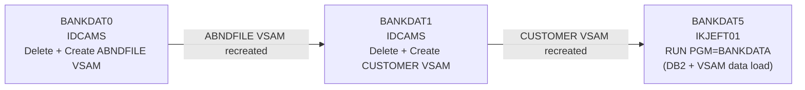

# Batch Job Flows

JCL job step sequences showing program execution order and data flow between steps.

## Job Flows

### BANKDATA (installjcl/BANKDATA.jcl)

The BANKDATA job is the primary data-initialisation job for the CBSA application. It creates or recreates the VSAM datasets and loads generated test data into both VSAM and DB2 tables.

| Step     | Program   | Input DD                         | Output DD                            | Condition              |
| -------- | --------- | -------------------------------- | ------------------------------------ | ---------------------- |
| BANKDAT0 | IDCAMS    | SYSIN (DELETE + DEFINE ABNDFILE) | ABNDFILE VSAM cluster                | None                   |
| BANKDAT1 | IDCAMS    | SYSIN (DELETE + DEFINE CUSTOMER) | CUSTOMER VSAM cluster                | None                   |
| BANKDAT5 | IKJEFT01  | VSAM=CUSTOMER VSAM (DD VSAM)     | CUSTOMER VSAM (writes customer records), DB2 ACCOUNT table, DB2 CONTROL table | None |

Notes:
- BANKDAT5 runs BANKDATA under IKJEFT01/DSN with DB2 plan CBSA.
- PARM='1,10000,1,1000000000000000' controls start key, end key, increment, and seed.
- The BANKDATA program populates CUSTOMER (VSAM WRITE), ACCOUNT (DB2 INSERT), and CONTROL (DB2 INSERT).
- ABNDFILE VSAM cluster: KEYS(12 0) -- 12-byte key at offset 0, RECORDSIZE(681 681).
- CUSTOMER VSAM cluster: KEYS(16 4) -- 16-byte key at offset 4 (first 4 bytes are an eyecatcher; sort code 6 + customer number 10 form the key), RECORDSIZE(259,259).

### COMPALL (buildjcl/COMPALL.jcl)

Mass-compile job that compiles and link-edits all CBSA programs and BMS maps. This is a build-time job, not a data-processing job.

```mermaid
graph LR
    S1["ABNDPROC\nCICS compile"] --> S2["BANKDATA\nBATCH compile"]
    S2 --> S3["BNK1MAI\nMAPGEN"]
    S3 --> S4["BNKMENU\nCICS compile"]
    S4 --> S5["CRDTAGY1-5\nCICS compile"]
    S5 --> S6["CREACC/CRECUST\nCICS compile"]
    S6 --> S7["DBCRFUN/DELACC/DELCUS\nCICS compile"]
    S7 --> S8["GETCOMPY/GETSCODE\nCICS compile"]
    S8 --> S9["INQACC/INQACCCU/INQCUST\nCICS compile"]
    S9 --> S10["UPDACC/UPDCUST/XFRFUN\nCICS compile"]
    S10 --> S11["BNK1 screens + maps\nCICS compile + MAPGEN"]
```

| Step       | Program  | Input DD                     | Output DD                          | Condition            |
| ---------- | -------- | ---------------------------- | ---------------------------------- | -------------------- |
| ABNDPROC   | IGYCRCTL | CBSA.COBOL(ABNDPROC)         | CBSA.CBSAMOD(ABNDPROC)             | None                 |
| BANKDATA   | IGYCRCTL | CBSA.COBOL(BANKDATA)         | CBSA.CBSAMOD(BANKDATA)             | None                 |
| BNK1MAI    | DFHMASP  | BMS source BNK1MAI           | CBSA.LOADLIB(BNK1MAI)              | None                 |
| BNKMENU    | IGYCRCTL | CBSA.COBOL(BNKMENU)          | CBSA.CBSAMOD(BNKMENU)              | None                 |
| CRDTAGY1-5 | IGYCRCTL | CBSA.COBOL(CRDTAGYn)         | CBSA.CBSAMOD(CRDTAGYn)             | None                 |
| CREACC     | IGYCRCTL | CBSA.COBOL(CREACC)           | CBSA.CBSAMOD(CREACC)               | None                 |
| CRECUST    | IGYCRCTL | CBSA.COBOL(CRECUST)          | CBSA.CBSAMOD(CRECUST)              | None                 |
| DBCRFUN    | IGYCRCTL | CBSA.COBOL(DBCRFUN)          | CBSA.CBSAMOD(DBCRFUN)              | None                 |
| DELACC     | IGYCRCTL | CBSA.COBOL(DELACC)           | CBSA.CBSAMOD(DELACC)               | None                 |
| DELCUS     | IGYCRCTL | CBSA.COBOL(DELCUS)           | CBSA.CBSAMOD(DELCUS)               | None                 |
| GETCOMPY   | IGYCRCTL | CBSA.COBOL(GETCOMPY)         | CBSA.CBSAMOD(GETCOMPY)             | None                 |
| GETSCODE   | IGYCRCTL | CBSA.COBOL(GETSCODE)         | CBSA.CBSAMOD(GETSCODE)             | None                 |
| INQACC     | IGYCRCTL | CBSA.COBOL(INQACC)           | CBSA.CBSAMOD(INQACC)               | None                 |
| INQACCCU   | IGYCRCTL | CBSA.COBOL(INQACCCU)         | CBSA.CBSAMOD(INQACCCU)             | None                 |
| INQCUST    | IGYCRCTL | CBSA.COBOL(INQCUST)          | CBSA.CBSAMOD(INQCUST)              | None                 |
| UPDACC     | IGYCRCTL | CBSA.COBOL(UPDACC)           | CBSA.CBSAMOD(UPDACC)               | None                 |
| UPDCUST    | IGYCRCTL | CBSA.COBOL(UPDCUST)          | CBSA.CBSAMOD(UPDCUST)              | None                 |
| XFRFUN     | IGYCRCTL | CBSA.COBOL(XFRFUN)           | CBSA.CBSAMOD(XFRFUN)               | None                 |
| BNK1CAC    | IGYCRCTL | CBSA.COBOL(BNK1CAC)          | CBSA.CBSAMOD(BNK1CAC)              | None                 |
| BNK1CCA    | IGYCRCTL | CBSA.COBOL(BNK1CCA)          | CBSA.CBSAMOD(BNK1CCA)              | None                 |
| BNK1CCS    | IGYCRCTL | CBSA.COBOL(BNK1CCS)          | CBSA.CBSAMOD(BNK1CCS)              | None                 |
| BNK1CRA    | IGYCRCTL | CBSA.COBOL(BNK1CRA)          | CBSA.CBSAMOD(BNK1CRA)              | None                 |
| BNK1DAC    | IGYCRCTL | CBSA.COBOL(BNK1DAC)          | CBSA.CBSAMOD(BNK1DAC)              | None                 |
| BNK1DCS    | IGYCRCTL | CBSA.COBOL(BNK1DCS)          | CBSA.CBSAMOD(BNK1DCS)              | None                 |
| BNK1TFN    | IGYCRCTL | CBSA.COBOL(BNK1TFN)          | CBSA.CBSAMOD(BNK1TFN)              | None                 |
| BNK1UAC    | IGYCRCTL | CBSA.COBOL(BNK1UAC)          | CBSA.CBSAMOD(BNK1UAC)              | None                 |
| Maps (x7)  | DFHMASP  | BMS source members           | CBSA.LOADLIB(mapname)              | None                 |

LKED step follows each COBOL step (COND=(7,LT,COBOL)) to produce final load modules in CBSA.LOADLIB.

Note: Individual per-program compile JCL members also exist in buildjcl/ (e.g., ACCLOAD.jcl, ACCOFFL.jcl, EXTDCUST.jcl). These reference programs not present in the analysed COBOL source tree; they are likely extended or optional components compiled separately from COMPALL.

### DB2 Schema Jobs (db2jcl/)

These jobs create the DB2 database, storage groups, tablespaces, tables, and indexes, and bind the DB2 plan. INSTDB2.jcl is a consolidated single-job alternative that creates the full schema (ACCOUNT, PROCTRAN, CONTROL tables plus indexes) in one step. The individual granular jobs (CRETB01-03, CREI101-301, etc.) and the consolidated INSTDB2.jcl are one-time installation jobs with no inter-step data dependencies relevant to application flow.

| Job         | Purpose                                              |
| ----------- | ---------------------------------------------------- |
| INSTDB2     | Consolidated: create DB2 database CBSA, all 3 stogroups, tablespaces, tables (ACCOUNT, PROCTRAN, CONTROL), and indexes in one job |
| CREDB00     | Create DB2 database CBSA (granular alternative)      |
| CRETB01     | Create ACCOUNT table                                 |
| CRETB02     | Create PROCTRAN table                                |
| CRETB03     | Create CONTROL table                                 |
| CREI101     | Create index on ACCOUNT                              |
| CREI201     | Create index on PROCTRAN                             |
| CREI301     | Create index on CONTROL                              |
| DB2BIND     | Bind DB2 plan CBSA from DBRM members                 |
| BTCHSQL     | Batch SQL execution utility                          |
| DROPDB2     | Drop all DB2 objects (reverse of above)              |

### CBSACSD (installjcl/CBSACSD.jcl)

Runs DFHCSDUP to load the CSD group BANK, defining all CICS programs, mapsets, files, and transactions. One-time installation step.

| Step    | Program  | Input                    | Output               | Condition |
| ------- | -------- | ------------------------ | -------------------- | --------- |
| DFHCSDUP| DFHCSDUP | BANK CSD member (SYSIN)  | DFHCSD dataset       | None      |

## Step Dependencies

| Job Name | Step     | Depends On | Via Dataset             | Dependency Type  |
| -------- | -------- | ---------- | ----------------------- | ---------------- |
| BANKDATA | BANKDAT1 | BANKDAT0   | ABNDFILE VSAM cluster   | Output-to-Input  |
| BANKDATA | BANKDAT5 | BANKDAT1   | CUSTOMER VSAM cluster   | Output-to-Input  |
| COMPALL  | LKED (each program) | COBOL step | CBSA.CBSAMOD(member) | COND=(7,LT,COBOL) |

## Conditional Execution

| Job Name | Step     | Condition           | Effect                                           |
| -------- | -------- | ------------------- | ------------------------------------------------ |
| COMPALL  | LKED     | COND=(7,LT,COBOL)   | Skip link-edit if COBOL compile RC > 7           |
| BANKDATA | BANKDAT0 | SET MAXCC=0 in IDCAMS | Force RC=0 so delete failure does not abort job |
| BANKDATA | BANKDAT1 | SET MAXCC=0 in IDCAMS | Force RC=0 so delete failure does not abort job |
