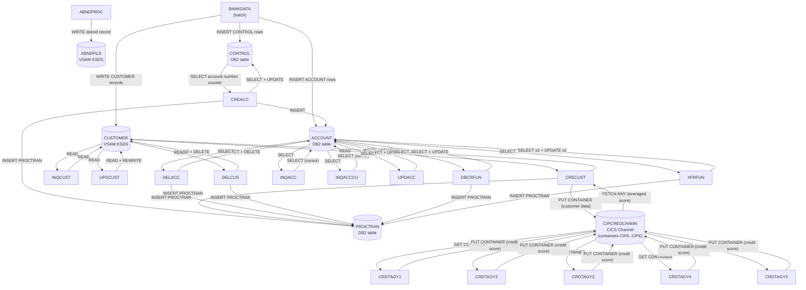

# Data Flows

Producer-consumer relationships between programs, tracing how data moves through files, databases, and CICS channels.

## Data Flow Diagram

## File Data Flows

| File / Dataset           | Producers (Write)      | Consumers (Read)                    | Flow Pattern |
| ------------------------ | ---------------------- | ----------------------------------- | ------------ |
| CUSTOMER VSAM (KSDS)     | BANKDATA, CRECUST      | INQCUST, UPDCUST, DELCUS, CRECUST   | Fan-out / Round-trip |
| ABNDFILE VSAM (KSDS)     | ABNDPROC               | (monitoring / manual review)        | Fan-in (write only from application) |

Notes:
- CUSTOMER VSAM is an indexed KSDS. The cluster definition specifies KEYS(16 4): a 16-byte key starting at offset 4. The first 4 bytes of each record are an eyecatcher; the key itself is composed of sort code (6 bytes) + customer number (10 bytes) = 16 bytes.
- BANKDATA writes to CUSTOMER VSAM via native COBOL I-O (SELECT...ASSIGN TO VSAM); all other programs access it through EXEC CICS READ/WRITE/REWRITE/DELETE FILE('CUSTOMER').
- ABNDFILE VSAM is written exclusively by ABNDPROC (681-byte fixed record, 12-byte key at offset 0); no application program reads from it directly.

## Database Data Flows

| Table / Segment | Writers (INSERT/UPDATE/DELETE)                       | Readers (SELECT/FETCH)                         | Flow Pattern  |
| --------------- | ---------------------------------------------------- | ---------------------------------------------- | ------------- |
| ACCOUNT         | BANKDATA (INSERT), CREACC (INSERT), DELACC (DELETE), UPDACC (UPDATE), DBCRFUN (UPDATE), XFRFUN (UPDATE x2) | INQACC (SELECT cursor), INQACCCU (SELECT cursor), DELACC (SELECT), UPDACC (SELECT), DBCRFUN (SELECT), XFRFUN (SELECT x2) | Shared (multi-writer, multi-reader) |
| PROCTRAN        | CREACC (INSERT), CRECUST (INSERT), DELACC (INSERT), DELCUS (INSERT), DBCRFUN (INSERT), XFRFUN (INSERT) | (audit/reporting -- no application reader found in codebase) | Fan-in (write-only from application) |
| CONTROL         | BANKDATA (INSERT), CREACC (UPDATE), BANKDATA (DELETE on re-init) | CREACC (SELECT -- account number counter)      | Round-trip    |

Notes:
- ACCOUNT is the central business table; it is read by all inquiry programs and written by all create/update/delete/transaction programs.
- PROCTRAN acts as an audit trail; every mutating operation appends a row. No read path was identified in the COBOL source, implying it is consumed externally (e.g., reporting or a z/OS Connect API).
- CONTROL holds the named counter used to generate sequential account numbers. BANKDATA seeds it; CREACC increments it on each new account creation (SELECT for current value, UPDATE to increment).

## Messaging Data Flows

| Queue / Topic          | Producers (PUT)            | Consumers (GET / FETCH)           | Message Format          |
| ---------------------- | -------------------------- | --------------------------------- | ----------------------- |
| CIPCREDCHANN (channel) | CRECUST (containers CIPA-CIPE) | CRDTAGY1-CRDTAGY5 (GET), CRECUST (FETCH ANY) | WS-CONT-IN copybook structure (eyecatcher, sort code, customer number, name, address, DOB, credit score, review date, success flag) |

Notes:
- CRECUST uses EXEC CICS RUN TRANSID to fire five asynchronous child tasks (OCR1-OCR5), each mapped to one of the CRDTAGY1-5 programs.
- Each child task reads a container (CIPA..CIPE) from the channel CIPCREDCHANN, computes a random credit score, writes it back, and returns.
- CRECUST waits up to 3 seconds then issues EXEC CICS FETCH ANY (NOSUSPEND) in a loop to collect returned scores. It averages whatever scores arrive within the timeout window. If no agency replies, the credit score is set to 0 and an error flag is set.

## Data Transformation Chains

Multi-step data processing chains where output of one program feeds the next:

### Chain 1: Customer Creation with Credit Scoring

| Chain Name           | Step | Program   | Input                             | Output                        | Transformation                                               |
| -------------------- | ---- | --------- | --------------------------------- | ----------------------------- | ------------------------------------------------------------ |
| Customer Creation    | 1    | BNK1CCS   | BMS map BNK1CCM (screen input)    | SUBPGM-PARMS COMMAREA         | Validates name, DOB, address; builds COMMAREA for CRECUST    |
| Customer Creation    | 2    | CRECUST   | SUBPGM-PARMS COMMAREA             | CUSTOMER VSAM record          | Runs parallel credit checks via async Async API (OCR1-5)      |
| Customer Creation    | 2a   | CRDTAGY1-5| CIPCREDCHANN container (in)       | CIPCREDCHANN container (out)  | Each agency returns a random credit score between 1 and 999  |
| Customer Creation    | 2b   | CRECUST   | Credit scores from FETCH ANY      | Averaged credit score         | Averages received scores; writes customer record to VSAM     |
| Customer Creation    | 3    | CRECUST   | Customer data                     | PROCTRAN DB2 row              | Appends a creation event to the processed-transaction log    |

### Chain 2: Account Creation

| Chain Name      | Step | Program  | Input                          | Output                     | Transformation                                                   |
| --------------- | ---- | -------- | ------------------------------ | -------------------------- | ---------------------------------------------------------------- |
| Account Creation | 1   | BNK1CAC  | BMS map BNK1CAM (screen input) | SUBPGM-PARMS COMMAREA      | Validates account type, interest rate, overdraft; builds COMMAREA |
| Account Creation | 2   | CREACC   | SUBPGM-PARMS COMMAREA          | CONTROL table (UPDATE)     | Reads account-number counter from CONTROL, increments it          |
| Account Creation | 3   | CREACC   | CONTROL counter value          | ACCOUNT DB2 row            | Inserts new ACCOUNT row with generated account number             |
| Account Creation | 4   | CREACC   | ACCOUNT row                    | PROCTRAN DB2 row           | Appends a creation event to the processed-transaction log         |

### Chain 3: Fund Transfer

| Chain Name    | Step | Program  | Input                           | Output                     | Transformation                                              |
| ------------- | ---- | -------- | ------------------------------- | -------------------------- | ----------------------------------------------------------- |
| Fund Transfer | 1    | BNK1TFN  | BMS map BNK1TFM (screen input)  | SUBPGM-PARMS COMMAREA      | Validates source/target accounts and amount                 |
| Fund Transfer | 2    | XFRFUN   | SUBPGM-PARMS COMMAREA           | ACCOUNT row (source debit) | SELECTs source account, subtracts amount, UPDATEs balance   |
| Fund Transfer | 3    | XFRFUN   | SUBPGM-PARMS COMMAREA           | ACCOUNT row (target credit)| SELECTs target account, adds amount, UPDATEs balance        |
| Fund Transfer | 4    | XFRFUN   | Transfer details                | PROCTRAN DB2 row           | Appends a transfer event to the processed-transaction log   |

### Chain 4: Customer Deletion

| Chain Name        | Step | Program  | Input                              | Output                          | Transformation                                                        |
| ----------------- | ---- | -------- | ---------------------------------- | ------------------------------- | --------------------------------------------------------------------- |
| Customer Deletion | 1    | BNK1DCS  | BMS map BNK1DCM (PF5 delete key)   | DELCUS-COMMAREA                 | Confirms customer number and invokes DELCUS                           |
| Customer Deletion | 2    | DELCUS   | DELCUS-COMMAREA (customer number)  | INQCUST call                    | Verifies the customer exists via INQCUST                              |
| Customer Deletion | 3    | DELCUS   | INQACCCU result (account list)     | DELACC calls (one per account)  | Iterates over all accounts; calls DELACC once per account to delete   |
| Customer Deletion | 4    | DELACC   | Account number (per iteration)     | ACCOUNT DB2 row deleted         | Deletes ACCOUNT row and writes PROCTRAN delete record                 |
| Customer Deletion | 5    | DELCUS   | Customer key                       | CUSTOMER VSAM record deleted    | Deletes the CUSTOMER VSAM record after all accounts are cleared       |
| Customer Deletion | 6    | DELCUS   | Customer delete details            | PROCTRAN DB2 row                | Appends a customer-deletion event to the processed-transaction log    |

### Chain 5: Batch Data Initialisation

| Chain Name        | Step | Program  | Input                            | Output                         | Transformation                                                       |
| ----------------- | ---- | -------- | -------------------------------- | ------------------------------ | -------------------------------------------------------------------- |
| Data Initialise   | 1    | IDCAMS   | SYSIN (DELETE + DEFINE ABNDFILE) | ABNDFILE VSAM cluster          | Recreates the VSAM abend-file cluster                                |
| Data Initialise   | 2    | IDCAMS   | SYSIN (DELETE + DEFINE CUSTOMER) | CUSTOMER VSAM cluster          | Recreates the VSAM customer-file cluster                             |
| Data Initialise   | 3    | BANKDATA | PARM='1,10000,1,seed'            | CUSTOMER VSAM, ACCOUNT DB2, CONTROL DB2 | Generates random customer + account data and seeds all three stores |
