# Program Call Graph

Topology of CALL, CICS LINK, CICS XCTL, and CICS RUN (async) relationships between programs in the CBSA application.

## Call Graph

```mermaid
graph TD
    %% Entry-point programs (transaction-driven)
    BNKMENU["BNKMENU\n(OMEN - online)"]
    BNK1CAC["BNK1CAC\n(OCAC - online)"]
    BNK1CCA["BNK1CCA\n(OCCA - online)"]
    BNK1CCS["BNK1CCS\n(OCCS - online)"]
    BNK1CRA["BNK1CRA\n(OCRA - online)"]
    BNK1DAC["BNK1DAC\n(ODAC - online)"]
    BNK1DCS["BNK1DCS\n(ODCS - online)"]
    BNK1TFN["BNK1TFN\n(OTFN - online)"]
    BNK1UAC["BNK1UAC\n(OUAC - online)"]
    BANKDATA["BANKDATA\n(batch)"]

    %% Backend / subprogram tier
    ABNDPROC["ABNDPROC\n(subprogram)"]
    CREACC["CREACC\n(subprogram)"]
    CRECUST["CRECUST\n(subprogram)"]
    DBCRFUN["DBCRFUN\n(subprogram)"]
    DELACC["DELACC\n(subprogram)"]
    DELCUS["DELCUS\n(subprogram)"]
    GETCOMPY["GETCOMPY\n(subprogram)"]
    GETSCODE["GETSCODE\n(subprogram)"]
    INQACC["INQACC\n(subprogram)"]
    INQACCCU["INQACCCU\n(subprogram)"]
    INQCUST["INQCUST\n(subprogram)"]
    UPDACC["UPDACC\n(subprogram)"]
    UPDCUST["UPDCUST\n(subprogram)"]
    XFRFUN["XFRFUN\n(subprogram)"]

    %% Credit agency stubs (async)
    CRDTAGY1["CRDTAGY1\n(OCR1 - async)"]
    CRDTAGY2["CRDTAGY2\n(OCR2 - async)"]
    CRDTAGY3["CRDTAGY3\n(OCR3 - async)"]
    CRDTAGY4["CRDTAGY4\n(OCR4 - async)"]
    CRDTAGY5["CRDTAGY5\n(OCR5 - async)"]

    %% BNKMENU routes user to transactions via RETURN TRANSID
    BNKMENU -->|"RETURN TRANSID ODCS"| BNK1DCS
    BNKMENU -->|"RETURN TRANSID ODAC"| BNK1DAC
    BNKMENU -->|"RETURN TRANSID OCCS"| BNK1CCS
    BNKMENU -->|"RETURN TRANSID OCAC"| BNK1CAC
    BNKMENU -->|"RETURN TRANSID OUAC"| BNK1UAC
    BNKMENU -->|"RETURN TRANSID OCRA"| BNK1CRA
    BNKMENU -->|"RETURN TRANSID OTFN"| BNK1TFN
    BNKMENU -->|"RETURN TRANSID OCCA"| BNK1CCA

    %% BNK1 screen programs link to back-end subprograms
    BNK1CAC -->|"CICS LINK CREACC"| CREACC
    BNK1CCA -->|"CICS LINK INQACCCU"| INQACCCU
    BNK1CCS -->|"CICS LINK CRECUST"| CRECUST
    BNK1CRA -->|"CICS LINK DBCRFUN"| DBCRFUN
    BNK1DAC -->|"CICS LINK INQACC"| INQACC
    BNK1DAC -->|"CICS LINK DELACC"| DELACC
    BNK1DCS -->|"CICS LINK INQCUST"| INQCUST
    BNK1DCS -->|"CICS LINK DELCUS"| DELCUS
    BNK1DCS -->|"CICS LINK UPDCUST"| UPDCUST
    BNK1TFN -->|"CICS LINK XFRFUN"| XFRFUN
    BNK1UAC -->|"CICS LINK INQACC"| INQACC
    BNK1UAC -->|"CICS LINK UPDACC"| UPDACC

    %% Back-end subprograms that call other subprograms
    CREACC -->|"CICS LINK INQCUST"| INQCUST
    CREACC -->|"CICS LINK INQACCCU"| INQACCCU
    CRECUST -->|"CICS RUN TRANSID OCR1 async"| CRDTAGY1
    CRECUST -->|"CICS RUN TRANSID OCR2 async"| CRDTAGY2
    CRECUST -->|"CICS RUN TRANSID OCR3 async"| CRDTAGY3
    CRECUST -->|"CICS RUN TRANSID OCR4 async"| CRDTAGY4
    CRECUST -->|"CICS RUN TRANSID OCR5 async"| CRDTAGY5
    DELCUS -->|"CICS LINK INQCUST"| INQCUST
    DELCUS -->|"CICS LINK INQACCCU"| INQACCCU
    DELCUS -->|"CICS LINK DELACC"| DELACC

    %% Error handler -- called by virtually all programs
    BNK1CAC -->|"CICS LINK ABNDPROC"| ABNDPROC
    BNK1CCA -->|"CICS LINK ABNDPROC"| ABNDPROC
    BNK1CCS -->|"CICS LINK ABNDPROC"| ABNDPROC
    BNK1CRA -->|"CICS LINK ABNDPROC"| ABNDPROC
    BNK1DAC -->|"CICS LINK ABNDPROC"| ABNDPROC
    BNK1DCS -->|"CICS LINK ABNDPROC"| ABNDPROC
    BNK1TFN -->|"CICS LINK ABNDPROC"| ABNDPROC
    BNK1UAC -->|"CICS LINK ABNDPROC"| ABNDPROC
    BNKMENU -->|"CICS LINK ABNDPROC"| ABNDPROC
    CREACC  -->|"CICS LINK ABNDPROC"| ABNDPROC
    CRECUST -->|"CICS LINK ABNDPROC"| ABNDPROC
    CRDTAGY1 -->|"CICS LINK ABNDPROC"| ABNDPROC
    CRDTAGY2 -->|"CICS LINK ABNDPROC"| ABNDPROC
    CRDTAGY3 -->|"CICS LINK ABNDPROC"| ABNDPROC
    CRDTAGY4 -->|"CICS LINK ABNDPROC"| ABNDPROC
    CRDTAGY5 -->|"CICS LINK ABNDPROC"| ABNDPROC
    DBCRFUN  -->|"CICS LINK ABNDPROC"| ABNDPROC
    DELACC   -->|"CICS LINK ABNDPROC"| ABNDPROC
    DELCUS   -->|"CICS LINK ABNDPROC"| ABNDPROC
    INQACC   -->|"CICS LINK ABNDPROC"| ABNDPROC
    INQACCCU -->|"CICS LINK ABNDPROC"| ABNDPROC
    INQCUST  -->|"CICS LINK ABNDPROC"| ABNDPROC
    XFRFUN   -->|"CICS LINK ABNDPROC"| ABNDPROC

    %% INQACCCU also calls INQCUST directly
    INQACCCU -->|"CICS LINK INQCUST"| INQCUST
```

## Call Matrix

| Caller     | Callee     | Call Type            | Linkage Items                                        |
| ---------- | ---------- | -------------------- | ---------------------------------------------------- |
| BNKMENU    | BNK1DCS    | CICS RETURN TRANSID  | TRANSID=ODCS (menu option 1 -- Display Customer)     |
| BNKMENU    | BNK1DAC    | CICS RETURN TRANSID  | TRANSID=ODAC (menu option 2 -- Display Account)      |
| BNKMENU    | BNK1CCS    | CICS RETURN TRANSID  | TRANSID=OCCS (menu option 3 -- Create Customer)      |
| BNKMENU    | BNK1CAC    | CICS RETURN TRANSID  | TRANSID=OCAC (menu option 4 -- Create Account)       |
| BNKMENU    | BNK1UAC    | CICS RETURN TRANSID  | TRANSID=OUAC (menu option 5 -- Update Account)       |
| BNKMENU    | BNK1CRA    | CICS RETURN TRANSID  | TRANSID=OCRA (menu option 6 -- Credit/Debit)         |
| BNKMENU    | BNK1TFN    | CICS RETURN TRANSID  | TRANSID=OTFN (menu option 7 -- Transfer Funds)       |
| BNKMENU    | BNK1CCA    | CICS RETURN TRANSID  | TRANSID=OCCA (menu option A -- Customer Accounts)    |
| BNK1CAC    | CREACC     | CICS LINK            | COMMAREA=SUBPGM-PARMS (cust no, acc type, int rate, overdraft, dates) |
| BNK1CCA    | INQACCCU   | CICS LINK            | COMMAREA=INQACCCU-COMMAREA (customer number, max accounts) |
| BNK1CCS    | CRECUST    | CICS LINK            | COMMAREA=SUBPGM-PARMS (name, DOB, address, credit score fields) |
| BNK1CRA    | DBCRFUN    | CICS LINK            | COMMAREA=SUBPGM-PARMS (account number, amount, facility type) |
| BNK1DAC    | INQACC     | CICS LINK            | COMMAREA=INQACC-COMMAREA (account number)            |
| BNK1DAC    | DELACC     | CICS LINK            | COMMAREA=PARMS-SUBPGM (account number)               |
| BNK1DCS    | INQCUST    | CICS LINK            | COMMAREA=INQCUST-COMMAREA (customer number)          |
| BNK1DCS    | DELCUS     | CICS LINK            | COMMAREA=DELCUS-COMMAREA (customer number)           |
| BNK1DCS    | UPDCUST    | CICS LINK            | COMMAREA=UPDCUST-COMMAREA (customer fields)          |
| BNK1TFN    | XFRFUN     | CICS LINK            | COMMAREA=SUBPGM-PARMS (source/target account, amount) |
| BNK1UAC    | INQACC     | CICS LINK            | COMMAREA=DFHCOMMAREA (account number)                |
| BNK1UAC    | UPDACC     | CICS LINK            | COMMAREA=DFHCOMMAREA (account fields to update)      |
| CREACC     | INQCUST    | CICS LINK            | COMMAREA=INQCUST-COMMAREA (customer number)          |
| CREACC     | INQACCCU   | CICS LINK            | COMMAREA=INQACCCU-COMMAREA (customer number)         |
| CRECUST    | CRDTAGY1   | CICS RUN TRANSID     | TRANSID=OCR1, CHANNEL=CIPCREDCHANN, container CIPA   |
| CRECUST    | CRDTAGY2   | CICS RUN TRANSID     | TRANSID=OCR2, CHANNEL=CIPCREDCHANN, container CIPB   |
| CRECUST    | CRDTAGY3   | CICS RUN TRANSID     | TRANSID=OCR3, CHANNEL=CIPCREDCHANN, container CIPC   |
| CRECUST    | CRDTAGY4   | CICS RUN TRANSID     | TRANSID=OCR4, CHANNEL=CIPCREDCHANN, container CIPD   |
| CRECUST    | CRDTAGY5   | CICS RUN TRANSID     | TRANSID=OCR5, CHANNEL=CIPCREDCHANN, container CIPE   |
| DELCUS     | INQCUST    | CICS LINK            | COMMAREA=INQCUST-COMMAREA (customer number)          |
| DELCUS     | INQACCCU   | CICS LINK            | COMMAREA=INQACCCU-COMMAREA (customer number)         |
| DELCUS     | DELACC     | CICS LINK            | COMMAREA=DELACC-COMMAREA (account number per loop)   |
| INQACCCU   | INQCUST    | CICS LINK            | COMMAREA=INQCUST-COMMAREA (customer number, cross-reference) |
| 23 programs | ABNDPROC  | CICS LINK            | COMMAREA=ABNDINFO-REC (abend code, task no, date/time, program, freeform text); UPDACC and UPDCUST declare WS-ABEND-PGM but do not issue EXEC CICS LINK to ABNDPROC |

## Entry Point Programs

Programs that are not called by any other program in the analysed codebase (likely top-level batch or CICS entry points):

- BNKMENU -- CICS transaction OMEN; the BMS main menu, first program the user encounters in the 3270 session
- BNK1CAC -- CICS transaction OCAC; create-account screen, reached via BNKMENU menu option 4 or directly
- BNK1CCA -- CICS transaction OCCA; customer-accounts inquiry screen, reached via BNKMENU menu option A
- BNK1CCS -- CICS transaction OCCS; create-customer screen, reached via BNKMENU menu option 3
- BNK1CRA -- CICS transaction OCRA; credit/debit screen, reached via BNKMENU menu option 6
- BNK1DAC -- CICS transaction ODAC; display-account screen, reached via BNKMENU menu option 2
- BNK1DCS -- CICS transaction ODCS; display-customer screen, reached via BNKMENU menu option 1
- BNK1TFN -- CICS transaction OTFN; transfer-funds screen, reached via BNKMENU menu option 7
- BNK1UAC -- CICS transaction OUAC; update-account screen, reached via BNKMENU menu option 5
- BANKDATA -- batch job (BANKDATA JCL); standalone data initialisation program, not invoked by any CICS program

## Leaf Programs

Programs that do not call any other program (utility or terminal processing):

- ABNDPROC -- writes ABEND records to the ABNDFILE VSAM dataset; has no outgoing CALL or LINK
- CRDTAGY1 -- async credit-scoring stub 1; reads/writes CICS containers only, returns via EXEC CICS RETURN
- CRDTAGY2 -- async credit-scoring stub 2; same as CRDTAGY1
- CRDTAGY3 -- async credit-scoring stub 3; same as CRDTAGY1
- CRDTAGY4 -- async credit-scoring stub 4; same as CRDTAGY1
- CRDTAGY5 -- async credit-scoring stub 5; same as CRDTAGY1
- DBCRFUN -- debit/credit function; performs DB2 SQL only, no outgoing LINKs to other application programs
- GETCOMPY -- utility returning company name; immediate RETURN, no outgoing calls
- GETSCODE -- utility returning sort code; immediate RETURN, no outgoing calls
- INQACC -- account inquiry; DB2 cursor SELECT only, no outgoing application LINKs
- INQCUST -- customer inquiry; VSAM READ only, no outgoing application LINKs
- UPDACC -- account update; DB2 SELECT and UPDATE only, no outgoing application LINKs
- UPDCUST -- customer update; VSAM READ and REWRITE only, no outgoing application LINKs
- XFRFUN -- fund transfer; DB2 SELECT, UPDATE, INSERT only, no outgoing application LINKs

Note: GETCOMPY and GETSCODE are registered in the CICS CSD (BANK group) but no callers were found within the analysed COBOL source. They may be called by programs outside the analysed scope (e.g., REST API handlers or z/OS Connect endpoints).

Note: UPDACC and UPDCUST each declare WS-ABEND-PGM = 'ABNDPROC' in working storage but no EXEC CICS LINK PROGRAM(WS-ABEND-PGM) statement was found in either program. They are correctly classified as leaf programs.

## Hub Programs

Programs called by 3 or more other programs (shared utilities):

| Program  | Called By                              | Call Count |
| -------- | -------------------------------------- | ---------- |
| ABNDPROC | 23 application programs: BNKMENU, BNK1CAC, BNK1CCA, BNK1CCS, BNK1CRA, BNK1DAC, BNK1DCS, BNK1TFN, BNK1UAC, CREACC, CRECUST, CRDTAGY1-5, DBCRFUN, DELACC, DELCUS, INQACC, INQACCCU, INQCUST, XFRFUN | 23 |
| INQCUST  | BNK1DCS, CREACC, DELCUS, INQACCCU    | 4          |
| INQACCCU | BNK1CCA, CREACC, DELCUS               | 3          |
| INQACC   | BNK1DAC, BNK1UAC                      | 2          |
| DELACC   | BNK1DAC, DELCUS                       | 2          |

## Circular Dependencies

No circular CALL chains detected. The call graph is strictly layered: BMS screen programs call back-end subprograms which call utility subprograms; no back-end program calls a BMS front-end program.
