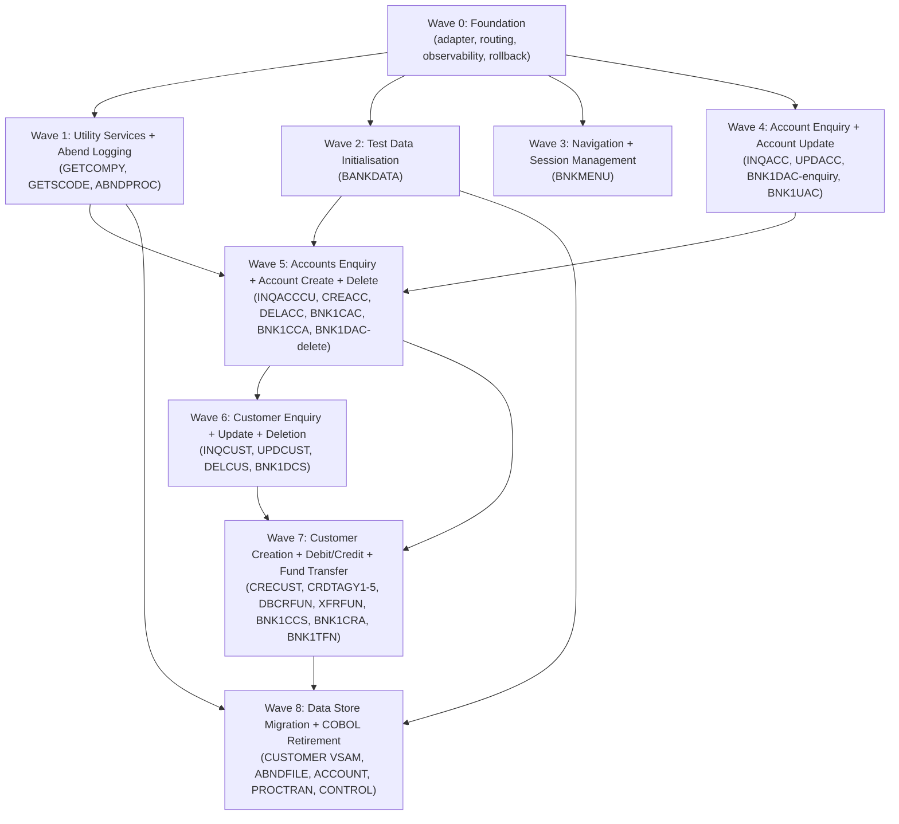

# Implementation Plan

A phased migration plan for incrementally extracting capabilities from this COBOL application using a strangler fig (hollow-out) approach.

## Executive Summary

The CICS Banking Sample Application (CBSA) is a clean two-tier CICS application comprising 29 COBOL programs (~18,700 LOC), 2 VSAM files, 3 DB2 tables, 9 BMS mapsets, and 14 CICS transactions. Its existing layering -- BMS screen programs delegating to backend service programs via CICS LINK with typed COMMAREA contracts -- is the ideal seam for a strangler fig migration. The recommended approach is outside-in: replace the 3270 BMS presentation tier with REST or web API endpoints first, routing those calls to the still-running COBOL backends via an anti-corruption layer; then progressively hollow out the backends service by service, starting with leaf programs (no downstream callers) and working inward toward hub programs (INQCUST, INQACCCU) and the highest-complexity orchestrators (CRECUST, DELCUS, XFRFUN).

Nine waves are planned including the foundation wave (Wave 0 through Wave 8). The critical path runs through the Customer Service cluster (Wave 6) because INQCUST and INQACCCU are shared utilities called by CREACC, DELCUS, BNK1DCS, BNK1CCA, and INQACCCU itself -- they cannot be retired until every caller has been migrated. The three highest-risk programmes are CRECUST (CICS ENQ serialisation, SYSIDERR retry fall-through defect, async credit agency fanout), XFRFUN (deadlock retry loop, two-account atomicity), and DELCUS (cascading delete, token-based optimistic locking, SYNCONRETURN). The SORTCODE compile-time constant embedded in 18 programs must be externalised to a configuration service before any backend migration wave can proceed. Known defects -- particularly the counter-non-rollback in CRECUST and the ABND-TIME timestamp bug pervasive across 23 programs -- should be corrected in the new implementation, not replicated.

---

## Migration Strategy

| Property              | Value                                                                  |
| --------------------- | ---------------------------------------------------------------------- |
| Approach              | Strangler Fig (hollow-out)                                             |
| Direction             | Outside-in (BMS presentation tier first, then backend services)        |
| Coexistence Duration  | 18-24 months (9 waves, waves 1-3 can run in parallel after wave 0)    |
| Primary Seam Type     | API gateway (CICS LINK COMMAREA boundary) + Database view (DB2/VSAM)  |

### Strategy Rationale

The CBSA architecture is already organised for strangler fig extraction. The BMS screen programs (BNK1xxx, BNKMENU) contain no business logic beyond field validation and map I/O; all data access and business rules live in the backend service programs (CREACC, CRECUST, DBCRFUN, XFRFUN, etc.). This means the CICS LINK boundary between each BNK1xxx program and its backend target is a pre-existing, typed, well-documented seam -- the COMMAREA copybooks function as interface definitions.

An outside-in approach is preferred over inside-out for three reasons. First, the BMS 3270 terminal interface is the hardest dependency for modern consumers to use; replacing it with REST/JSON unblocks both web UI and API integration immediately. Second, the backend programs can continue to serve COBOL callers and new REST callers simultaneously during coexistence, avoiding dual-write complexity in early waves. Third, the existing Java web layer (which already calls GETCOMPY and GETSCODE via CICS LINK) demonstrates that the organisation has infrastructure for mixed COBOL/Java CICS operation, reducing Wave 0 risk.

The CUSTOMER VSAM file and the DB2 ACCOUNT, PROCTRAN, and CONTROL tables are shared across multiple backend programs. Because those backends will be migrated in separate waves, the data stores must remain shared (both old COBOL and new services reading and writing the same physical store) throughout the transition. Migration of the data stores themselves to a modern schema occurs as the last program in each data cluster is retired.

---

## Seam Analysis

Natural boundaries in the current system where extraction intercepts can be placed:

| Seam | Type | Programs Involved | Direction | Complexity | Notes |
| --- | --- | --- | --- | --- | --- |
| BMS 3270 terminal interface | Screen | BNKMENU, all BNK1xxx | In | Medium | 9 mapsets; each screen is a stateless pseudo-conversational request; natural REST request boundary; BMS symbolic map copybooks must be recovered from BMS source before extraction |
| CICS LINK COMMAREA (BMS to backend) | CALL | BNK1CAC/CREACC, BNK1CCS/CRECUST, BNK1CRA/DBCRFUN, BNK1TFN/XFRFUN, BNK1DAC/INQACC+DELACC, BNK1DCS/INQCUST+DELCUS+UPDCUST, BNK1UAC/INQACC+UPDACC, BNK1CCA/INQACCCU | Both | Low | COMMAREA copybooks are the service contracts; one-to-one mapping to REST endpoints; adapter shim translates HTTP request to COMMAREA and invokes CICS LINK |
| GETCOMPY / GETSCODE Java boundary | CALL | GETCOMPY, GETSCODE | In | Low | Java CompanyNameResource.java already calls GETCOMPY via CICS LINK; existing pattern for COBOL-to-Java interop; replace with config service or environment variable |
| VSAM CUSTOMER file boundary | File | CRECUST, INQCUST, UPDCUST, DELCUS, BANKDATA | Both | High | KSDS with composite 16-byte key; control sentinel record at key 0000009999999999 must be handled separately; CICS FILE vs batch FD access pattern difference; dual-write needed during coexistence |
| DB2 ACCOUNT table boundary | DB | CREACC, INQACC, INQACCCU, UPDACC, DELACC, DBCRFUN, XFRFUN, BANKDATA | Both | Medium | Shared by all account-domain programs; can use shared database pattern during coexistence; date format inconsistency (DD.MM.YYYY stored in DB2 DATE columns) must be normalised |
| DB2 PROCTRAN table boundary | DB | CRECUST, CREACC, DELACC, DELCUS, DBCRFUN, XFRFUN | Out | Medium | Write-only append log from COBOL; external readers unknown; new services must continue writing PROCTRAN rows (or an event stream equivalent) for audit continuity |
| DB2 CONTROL table boundary | DB | CREACC, BANKDATA | Both | Medium | Counter semantics guarded by CICS ENQ; replace with DB2 SEQUENCE or identity column; only two programs involved but timing is critical (CREACC migration depends on this) |
| CICS Async channel (credit scoring) | Queue | CRECUST, CRDTAGY1-5 | Both | Medium | CICS channels/containers used as a de facto message queue; replace with HTTP async or MQ fanout; credit agencies are stubs -- replace with parameterised external API call |
| CICS ENQ/DEQ resource locks | CALL | CRECUST (HBNKCUST), CREACC (HBNKACCT) | Both | High | No direct equivalent in non-CICS systems; replace with DB2 SEQUENCE (CREACC) or optimistic locking + retry (CRECUST); SYSIDERR retry fall-through defect in CRECUST must not be replicated |
| ABNDFILE VSAM write boundary | File | ABNDPROC | Out | Low | Write-only; no application reader; replace with structured log sink (JSON/ELK/Splunk) as part of Wave 1; 23 programs link to ABNDPROC -- adapter must remain callable from COBOL during coexistence |

---

## Migration Waves

### Wave 0: Foundation

| Property      | Value                                                                                  |
| ------------- | -------------------------------------------------------------------------------------- |
| Objective     | Establish the infrastructure for coexistence: routing adapter, observability, and rollback mechanism before any capability moves |
| Prerequisites | None                                                                                   |

**Deliverables:**

- CICS LINK adapter library: a thin shim that translates inbound HTTP/REST requests into COMMAREA payloads and issues EXEC CICS LINK to the existing COBOL backend; one adapter per backend program (CREACC, CRECUST, DBCRFUN, XFRFUN, INQACC, INQACCCU, INQCUST, UPDACC, UPDCUST, DELACC, DELCUS, GETCOMPY, GETSCODE). This is the anti-corruption layer.
- Feature flag / traffic routing layer: controls whether each CICS transaction routes to the legacy BMS program or to the new REST endpoint. Starts with 100% COBOL; individual capabilities can be flipped per transaction.
- Structured logging service: a modern replacement for ABNDPROC that accepts the same ABNDINFO schema but writes to a JSON log sink (ELK, Splunk, or CloudWatch). Register as a parallel target alongside ABNDPROC during coexistence so defects in both paths are visible.
- SORTCODE externalisation: replace the SORTCODE compile-time constant (currently embedded in 18 programs as a COPY SORTCODE literal) with a runtime configuration property injected via the adapter layer. This unblocks backend migration by decoupling the sort code from the binary.
- CI/CD pipeline for the new platform: build, test, and deploy automation for new services.
- Rollback mechanism: a circuit-breaker toggle per capability that redirects all traffic back to the COBOL BMS path within 60 seconds if the new service returns errors above a threshold.
- Dark-traffic / shadow mode: route a copy of production traffic to the new adapter layer (discarding responses) to validate COMMAREA serialisation before go-live.

---

### Wave 1: Utility Services and Abend Logging

| Property     | Value                                                                         |
| ------------ | ----------------------------------------------------------------------------- |
| Capability   | Utility Services (14) + Centralised Abend Logging (13)                       |
| Programs     | GETCOMPY, GETSCODE, ABNDPROC                                                  |
| Dependencies | Wave 0                                                                        |
| Complexity   | Low                                                                           |
| Risk Level   | Low                                                                           |

**Extraction scope:**

- GETCOMPY: replace with a configuration service endpoint that returns the application company name from an environment variable or config map. The Java CompanyNameResource.java caller is redirected from CICS LINK to HTTP.
- GETSCODE: replace with a configuration service endpoint returning the sort code. Any REST API or z/OS Connect caller is redirected.
- ABNDPROC: replace with a structured logging microservice accepting the ABNDINFO schema (or a JSON equivalent) and writing to the chosen log sink. The CICS LINK call from 23 COBOL programs remains in place during coexistence -- the adapter forwards to both ABNDPROC (VSAM) and the new log service until all 23 callers have been migrated.

**Coexistence approach:**

- GETCOMPY and GETSCODE have no COBOL callers in the source; only the Java web layer calls them. Redirect the Java callers to the new config service endpoint. The COBOL programs remain deployed in CICS as a fallback but receive no traffic once the Java layer is switched.
- ABNDPROC stays deployed and continues to write to ABNDFILE VSAM. The new logging service runs in parallel. Once all COBOL programs are migrated off ABNDPROC (Wave 7), the VSAM write can be stopped.

**Rollback plan:**

- GETCOMPY/GETSCODE: redirect Java callers back to CICS LINK. Zero data risk; no state.
- ABNDPROC: disable the new logging service adapter; COBOL programs continue linking to ABNDPROC only. No data loss because ABNDFILE VSAM continues to receive writes throughout.

---

### Wave 2: Test Data Initialisation

| Property     | Value                                                              |
| ------------ | ------------------------------------------------------------------ |
| Capability   | Test Data Initialisation (15)                                      |
| Programs     | BANKDATA (batch), IDCAMS (JCL steps BANKDAT0, BANKDAT1)           |
| Dependencies | Wave 0                                                             |
| Complexity   | Medium                                                             |
| Risk Level   | Low                                                                |

**Extraction scope:**

- Replace BANKDATA.cbl and its JCL harness with a modern data fixture script (Python, Go, or equivalent) that writes to the same CUSTOMER VSAM and DB2 ACCOUNT/CONTROL tables during the coexistence period, and to the new data stores post-migration.
- Fix known defects in BANKDATA during rewrite: hardcoded statement dates (01.07.2021 / 01.08.2021), SURNAME array duplicates and misspellings, INITIALS transposition, and the unreachable CALC-DAY-OF-WEEK section.
- The new fixture script accepts the same logical parameters (start, end, step, random seed) via CLI arguments instead of JCL PARM.
- Update the fixture script to seed the DB2 SEQUENCE object (created in Wave 5) instead of CONTROL table rows once Wave 5 is complete. The fixture must support both seeding modes during the Wave 5 transition period.

**Coexistence approach:**

- BANKDATA is batch-only with no CICS coupling. It can be replaced independently of all online programs. The new fixture script targets the same physical VSAM and DB2 stores used by the COBOL online programs during coexistence.
- IDCAMS cluster recreation steps (BANKDAT0, BANKDAT1) are replaced by schema migration scripts that manage the VSAM cluster lifecycle.

**Rollback plan:**

- Re-run the original BANKDATA JCL. Because this is a destructive initialisation operation (not a live transaction path), rollback means re-running either the old or new fixture script. No routing risk.

---

### Wave 3: Navigation and Session Management

| Property     | Value                                                              |
| ------------ | ------------------------------------------------------------------ |
| Capability   | Navigation and Session Management (1)                              |
| Programs     | BNKMENU                                                            |
| Dependencies | Wave 0                                                             |
| Complexity   | Low                                                                |
| Risk Level   | Low                                                                |

**Extraction scope:**

- Replace the BNKMENU BMS 3270 main menu with a new web UI landing page or REST navigation endpoint. The menu routes to 8 capabilities (ODCS, ODAC, OCCS, OCAC, OUAC, OCRA, OTFN, OCCA) -- these become API routes or UI navigation links.
- Pseudo-conversational session management (1-byte COMMAREA token, CICS RETURN TRANSID) is replaced by stateless HTTP sessions (JWT or cookie-based).
- The ABND-THIS-TASK abend path in BNKMENU is replaced by the structured logging service from Wave 1.

**Coexistence approach:**

- The traffic routing layer (Wave 0) directs 3270 sessions to BNKMENU and new web/API sessions to the new navigation layer. Both paths can coexist indefinitely.
- BNKMENU remains deployed in CICS throughout the transition for terminal users until 3270 access is formally retired.

**Rollback plan:**

- Toggle the traffic routing flag to direct all sessions back to BNKMENU. No data state is held in BNKMENU; rollback is instantaneous.

---

### Wave 4: Account Enquiry and Account Update

| Property     | Value                                                                          |
| ------------ | ------------------------------------------------------------------------------ |
| Capability   | Account Enquiry (4) + Account Update (7)                                       |
| Programs     | INQACC, UPDACC, BNK1DAC (partial -- enquiry path), BNK1UAC                    |
| Dependencies | Wave 0                                                                         |
| Complexity   | Low                                                                            |
| Risk Level   | Low                                                                            |

**Extraction scope:**

- INQACC: replace DB2 cursor SELECT with a REST GET /accounts/{accountNumber} endpoint backed by the same DB2 ACCOUNT table. Implement the sentinel mode (account number 99999999 returns the highest-numbered account) as a query parameter. Normalise date format from DD.MM.YYYY to ISO 8601 in responses.
- UPDACC: replace DB2 SELECT+UPDATE with a REST PATCH /accounts/{accountNumber} endpoint updating only ACCOUNT_TYPE, ACCOUNT_INTEREST_RATE, and ACCOUNT_OVERDRAFT_LIMIT. Preserve the no-PROCTRAN rule (no audit row on update). Fix the dead abend infrastructure (UPDACC currently soft-fails; new service should emit structured errors to the logging service from Wave 1). Note: the UPDACC program header comment incorrectly states that statement dates can be amended; define the API contract from the PROCEDURE DIVISION only -- statement dates are read-only.
- BNK1DAC (enquiry path) and BNK1UAC: the BMS presentation layer is replaced by the new web UI or REST client. BNK1DAC's delete path (DELACC) remains in COBOL through Wave 5.
- Wave 3 (BNKMENU) is recommended before Wave 4 for the web UI presentation path, but the backend INQACC/UPDACC extraction can proceed from Wave 0 alone if the 3270 BMS path continues to serve terminal users.

**Coexistence approach:**

- INQACC and UPDACC are leaf programs (no callers other than BNK1DAC and BNK1UAC). The CICS LINK adapter (Wave 0) allows BNK1DAC and BNK1UAC to route to the new REST services while remaining deployed in CICS.
- The DB2 ACCOUNT table is shared: both the COBOL programs still running (CREACC, DELACC, DBCRFUN, XFRFUN) and the new INQACC/UPDACC services read and write the same physical table. No dual-write needed for this wave because INQACC is read-only and UPDACC only updates three non-balance fields that no other program modifies concurrently.

**Rollback plan:**

- Toggle routing flag to direct BNK1DAC and BNK1UAC back to COBOL INQACC and UPDACC. INQACC is read-only; no data state to reconcile. UPDACC: if a partial set of updates were written by the new service before rollback, the DB2 ACCOUNT table values remain valid because the update is idempotent (no counter or sequence involved).

---

### Wave 5: Accounts Enquiry by Customer and Account Creation / Deletion

| Property     | Value                                                                                       |
| ------------ | ------------------------------------------------------------------------------------------- |
| Capability   | Accounts Enquiry by Customer (5) + Account Creation (6) + Account Deletion (8)             |
| Programs     | INQACCCU, BNK1CCA, CREACC, BNK1CAC, DELACC, BNK1DAC (delete path)                         |
| Dependencies | Wave 0, Wave 1, Wave 2, Wave 4                                                              |
| Complexity   | High                                                                                        |
| Risk Level   | High                                                                                        |

**Extraction scope:**

- INQACCCU: replace DB2 cursor SELECT returning up to 20 accounts with a REST GET /customers/{customerId}/accounts endpoint. INQACCCU also calls INQCUST for cross-reference; during this wave, INQCUST is still COBOL -- the new INQACCCU service calls INQCUST via the Wave 0 CICS LINK adapter until INQCUST migrates in Wave 6.
- CREACC: extract account creation logic as a REST POST /accounts endpoint. Critical migration tasks: (a) replace CICS ENQ/DEQ on HBNKACCT{sortcode} with a DB2 SEQUENCE object or identity column for account number generation, eliminating the ENQ race condition -- the DB2 SEQUENCE must be created and seeded with the current CONTROL.ACCOUNT-LAST value before cutover; (b) replace the CONTROL table SELECT+UPDATE counter pattern with the DB2 SEQUENCE; (c) PROCTRAN INSERT (type 'OCA') must be included in the same database transaction as the ACCOUNT INSERT; (d) the next-statement-date calculation inconsistency (CD010 vs WAD010) must be resolved in the new implementation; (e) confirm the CONTROL table schema owner (CONTDB2.cpy declares STTESTER but CRETB03.jcl uses IBMUSER) before SEQUENCE creation.
- DELACC: extract account deletion as a REST DELETE /accounts/{accountNumber} endpoint. PROCTRAN INSERT (type 'ODA') must be atomic with the ACCOUNT DELETE. Fix the missing ABNDPROC call on the HRAC abend path.
- BNK1CCA, BNK1CAC, and BNK1DAC (delete path): BMS presentation tier replaced by new web UI/REST client.
- The BANKDATA fixture (Wave 2) must be updated to reset the DB2 SEQUENCE instead of the CONTROL rows during re-initialisation; this update must be deployed before the Wave 5 SEQUENCE is created.

**Coexistence approach:**

- INQACCCU is called by CREACC, DELCUS, and BNK1CCA. When INQACCCU migrates, the COBOL callers (CREACC still COBOL until this wave, DELCUS still COBOL until Wave 6) must be able to call either the COBOL or new version. The Wave 0 adapter mediates: COBOL programs continue using EXEC CICS LINK to INQACCCU, which the adapter routes to the new service.
- CREACC accesses CONTROL DB2 table and ACCOUNT DB2 table. The CONTROL table counter must be migrated to a DB2 SEQUENCE before CREACC cutover. BANKDATA (Wave 2) must also be updated to seed the SEQUENCE instead of the CONTROL rows.
- DELACC is called by DELCUS (still COBOL through Wave 6). The Wave 0 adapter allows DELCUS to call either COBOL DELACC or the new service during the transition period.
- DB2 ACCOUNT and PROCTRAN tables remain shared with all remaining COBOL programs.

**Rollback plan:**

- INQACCCU: toggle routing flag; COBOL callers continue using EXEC CICS LINK to COBOL INQACCCU. Read-only; no data state to reconcile.
- CREACC: more complex. If the DB2 SEQUENCE has been created, rollback requires the COBOL CREACC to read from the SEQUENCE instead of the CONTROL table. Mitigation: run COBOL CREACC and new service in parallel for 48 hours (dark traffic), comparing outputs before cutover. Keep CONTROL table rows in sync with SEQUENCE value during transition.
- DELACC: toggle routing flag. ACCOUNT rows deleted by the new service cannot be restored from COBOL. Ensure new DELACC writes PROCTRAN rows in the same format as COBOL before cutover.

---

### Wave 6: Customer Service (Enquiry, Update, Deletion)

| Property     | Value                                                                                           |
| ------------ | ----------------------------------------------------------------------------------------------- |
| Capability   | Customer Enquiry (2) + Customer Update (9) + Customer Deletion (10)                            |
| Programs     | INQCUST, BNK1DCS (enquiry+update paths), UPDCUST, DELCUS, BNK1DCS (delete path)               |
| Dependencies | Wave 0, Wave 5                                                                                  |
| Complexity   | High                                                                                            |
| Risk Level   | High                                                                                            |

**Extraction scope:**

- INQCUST: replace VSAM READ with a REST GET /customers/{customerId} endpoint. INQCUST is the most widely shared utility (called by BNK1DCS, CREACC, DELCUS, INQACCCU -- all migrated by this wave except CRECUST which migrates in Wave 7). The VSAM CUSTOMER file must remain accessible to both the new service and COBOL CRECUST until Wave 7. INQCUST also implements a backward-browse (STARTBR/READPREV) path for last-customer lookup; this must be preserved as a query parameter in the new service.
- UPDCUST: replace VSAM READ+REWRITE with a REST PATCH /customers/{customerId} endpoint. Fix the dead abend infrastructure (currently soft-fails without logging). Preserve the no-PROCTRAN rule.
- DELCUS: the highest-risk extraction in this wave. Key migration tasks: (a) replace cascading CICS LINK to DELACC (now a REST service from Wave 5) with an iterated REST DELETE; (b) replace CICS token-based optimistic locking on CUSTOMER VSAM with optimistic locking via a row version field or CAS operation in the new data store; (c) replace SYSIDERR retry loop (100 retries, 3-second delay) with exponential backoff against the new data store; (d) the SYNCONRETURN on INQACCCU LINK must be replaced by appropriate transaction boundaries in the new orchestration; (e) PROCTRAN INSERT (type 'ODC') must be written atomically with the customer delete; (f) do not replicate the silent DELACC return-code non-inspection defect; (g) implement a saga pattern for the cascade -- see Transaction Integrity section.
- BNK1DCS: all paths (enquiry, update, delete) migrated to new web UI/REST client.

**Coexistence approach:**

- INQCUST migration is the critical path enabler. It is called by CRECUST (still COBOL through Wave 7). The Wave 0 adapter must route CRECUST's EXEC CICS LINK INQCUST to the new REST service. Shared CUSTOMER VSAM remains the single source of truth until Wave 7.
- UPDCUST and INQCUST both access the CUSTOMER VSAM file. During coexistence, CRECUST also writes to CUSTOMER VSAM (Wave 7 not yet done). All services must use a shared-database coexistence pattern against the same VSAM file (via CICS FILE commands for COBOL, or via a VSAM-adapter microservice for the new platform).
- DELCUS is a multi-step orchestrator. Its cascade depends on DELACC (new REST service from Wave 5) and INQACCCU (new REST service from Wave 5). Test the full cascade in a production-like staging environment before cutover.

**Rollback plan:**

- INQCUST: toggle routing flag; COBOL callers (CRECUST) continue using EXEC CICS LINK to COBOL INQCUST. Read-only; no data state risk.
- UPDCUST: toggle routing flag; any updates written by the new service are valid VSAM records readable by COBOL programs.
- DELCUS: highest rollback risk. After a customer deletion, the CUSTOMER VSAM record and associated ACCOUNT rows no longer exist. Rollback cannot restore deleted records. Mitigation: blue-green deployment with parallel COBOL and new-service shadow runs; retain COBOL DELCUS in CICS for 30 days after cutover for emergency re-route; ensure PROCTRAN rows are written before proceeding with deletes so the deletion event is auditable even on rollback.

---

### Wave 7: Customer Creation with Credit Scoring and Debit/Credit and Fund Transfer

| Property     | Value                                                                                                           |
| ------------ | --------------------------------------------------------------------------------------------------------------- |
| Capability   | Customer Creation with Credit Scoring (3) + Debit/Credit Funds (11) + Fund Transfer (12)                       |
| Programs     | CRECUST, BNK1CCS, CRDTAGY1-5, DBCRFUN, BNK1CRA, XFRFUN, BNK1TFN                                               |
| Dependencies | Wave 0, Wave 5, Wave 6                                                                                          |
| Complexity   | High                                                                                                            |
| Risk Level   | High                                                                                                            |

**Extraction scope:**

- CRECUST: the most complex extraction. Key tasks: (a) replace CICS Async API (RUN TRANSID / channels / containers) credit-scoring fanout with an async HTTP or message-queue fanout to five credit-agency endpoints (replacing CRDTAGY1-5 with a single parameterised external credit-scoring service or five independent calls); (b) replace CICS ENQ/DEQ on HBNKCUST{sortcode} with an optimistic locking pattern or distributed lock (e.g., Redis SETNX or DB2 row lock) for customer number allocation; (c) replace VSAM WRITE with the new customer data store write; (d) PROCTRAN INSERT (type 'OCC') atomic with customer WRITE; (e) fix the SYSIDERR retry fall-through defect (counter must not be incremented on failed VSAM write); (f) fix the counter non-restore-on-failure defect; (g) fix the control record update having no error check; (h) implement proper aggregation timeout (currently 3 seconds fixed; make configurable); (i) CRDTAGY1-5 become a single parameterised credit-scoring service stub for now, replaceable with real bureau integration later.
- DBCRFUN: replace DB2 SELECT+UPDATE+PROCTRAN INSERT with a REST POST /accounts/{accountNumber}/transactions endpoint. PROCTRAN INSERT must be atomic with the ACCOUNT UPDATE. Preserve the facility-type routing (teller vs payment-link), the MORTGAGE/LOAN payment-link rejection, and the payment-link available-balance check. Replace the CICS HANDLE ABEND storm-drain pattern with a circuit breaker library. Fix the balance-copied-before-SQLCODE-check defect.
- XFRFUN: replace the two-account DB2 UPDATE with a REST POST /transfers endpoint. Key tasks: (a) implement deadlock-safe update ordering (lower account number first) in the new data layer; (b) replace the CICS deadlock retry loop (5 retries, 1-second backoff) with a proper retry/backoff policy using the DB2 transaction manager or ORM; (c) PROCTRAN INSERT atomic with both ACCOUNT UPDATEs in a single database transaction; (d) replace CICS HANDLE ABEND with structured exception handling; (e) enforce cross-bank transfer rejection (sort code must match installation constant, or implement actual cross-bank routing); (f) do not replicate the missing ABNDPROC calls on some ABEND paths; (g) verify the dynamic SQL scaffolding in XFRFUN (STMTBUF referencing STTESTER.PLOP) is test-only and not exercised in production before cutover.
- CRDTAGY1-5: retired as COBOL programs once CRECUST's new async fanout is deployed.

**Coexistence approach:**

- CRECUST writes to the CUSTOMER VSAM file. By Wave 7, all other programs that read/write CUSTOMER (INQCUST, UPDCUST, DELCUS) have been migrated. Only CRECUST itself still writes to VSAM. The new CRECUST service writes to the new customer data store. A dual-write or CDC layer must propagate new customer records back to VSAM for any remaining COBOL programs still in CICS.
- DBCRFUN and XFRFUN access the DB2 ACCOUNT table, which is still shared with any COBOL programs remaining in CICS at this stage. The shared-database coexistence pattern continues.
- PROCTRAN is append-only and shared across all writers. New services must write PROCTRAN rows in the identical binary/character format expected by external consumers (reporting, z/OS Connect). Validate PROCTRAN row format against the external consumer specification before cutover.
- Run DBCRFUN and XFRFUN in shadow mode (dark traffic with response comparison) for a minimum of two business cycles before cutover, given their direct financial impact.

**Rollback plan:**

- CRECUST: toggle routing flag. Any customer records written to the new data store that were not propagated back to VSAM will be invisible to COBOL programs. Ensure dual-write is in place before cutover and validated before the flag is flipped.
- DBCRFUN: toggle routing flag. Balance updates written by the new service remain in DB2 ACCOUNT table -- valid and visible to COBOL programs. PROCTRAN rows written remain.
- XFRFUN: highest financial risk. A failed two-account update during rollback requires manual reconciliation if the debit applied but the credit did not. Mitigation: maintain a transfer idempotency log keyed on the request ID; the rollback procedure includes a reconciliation query before re-enabling COBOL XFRFUN.

---

### Wave 8: Data Store Migration and COBOL Retirement

| Property     | Value                                                                                          |
| ------------ | ---------------------------------------------------------------------------------------------- |
| Capability   | All remaining data store migrations + COBOL program retirement                                 |
| Programs     | ABNDPROC (VSAM retirement), all BNK1xxx (CICS CSD retirement)                                 |
| Dependencies | Waves 1-7                                                                                      |
| Complexity   | High                                                                                           |
| Risk Level   | Medium                                                                                         |

**Extraction scope:**

- Migrate CUSTOMER VSAM KSDS to a modern relational or document store. Extract ~10,000 customer records, normalise the composite key (SORTCODE + CUSTOMER-NUMBER), convert date fields from DDMMYYYY to ISO 8601, and remove the control sentinel record (key 0000009999999999 eyecatcher 'CTRL') -- its function has been replaced by the DB2 SEQUENCE from Wave 5.
- Migrate ABNDFILE VSAM to the structured log store (Elasticsearch/Splunk/CloudWatch). Historical abend records can be loaded as structured JSON events, correcting the ABND-TIME timestamp defect (HH:MM:MM to HH:MM:SS) during migration.
- Migrate DB2 ACCOUNT table to the new data store (or retain DB2 if the target platform is DB2). Normalise date columns (currently stored as DD.MM.YYYY string in DATE columns), resolve LOAN/MORTGAGE negative balance semantics, and remove the IMS PCB pointer artefacts from related copybook definitions.
- Migrate PROCTRAN to the new audit store or event stream. Normalise the REDEFINES-based description field into a properly typed schema per transaction type (transfer, debit, credit, create/delete customer/account).
- Retire DB2 CONTROL table after DB2 SEQUENCE is in use.
- Retire all COBOL programs from the CICS CSD (BANK group) and decommission the CICS region if no other tenants.

**Coexistence approach:**

- At the start of Wave 8, all capabilities have been migrated; no COBOL programs are receiving live traffic. The COBOL programs remain deployed in CICS in standby mode during the data migration period.
- CUSTOMER VSAM migration uses a bulk export-transform-load: IDCAMS REPRO to a flat file, then a transformation script, then load to the new store. A final consistency check compares record counts and key distributions.
- ACCOUNT and PROCTRAN DB2 migration uses DB2 UNLOAD + transform + load to the new schema. All date fields are converted during the transform step.

**Rollback plan:**

- Data store migration rollback: if a migrated data store is found to be inconsistent, re-enable the COBOL programs in CICS (still deployed in standby) and restore traffic routing to COBOL. The original VSAM and DB2 stores remain intact until Wave 8 is declared complete and a retention period expires.
- Retention period: keep the original VSAM clusters and DB2 tables read-only for 90 days after Wave 8 completion before physical deletion.

---

## Wave Sequencing

| Wave | Capability | Programs | Dependencies | Complexity | Risk | Rationale |
| ---- | ---------- | -------- | ------------ | ---------- | ---- | --------- |
| 0 | Foundation | - | - | Low | Low | Establishes adapter, routing, observability, and rollback infrastructure; all subsequent waves depend on it |
| 1 | Utility Services + Abend Logging | GETCOMPY, GETSCODE, ABNDPROC | Wave 0 | Low | Low | Leaf programs with no data dependencies; GETCOMPY/GETSCODE have no state; quick wins that validate the adapter pattern |
| 2 | Test Data Initialisation | BANKDATA | Wave 0 | Medium | Low | Batch-only; no CICS coupling; self-contained; fixes known data quality defects; can run in parallel with Wave 1; must be updated before Wave 5 to support SEQUENCE seeding |
| 3 | Navigation and Session Management | BNKMENU | Wave 0 | Low | Low | Presentation-only; no data access; no downstream impact on backend programs; enables web UI deployment; can run in parallel with Waves 1 and 2 |
| 4 | Account Enquiry + Account Update | INQACC, UPDACC, BNK1DAC (partial), BNK1UAC | Wave 0 | Low | Low | Leaf programs; DB-only access; INQACC is read-only; UPDACC modifies non-balance fields only; validates DB2 adapter pattern; Wave 3 recommended for web UI path but not required for backend extraction |
| 5 | Accounts Enquiry + Account Creation + Account Deletion | INQACCCU, BNK1CCA, CREACC, BNK1CAC, DELACC, BNK1DAC (delete) | Wave 0, Wave 1, Wave 2, Wave 4 | High | High | CREACC requires ENQ replacement with DB2 SEQUENCE (highest prerequisite for Wave 7); INQACCCU is shared hub for Wave 6 programs; Wave 2 (BANKDATA) must be updated to seed SEQUENCE |
| 6 | Customer Enquiry + Update + Deletion | INQCUST, UPDCUST, DELCUS, BNK1DCS | Wave 0, Wave 5 | High | High | INQCUST is the widest hub (4 callers); DELCUS is the highest-complexity orchestrator after CRECUST; must follow Wave 5 because DELCUS calls DELACC |
| 7 | Customer Creation + Debit/Credit + Fund Transfer | CRECUST, CRDTAGY1-5, BNK1CCS, DBCRFUN, BNK1CRA, XFRFUN, BNK1TFN | Wave 0, Wave 5, Wave 6 | High | High | CRECUST calls INQCUST (Wave 6); DBCRFUN and XFRFUN are financial transaction writers requiring maximum shadow testing; all three have the most known defects |
| 8 | Data Store Migration + COBOL Retirement | All remaining VSAM/DB2 stores | Waves 1-7 | High | Medium | No live traffic on COBOL programs; pure data migration; rollback window is 90-day read-only retention |

---

## Data Migration Strategy

| Data Store | Type | Used By | Migration Approach | Coexistence Pattern | Wave |
| --- | --- | --- | --- | --- | --- |
| CUSTOMER | VSAM KSDS | Customer Enquiry, Customer Creation, Customer Update, Customer Deletion, Test Data Initialisation | Bulk export via IDCAMS REPRO, transform (key normalisation, date format conversion DDMMYYYY to ISO 8601, sentinel record removal), load to target store | Shared VSAM database: COBOL programs use EXEC CICS FILE, new services use VSAM-adapter microservice or CICS gateway; dual-write in Wave 7 for CRECUST | 8 (physical migration); dual-write active from Wave 7 |
| ABNDFILE | VSAM KSDS | Centralised Abend Logging | Export historical records to structured log store; correct ABND-TIME timestamp defect (HH:MM:MM to HH:MM:SS) during migration | ABNDPROC continues writing to VSAM; Wave 1 logging service writes in parallel; VSAM retired after all COBOL programs are off ABNDPROC | 8 (physical retirement); parallel write from Wave 1 |
| ACCOUNT | DB2 | Account Enquiry, Account Update, Account Creation, Account Deletion, Debit/Credit, Fund Transfer, Test Data Initialisation | Retain DB2 during migration (shared database); normalise date columns (DD.MM.YYYY to ISO 8601) and schema in Wave 8 post-migration cleanup | Shared database: all programs (COBOL and new services) read/write the same DB2 ACCOUNT table throughout migration | 8 (schema normalisation); shared throughout |
| PROCTRAN | DB2 | All financial and customer lifecycle events (write-only from COBOL) | Retain DB2 during migration; new services write PROCTRAN rows in identical format; post-Wave 7 normalise to typed schema (remove REDEFINES-based overlay per transaction type) | Shared database: append-only; no reader conflicts; new services append rows in same format as COBOL | 8 (schema normalisation) |
| CONTROL | DB2 | Account Creation (CREACC), Test Data Initialisation | Create DB2 SEQUENCE object before Wave 5 CREACC cutover; seed SEQUENCE with current CONTROL.ACCOUNT-LAST value; update BANKDATA fixture (Wave 2) to reset SEQUENCE instead of CONTROL rows | Parallel: CONTROL table rows remain as reference; CREACC uses SEQUENCE after cutover; BANKDATA (new) resets SEQUENCE on re-init | 5 (SEQUENCE creation); 8 (CONTROL table retirement) |

---

## Coexistence Architecture

### Routing Pattern

During migration, all inbound requests -- whether from a 3270 terminal, the Java web UI, or new REST clients -- pass through the traffic routing layer deployed in Wave 0. The routing layer maintains a feature flag per capability (keyed by CICS transaction ID or REST endpoint path). When the flag for a capability is set to COBOL, requests are forwarded to the CICS LINK adapter which invokes the COBOL program; when set to NEW, requests are forwarded to the new service. Flags can be toggled per capability independently, allowing individual waves to be cut over or rolled back without affecting other capabilities. During shadow mode (dark traffic), both paths are invoked and responses compared, with the COBOL response returned to the caller.

For COBOL-to-COBOL calls that cross wave boundaries (for example, CRECUST calling INQCUST after INQCUST migrates in Wave 6), the CICS LINK adapter intercepts the EXEC CICS LINK at the adapter level and routes to the new REST service. The COBOL program is not modified; the adapter wraps the LINK call transparently.

### Transaction Integrity

Financial operations (DBCRFUN, XFRFUN) currently rely on CICS unit-of-work (a single DB2 connection under CICS two-phase commit) to atomically commit the ACCOUNT UPDATE and PROCTRAN INSERT. On the new platform, the equivalent pattern is a single database transaction per request. The new services must not split the ACCOUNT mutation and the PROCTRAN INSERT across separate transactions; both must succeed or both must roll back.

For the Customer Deletion cascade (DELCUS), the COBOL implementation uses ABEND-to-prevent-partial-deletes as its integrity mechanism. The new service must implement a saga pattern: each account deletion is an idempotent compensatable step; if the customer record deletion fails after accounts have been deleted, a compensation saga re-creates the deleted account records from the PROCTRAN audit trail. This is a deliberate improvement over the COBOL implementation's ABEND-and-hope approach.

Cross-system transactions (where a COBOL program and a new service participate in the same logical operation) are avoided by ensuring each capability is migrated atomically: during coexistence, a given request is handled entirely by COBOL or entirely by the new service, never split across both. The Wave 0 traffic routing flag enforces this.

### Data Synchronisation

The primary coexistence strategy is shared database: COBOL programs and new services read and write the same physical DB2 tables and VSAM files throughout the migration. No CDC or dual-write infrastructure is required for the DB2 tables (ACCOUNT, PROCTRAN, CONTROL) because DB2 provides native transaction isolation.

For the CUSTOMER VSAM file, new services access it via one of two approaches during coexistence: (a) a VSAM-adapter microservice that issues EXEC CICS FILE commands on behalf of the new service, preserving the KSDS access semantics; or (b) z/OS Connect REST API exposing VSAM file operations. Either approach ensures COBOL programs and new services see a consistent view. The VSAM file is not migrated to a new data store until Wave 8, after CRECUST (the last COBOL writer) has been migrated in Wave 7.

The ABNDFILE VSAM is write-only from the application perspective. During coexistence (Waves 1-7), both ABNDPROC (writing to VSAM) and the new logging service write on every error event. The two logs are reconciled by common key fields (APPLID, TRANID, timestamp) if needed for post-incident analysis.

---

## Risk Register

| Risk | Wave | Impact | Likelihood | Mitigation |
| --- | --- | --- | --- | --- |
| CRECUST SYSIDERR retry fall-through defect replicated in new service | Wave 7 | High | Medium | Write new CRECUST from specification, not from COBOL source translation; include explicit test for counter non-increment on failed customer write |
| CRECUST customer counter not restored on failure replicated | Wave 7 | High | Medium | New implementation must use DB2 SEQUENCE or atomic counter-plus-write in a single transaction; counter increment is committed only when the customer record is successfully persisted |
| CICS ENQ/DEQ has no equivalent in new platform | Wave 5, Wave 7 | High | High | Replace CREACC ENQ with DB2 SEQUENCE (Wave 5 prerequisite); replace CRECUST ENQ with optimistic locking or a distributed lock service; validate under concurrent load before cutover |
| CICS Async API (channels/containers) has no equivalent in new platform | Wave 7 | Medium | High | Replace CRECUST async fanout with HTTP async (futures/promises) or message-queue fanout to credit agency stubs; credit agencies are stubs, so timing semantics are controllable in tests |
| VSAM CUSTOMER file access pattern differs between batch and CICS | Wave 6, Wave 7, Wave 8 | High | Medium | Implement VSAM-adapter microservice that normalises CICS FILE and batch FD access; validate all access patterns (keyed read, browse, rewrite, delete with token) before cutover |
| PROCTRAN format mismatch breaks external reporting/API consumers | Wave 7, Wave 8 | High | Medium | Identify all external PROCTRAN consumers before Wave 7; validate new service PROCTRAN row format against consumer expectations in staging; use dark traffic to compare PROCTRAN rows produced by COBOL and new service |
| SORTCODE hardcoded in 18 programs prevents independent migration | Wave 0 | Medium | High | Externalise SORTCODE as a runtime configuration property in Wave 0 adapter; validate all 18 programs receive the correct sort code via the adapter before any backend migration |
| ABND-TIME timestamp defect replicated in new logging service | Wave 1 | Low | Medium | Implement ABNDINFO-equivalent structured log event with correct HH:MM:SS timestamp; add unit test asserting seconds field is populated |
| DELCUS cascading delete leaves partial state on failure | Wave 6 | High | Medium | Implement saga with compensation: store deletion intent before starting; if cascade fails midway, compensation saga restores deleted account rows from PROCTRAN audit; test with injected failures at each step |
| DELACC delete path in BNK1DAC migrates before DELCUS in Wave 6 | Wave 5 | Medium | Medium | DELACC is shared between BNK1DAC (direct) and DELCUS (cascade); both routing paths must be validated; Wave 0 adapter must route both CICS LINK calls to the same new DELACC service |
| XFRFUN two-account atomicity risk during rollback | Wave 7 | High | Low | Implement idempotency key per transfer request; reconciliation query on rollback checks PROCTRAN for the idempotency key to detect partial completion; dead-letter queue for failed transfer saga steps |
| Control record and SEQUENCE out-of-sync during Wave 5 coexistence | Wave 5 | Medium | Medium | Run CONTROL table and DB2 SEQUENCE in parallel during Wave 5 shadow period; compare counter values after each test account creation; seed SEQUENCE with CONTROL.ACCOUNT-LAST+1 at cutover, not before |
| DB2 CONTROL table schema owner (STTESTER vs IBMUSER) ambiguity | Wave 5 | Low | Low | Confirm actual schema owner from installation before Wave 5; the CONTDB2.cpy declares STTESTER but CRETB03.jcl uses IBMUSER; resolve before SEQUENCE creation |
| BANKDATA fixture not updated before Wave 5 SEQUENCE creation | Wave 5 | Medium | Medium | Wave 2 BANKDATA replacement must include SEQUENCE-reset mode before Wave 5 cutover; deploy and test SEQUENCE-reset path in staging before creating the SEQUENCE in production |
| XFRFUN dynamic SQL scaffolding (STTESTER.PLOP) active in production | Wave 7 | Medium | Low | Verify that STMTBUF/STMTBUF2 and WS-TESTING-DB-NAME code paths in XFRFUN are never reached in production before migration; include negative test case confirming dynamic SQL path is dead code |
| Orphan copybooks (NEWACCNO, NEWCUSNO, PROCISRT) may indicate undocumented callers | All | Low | Low | Survey all batch JCL and z/OS Connect configurations for references to these copybooks before Wave 0; if callers exist outside the analysed scope, they must be included in the migration plan |
| UPDACC header comment inaccuracy creates incorrect API contract | Wave 4 | Low | Low | Define REST API contract from COBOL PROCEDURE DIVISION, not from header comments; UPDACC only modifies three fields (type, interest rate, overdraft limit); statement dates are read-only in the new API |
| BMS symbolic map copybooks absent from source (generated at build time) | Wave 3 | Medium | Low | Recover BMS symbolic map copybooks from the BMS source files (BNK1MAI.bms, etc.) via DFHMASP; they are required to understand screen field layouts for the REST API request/response schema |
| IMS PCB pointer fields in COMMAREA copybooks confuse new API contracts | All | Low | Low | Strip PCB pointer fields (COMM-PCB-POINTER, COMM-PCB1, COMM-PCB2) from all new service API contracts; they are vestigial IMS artefacts with no functional role in the CICS-only application |

---

## Dependency Graph

