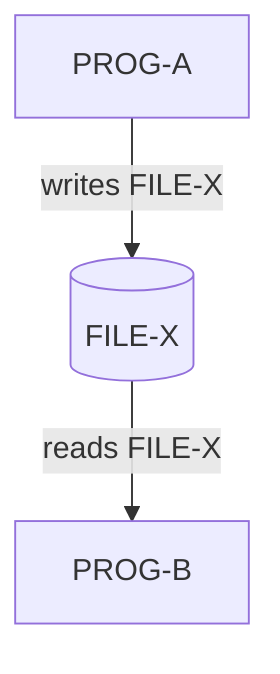

# Data Flows

Producer-consumer relationships between programs, tracing how data moves through files, databases, and queues.

## Data Flow Diagram

## File Data Flows

| File / Dataset | Producers (Write)  | Consumers (Read)   | Flow Pattern     |
| -------------- | ------------------- | ------------------- | ---------------- |
| [FILE-NAME]    | [PROG-A]            | [PROG-B, PROG-C]   | [Pipeline/Fan-out/Fan-in] |

## Database Data Flows

| Table / Segment | Writers (INSERT/UPDATE) | Readers (SELECT)   | Flow Pattern     |
| --------------- | ----------------------- | ------------------- | ---------------- |
| [TABLE-NAME]    | [PROG-A]                | [PROG-B]            | [Pipeline/Shared] |

## Messaging Data Flows

| Queue / Topic | Producers (PUT)    | Consumers (GET)    | Message Format   |
| ------------- | ------------------- | ------------------- | ---------------- |
| [QUEUE-NAME]  | [PROG-A]            | [PROG-B]            | [copybook ref]   |

## Data Transformation Chains

Multi-step data processing chains where output of one program feeds the next:

| Chain Name    | Step | Program   | Input            | Output           | Transformation      |
| ------------- | ---- | --------- | ---------------- | ---------------- | -------------------- |
| [Chain name]  | 1    | [PROG-A]  | [source]         | [FILE-X]         | [What it does]       |
| [Chain name]  | 2    | [PROG-B]  | [FILE-X]         | [FILE-Y]         | [What it does]       |
