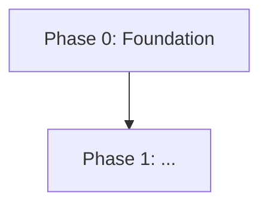

# Implementation Plan

A phased migration plan for this COBOL application, with strategy selected based on codebase characteristics.

## Executive Summary

[1-2 paragraph migration recommendation: selected strategy, rationale, estimated phase count, key constraints, and critical risks]

## Strategy Evaluation

### Codebase Characteristics

| Signal | Value | Implication |
| --- | --- | --- |
| Scale (programs, LOC) | [N programs, Nk LOC] | [Small/Medium/Large -- implications for strategy] |
| Online/batch mix | [Online-heavy / Batch-heavy / Mixed / Batch-only] | [Implications for migration approach] |
| Coupling level | [High/Medium/Low -- shared copybooks, CALL density] | [Implications for seam placement] |
| Natural seams | [Present/Partial/Absent -- CALL boundaries, file I/O, MQ] | [Implications for incremental extraction] |
| Regulatory/risk profile | [High/Medium/Low] | [Implications for validation requirements] |
| Data architecture | [Shared/Isolated/Mixed] | [Implications for coexistence complexity] |
| Business continuity | [Zero-downtime / Planned-window / Flexible] | [Implications for cutover approach] |

### Strategy Assessment

| Strategy | Fit | Rationale |
| --- | --- | --- |
| Strangler Fig | [Strong/Moderate/Poor] | [Why it does or does not fit this codebase] |
| Rewrite | [Strong/Moderate/Poor] | [Why it does or does not fit this codebase] |
| Branch-by-Abstraction | [Strong/Moderate/Poor] | [Why it does or does not fit this codebase] |
| Parallel Run | [Strong/Moderate/Poor] | [Why it does or does not fit this codebase] |
| Pipeline Replacement | [Strong/Moderate/Poor] | [Why it does or does not fit this codebase] |

### Recommended Strategy

[Selected strategy (or hybrid) with rationale grounded in the assessment above. If hybrid, explain which strategy applies to which part of the system.]

## Migration Strategy

| Property              | Value                                                         |
| --------------------- | ------------------------------------------------------------- |
| Approach              | [Strangler Fig / Rewrite / Branch-by-Abstraction / Parallel Run / Pipeline Replacement / Hybrid] |
| Direction             | [Outside-in / Inside-out / Middle-out / N/A]                  |
| Coexistence Duration  | [Estimated overlap period, or N/A for single-cutover]         |
| Primary Seam Type     | [API gateway / Message queue / Database view / File intercept / Abstraction layer / N/A] |

### Strategy Rationale

[Why this approach was selected based on the codebase characteristics: coupling level, data architecture, integration patterns, batch vs online mix]

## Boundary Analysis

Natural boundaries in the current system where migration intercepts can be placed. Adapt this section to the selected strategy -- seams for Strangler Fig, coupling points for Branch-by-Abstraction, step boundaries for Pipeline Replacement, integration touchpoints for Rewrite, comparison points for Parallel Run.

| Boundary | Type | Programs Involved | Direction | Complexity | Notes |
| --- | --- | --- | --- | --- | --- |
| [Boundary name] | [CALL / File / DB / Screen / Queue / Copybook / JCL Step] | [programs] | [In/Out/Both] | [High/Medium/Low] | [Considerations] |

## Migration Phases

### Phase 0: Foundation

| Property      | Value                     |
| ------------- | ------------------------- |
| Objective     | [What this phase achieves] |
| Prerequisites | None                      |

**Deliverables:**

- [Infrastructure, observability, rollback mechanism]
- [Coexistence plumbing (if applicable): routing, dual-write, sync]
- [Validation framework (if Parallel Run): comparison tooling, reporting]

### Phase N: [Capability Name]

| Property     | Value                      |
| ------------ | -------------------------- |
| Capability   | [From capabilities.md]     |
| Programs     | [Programs being migrated]  |
| Dependencies | [Prior phases required]    |
| Complexity   | [High/Medium/Low]          |
| Risk Level   | [High/Medium/Low]          |

**Migration scope:**

- [What moves to the new platform in this phase]

**Coexistence approach:**

- [How old and new run side-by-side during this phase, or N/A]

**Rollback plan:**

- [How to revert if the phase fails]

## Phase Sequencing

| Phase | Capability   | Programs   | Dependencies | Complexity        | Risk              | Rationale          |
| ----- | ------------ | ---------- | ------------ | ----------------- | ----------------- | ------------------ |
| 0     | Foundation   | -          | -            | Low               | Low               | [Why first]        |
| N     | [Name]       | [programs] | [Phase N-1]  | [High/Medium/Low] | [High/Medium/Low] | [Why this order]   |

## Data Migration Strategy

| Data Store | Type | Used By | Migration Approach | Coexistence Pattern | Phase |
| --- | --- | --- | --- | --- | --- |
| [Name] | [VSAM/DB2/IMS/Flat] | [programs/capabilities] | [Replicate / Sync / Migrate / Shared] | [Dual-write / CDC / Batch sync / N/A] | [N] |

## Coexistence Architecture

_Omit this section for strategies with no coexistence period (e.g., single-cutover Rewrite)._

### Routing Pattern

[How requests are routed between COBOL and new services during migration]

### Transaction Integrity

[How cross-system transactions are handled during coexistence]

### Data Synchronisation

[How data stays consistent between old and new systems]

## Risk Register

| Risk | Phase | Impact | Likelihood | Mitigation |
| --- | --- | --- | --- | --- |
| [Risk description] | [Phase N] | [High/Medium/Low] | [High/Medium/Low] | [Mitigation strategy] |

## Dependency Graph

