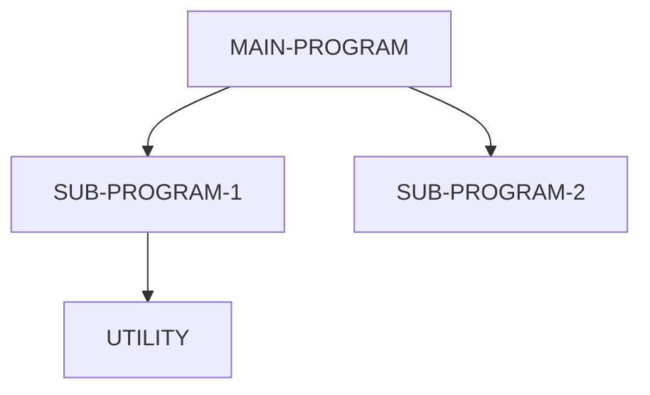

# Program Call Graph

Topology of CALL, PERFORM, and CICS LINK/XCTL relationships between programs.

## Call Graph

## Call Matrix

| Caller   | Callee   | Call Type             | Linkage Items      |
| -------- | -------- | --------------------- | ------------------ |
| [CALLER] | [CALLEE] | [CALL/CICS LINK/XCTL] | [key USING params] |

## Entry Point Programs

Programs that are not called by any other program in the analysed codebase (likely top-level batch or CICS entry points):

- [PROGRAM-NAME] -- [batch/CICS transaction ID]

## Leaf Programs

Programs that do not call any other program (utility or terminal processing):

- [PROGRAM-NAME] -- [purpose]

## Circular Dependencies

Any detected circular CALL chains:

- None detected (or list them)
